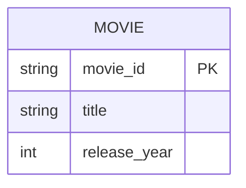

# Definition & Mechanics
A **primary key** is a candidate key selected to uniquely identify each occurrence of an entity type. It is a minimal set of attributes that uniquely identifies each record in a table.

* **Selection criteria**: typically chosen for simplicity, stability, and ease of use.
* **Notation**: often underlined in traditional ER diagrams or denoted with a {PK} suffix in UML.

# Worked Example
Domain: Film production

Suppose we have an entity type `Movie` with attributes `movie_id, title, release_year`. We select `movie_id` as the primary key.

| movie_id | title | release_year |
| --- | --- | --- |
| M001 | Inception | 2010 |
| M002 | Interstellar | 2014 |

# Edge Case
> **Q:** A university models `Student` with attributes `student_id, email, phone_number`. Both `student_id` and `email` uniquely identify each student. Which should be chosen as primary key?
> **A:** Either can be chosen, but `student_id` is likely preferred for simplicity and stability. If `email` changes frequently (e.g., due to policy updates), `student_id` provides a more stable identifier.

# Connections
- **Depends on:** [[Candidate_Key]] — Primary key is a specific type of candidate key.
- **Enables:** [[Logical_Database_Design]] — Primary keys are crucial for defining relational schemas and ensuring data integrity.