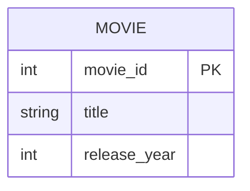

# Definition & Mechanics
A **primary key** is a **candidate key** selected to uniquely identify each occurrence of an **entity type**. It is a minimal set of attributes that uniquely identifies each record in a table.

* **Selection criteria**: 
  - **Uniqueness**: ensures each value is distinct.
  - **Non-nullability**: ensures no null values are allowed.
* **Notation**: 
  - Underlined in traditional ER diagrams.
  - `{PK}` suffix in UML.

# Worked Example
Domain: Film production

Suppose we have an entity type `Movie` with attributes `movie_id, title, release_year`. We want to uniquely identify each movie.

| Attribute | Description | Candidate Key |
| --- | --- | --- |
| movie_id | Unique identifier | Yes |
| title | Movie title | No (not unique) |
| release_year | Year of release | No (not unique) |

We choose `movie_id` as the primary key.

# Edge Case
> **Q:** A university has an entity type `Student` with attributes `student_id, email, phone_number`. Both `student_id` and `email` are unique, but some students may not have a phone number. Which attribute(s) can be the primary key?
> **A:** Both `student_id` and `email` can uniquely identify a student. However, since `phone_number` can be null, only `student_id` or a composite key including `email` and a nullable attribute can be a primary key. We choose `student_id` as it is simpler and more conventional.

# Connections
- **Depends on:** [[Candidate_Key]] — Primary key is a specific type of candidate key.
- **Enables:** [[Entity_Types]] — Choosing a primary key helps define the entity type's identifier.