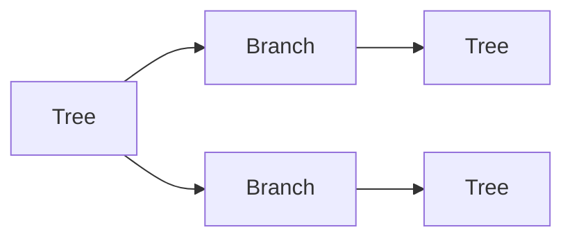

# Definition & Mechanics
**Recursion** is a programming technique where a function calls itself repeatedly until it reaches a base case that stops the recursion. 
* **Key components**: 
  + **Base case**: a trivial case that can be solved directly, stopping the recursion.
  + **Recursive case**: the function calls itself with a modified argument, moving towards the base case.
* **Requirements**: 
  + Every recursive function must have a base case to prevent infinite loops.
  + Each recursive call must bring the problem closer to the base case.

# Worked Example
Domain: Forestry management

Suppose we want to calculate the total number of trees in a forest, where each tree may have branches that are also trees. We can use recursion to solve this.



| Tree ID | Branch Count |
| --- | --- |
| 1    | 2          |
| 2    | 0          |
| 3    | 1          |
| 4    | 0          |
| 5    | 2          |

python
def count_trees(tree_id, branches):
    if branches == 0:  # base case
        return 1
    else:
        return 1 + sum(count_trees(i, b) for i, b in branches)

# Example usage
branches = {
    1: [2, 3],
    2: [],
    3: [4],
    4: [],
    5: [6, 7],
    6: [],
    7: []
}

print(count_trees(1, branches))  # Output: 7
```text