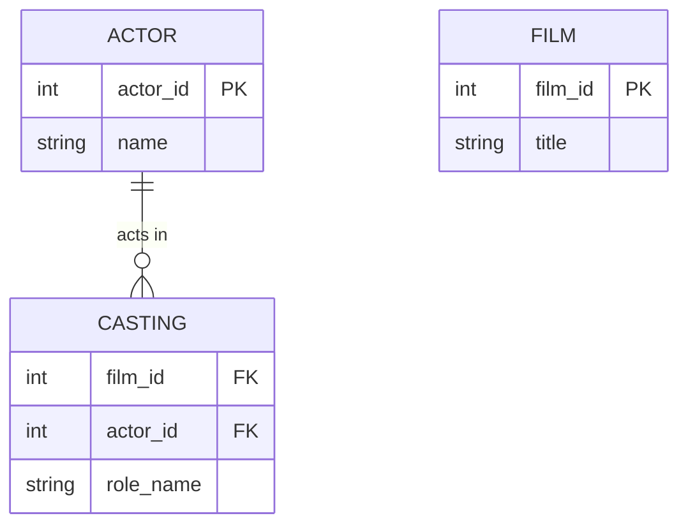

# Definition & Mechanics
A **recursive relationship** is a relationship type where the same entity type participates more than once in different roles. This requires **role names** to indicate the purpose that each participating entity type plays in the relationship.

* **Same entity type participates**: both sides of the relationship are the same entity type.
* **Role names are required**: to clarify the different roles played by the entity type.
* **Example degrees**: unary (1:1, 1:N), binary (not applicable), ternary/quaternary (rare).

# Worked Example
Domain: Film production

Suppose we want to model a film's cast, where an actor can play multiple roles in the same film, and a role can be played by multiple actors.

| Actor | Role |
| --- | --- |
| Tom Hanks | Captain Phillips |
| Tom Hanks | Forrest Gump |
| Meg Ryan | Sleepless in Seattle |

# Edge Case
> **Q:** A company has an organizational hierarchy where an employee manages other employees. Is the "Manages" relationship recursive?
> **A:** Yes, it is recursive. The same entity type (`Employee`) participates in different roles: `Manager` and `Staff_Member`. Role names clarify these roles.

# Connections
- **Depends on:** [[Relationship_Types]] — Recursive relationships are a specific type of relationship.
- **Enables:** [[Multiplicity]] — Understanding recursive relationships helps in defining multiplicity constraints.