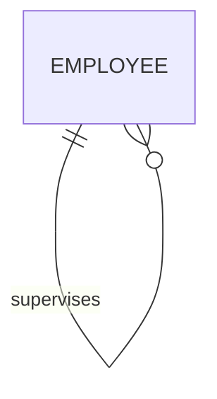
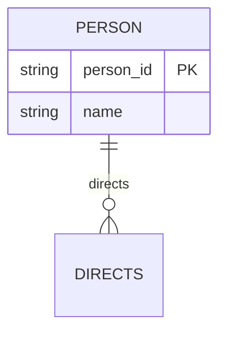

# Definition & Mechanics
A **recursive relationship** is a relationship type where the same entity type participates more than once in different roles. This relationship involves an entity type related to itself.

* **Roles**: Each occurrence of the entity type plays a distinct role in the relationship.
* **Example roles**: manager and employee in a "supervises" relationship.
* **Representation**: A recursive relationship is often depicted with role names.

# Worked Example
Domain: Film production

Consider a film production company where some directors also act in their own films. A recursive relationship `DIRECTOR_DIRECTS_ACTOR` can model this.

| Director (Entity) | Actor (Entity) |
| --- | --- |
| John Smith | John Smith |
| Jane Doe | Tom Hanks |

# Edge Case
> **Q:** In a university setting, can a course be both a prerequisite and a corequisite for another course?
> **A:** Yes, this can be modeled with a recursive relationship. A course can be related to itself in different roles: 
  - **prerequisite_of**: A course that must be taken before another.
  - **corequisite_of**: A course that must be taken alongside another.

# Connections
- **Depends on:** [[Relationship_Types]] — Recursive relationships are a type of relationship.
- **Enables:** [[Structural_Constraints]] — Understanding recursive relationships helps in defining complex structural constraints.