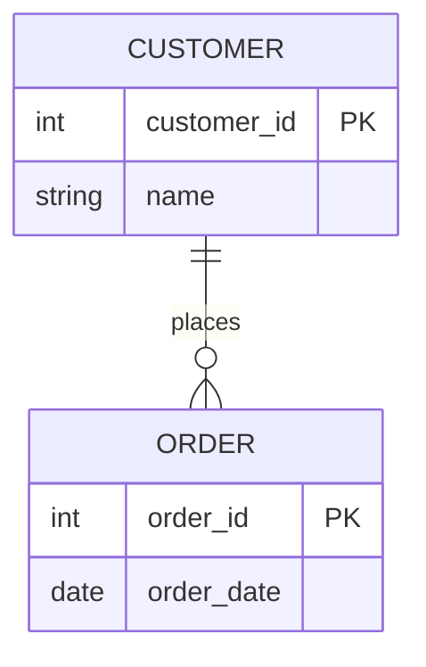
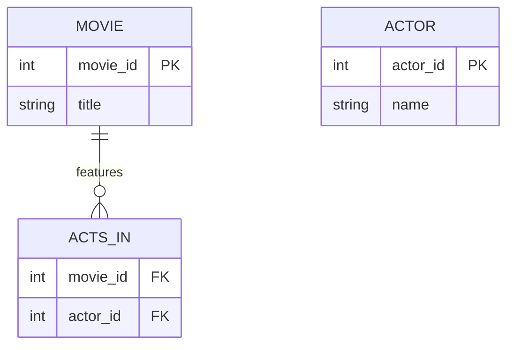

# Definition & Mechanics
A **relationship type** represents a meaningful association between (or among) entity types. It is a set of relationships that share similar properties and constraints.

* **Relationship occurrence**: a uniquely identifiable association, which includes one occurrence from each participating entity type.
* **Degree of a relationship**: the number of participating entities in a relationship (unary, binary, ternary, quaternary, n-ary).
* **Role names**: may be given to indicate the purpose that each participating entity type plays in a relationship.

# Worked Example
Domain: Film production

Suppose we have entity types `Movie` and `Actor`. A movie can have multiple actors, and an actor can act in multiple movies.

| Entity Type | Attributes | Key |
| --- | --- | --- |
| Movie | movie_id, title, release_year | movie_id |
| Actor | actor_id, name, birth_date | actor_id |

The relationship type between `Movie` and `Actor` is **Acts_In**.

# Edge Case
> **Q:** A university has entity types `Student` and `Course`. A student can enroll in multiple courses, and a course can have multiple students. However, the university wants to track not only the student-course enrollment but also the grade each student receives in each course. Should the relationship type between `Student` and `Course` be considered as having attributes?
> **A:** Yes, the relationship type `Enrolls_In` should be considered as having attributes, specifically `grade`. This is because the grade is a property of the relationship between a student and a course, not a property of the student or course alone.

# Connections
- **Depends on:** [[Entity_Types]] — Relationship types are defined between entity types.
- **Enables:** [[Structural_Constraints]] — Understanding relationship types is necessary to define structural constraints such as multiplicity.