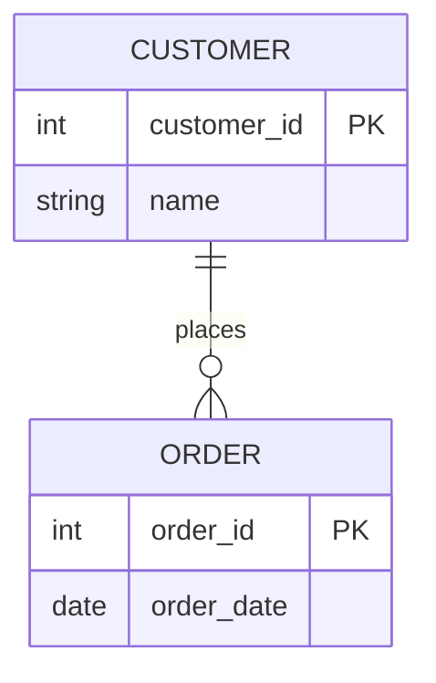
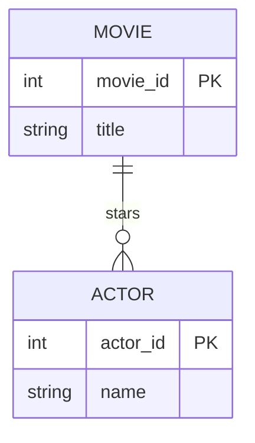

# Definition & Mechanics
A **relationship type** represents a meaningful association between (or among) entity types. It is a set of relationships that share similar properties and constraints.

* **Relationship occurrence**: a uniquely identifiable association, which includes one occurrence from each participating entity type.
* **Degree of a relationship**: the number of participating entities in a relationship (unary, binary, ternary, quaternary, n-ary).
* **Role names**: may be given to indicate the purpose that each participating entity type plays in a relationship.

# Worked Example
Domain: Film production

| Entity Type 1 | Relationship | Entity Type 2 |
| --- | --- | --- |
| Movie | stars | Actor |

In this example, `Movie` and `Actor` are entity types, and `stars` is a relationship type.

# Edge Case
> **Q:** A university has a `Course` entity and a `Student` entity. A course can have multiple students, and a student can enroll in multiple courses. Is this a unary, binary, or n-ary relationship?
> **A:** This is a binary relationship because it involves two distinct entity types: `Course` and `Student`. The fact that a course can have multiple students and a student can enroll in multiple courses indicates a many-to-many (*:*) relationship.

# Connections
- **Depends on:** [[Entity_Types]] — Relationship types are defined between entity types.
- **Enables:** [[Structural_Constraints]] — Understanding relationship types is necessary to define structural constraints such as multiplicity.