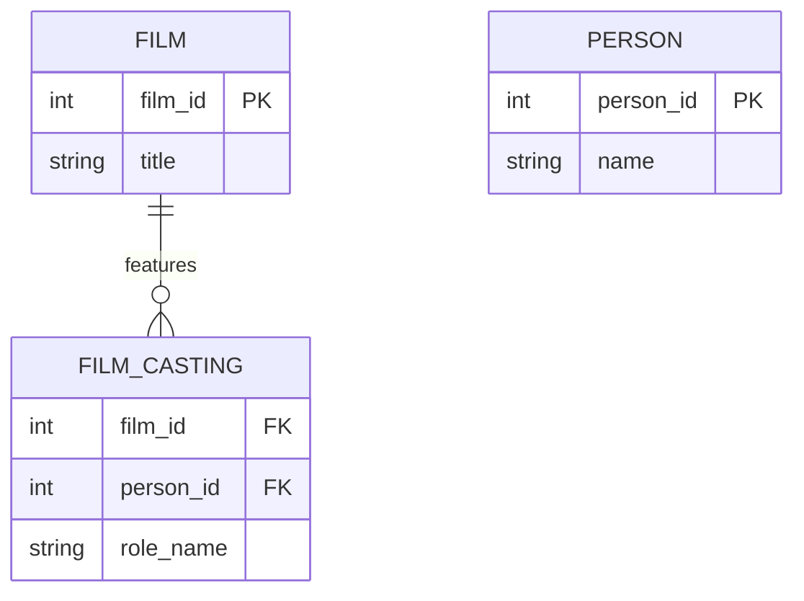

# Definition & Mechanics
**Role names** are labels assigned to entity types participating in a relationship to indicate the purpose or role each entity plays. 
* **Purpose**: clarify the meaning of the relationship, especially in recursive or complex relationships.
* **Notation**: written next to the entity type in an ER diagram.

# Worked Example
Domain: Film production

Suppose we have a `Film` entity and a `Person` entity. A person can play multiple roles in a film (e.g., director, actor).

# Edge Case
> **Q:** In a university setting, an academic `Supervises` another academic. Is a role name necessary?
> **A:** No, because the relationship is between two distinct entity types (`Academic` and itself in a different role). However, if an academic `Mentors` a student, a role name clarifies the purpose. The edge case here is recognizing when an entity participates in a relationship with itself, making role names crucial for clarity.

# Connections
- **Depends on:** [[Relationship_Types]] — Role names are used to clarify relationships between entity types.
- **Enables:** [[Er_Diagram_Construction]] — Understanding role names helps in accurately constructing ER diagrams.