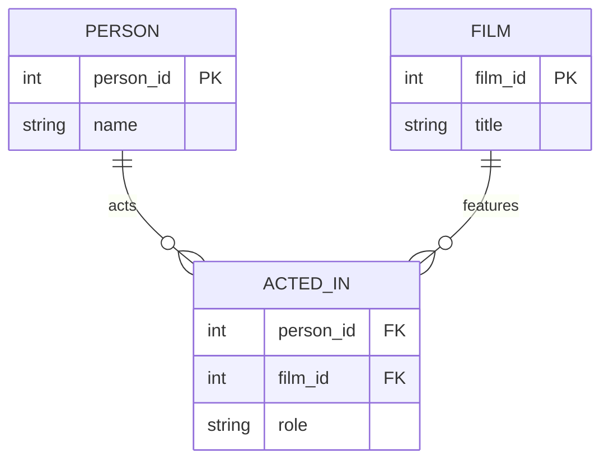

# Definition & Mechanics
A **role name** in a relationship is a descriptive name given to a participating entity type, indicating its specific role or function within that relationship. 
* **Purpose**: Clarifies the meaning of the relationship, especially in cases where the same entity type participates more than once.
* **Notation**: Often represented by labeling the line connecting the entity type to the relationship with the role name.

# Worked Example
Domain: Film production

Suppose we have an entity type `Person` and a relationship type `Acted_In`. In this relationship, `Person` participates twice: once as an actor and once as a director.

In the `ACTED_IN` relationship:
- `Person` plays the role of **actor**.
- `Film` plays no role name (implicit).

# Edge Case
> **Q:** In a university database, we have entity types `Student` and `Course`. A relationship `Enrolled_In` exists between them. Can we use role names for `Student` and `Course` in this relationship?
> **A:** No, role names are typically used when the same entity type participates in a relationship more than once, or when the relationship needs clarification. Here, `Student` and `Course` have clear, distinct roles (enrolling, being enrolled in), so role names like `enrolled_student` and `course_offering` are not necessary.

# Connections
- **Depends on:** [[Relationship_Types]] — Understanding relationships is prerequisite to understanding role names.
- **Enables:** [[Recursive_Relationship]] — Role names are particularly useful in recursive relationships.