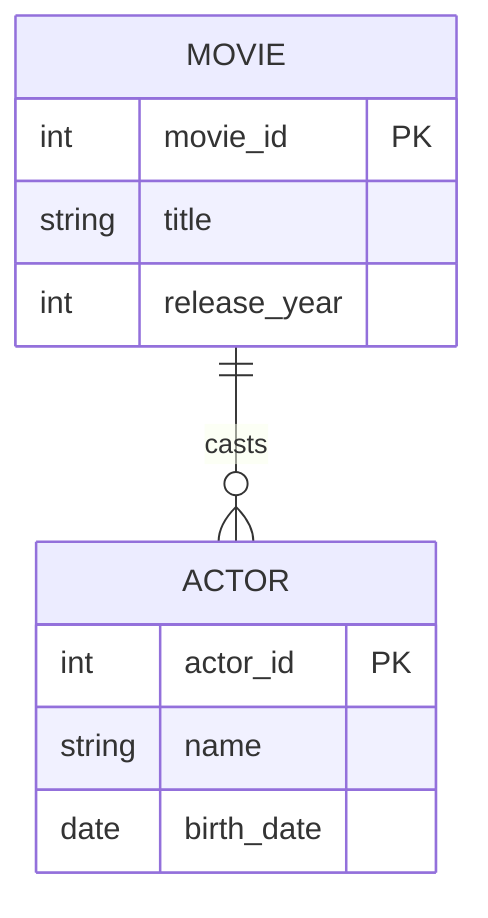

# Definition & Mechanics
A **strong entity type** is an entity type that has a **candidate key** of its own and is not existence-dependent on another entity type. 
* **Key characteristics:**
  + Has a **unique identifier** (candidate key)
  + Exists independently of other entity types
  + Can be a **parent entity** in an identifying relationship

# Worked Example
Domain: Film production

| Entity Type | Attributes | Key | Strong/Weak |
|---|---|---|---|
| Movie | movie_id, title, release_year | movie_id | Strong |
| Actor | actor_id, name, birth_date | actor_id | Strong |

# Edge Case
> **Q:** A university models `Course` (course_id, name, credits) and `Enrollment` (enrollment_id, course_id, student_id). Is `Course` strong or weak?
> **A:** `Course` is strong. It has a **candidate key** (course_id) and exists independently of `Enrollment`. The presence of `Enrollment` does not affect `Course`'s existence.

# Connections
- **Depends on:** [[Entity_Types]] — Strong entity types are a subclassification within the entity type taxonomy.
- **Enables:** [[Relationship_Types]] — Strong entity types often participate in relationships as parents or children.