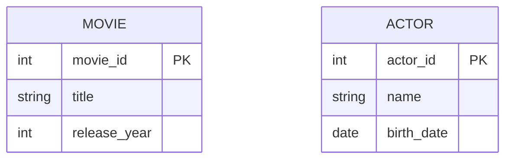

# Definition & Mechanics
A **strong entity type** is an entity type that has a **candidate key** and is not existence-dependent on another entity type. 
* It has a **unique identifier** (primary key) that can distinguish each occurrence.
* It **exists independently**, meaning its existence is not reliant on another entity.
* **Identification test**: Can you uniquely identify this occurrence without referencing another entity's key? If yes → it is strong.

# Worked Example
Domain: Film production

| Entity Type | Attributes | Key | Strong/Weak |
|---|---|---|---|
| Movie | movie_id, title, release_year | movie_id | Strong |
| Actor | actor_id, name, birth_date | actor_id | Strong |

In this example, both `Movie` and `Actor` are strong entity types because they have their own primary keys (`movie_id` and `actor_id`) and exist independently.

# Edge Case
> **Q:** A university models `Course` (course_id, name) and `Enrollment` (enrollment_id, course_id, student_id). Is `Course` weak or strong?
> **A:** Strong. `Course` has its own primary key (`course_id`) and exists independently of `Enrollment`. The presence of a foreign key in `Enrollment` referencing `Course` does not make `Course` weak; it only establishes a relationship.

# Connections
- **Depends on:** [[Entity_Types]] — Strong entity types are a fundamental classification within entity types.
- **Enables:** [[Relationship_Types]] — Understanding strong entity types helps in defining relationships between them.