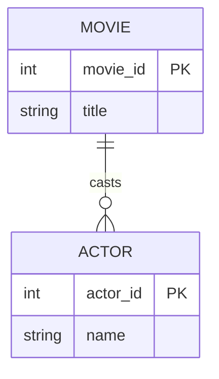

# Definition & Mechanics
**Structural constraints** define the rules that govern the relationships between entity types in a database. They ensure data consistency and integrity by specifying the **multiplicity** of relationships, which includes **cardinality** and **participation**.

* **Multiplicity**: The number or range of possible occurrences of an entity type that may relate to a single occurrence of an associated entity type.
* **Cardinality**: Describes the maximum number of possible relationship occurrences for an entity participating in a given relationship type.
* **Participation**: Determines whether all or only some entity occurrences participate in a relationship.

# Worked Example
Domain: Film production

Suppose we have two entity types: `Movie` and `Actor`. A movie can have multiple actors, and an actor can act in multiple movies. We want to model this relationship with structural constraints.

In this example, the relationship `casts` has a multiplicity of *:* (many-to-many), meaning a movie can have multiple actors and an actor can act in multiple movies.

# Edge Case
> **Q:** Consider a university database with entity types `Student` and `Course`. A student must enroll in at least one course, but a course may or may not have students enrolled. What are the structural constraints for the `enrolls_in` relationship?
> **A:** The `enrolls_in` relationship has a participation constraint where a `Student` must participate (total participation), but a `Course` may or may not have a `Student` enrolled (partial participation). The cardinality is likely *:* (many-to-many), but with a minimum of one student per course not required. This requires careful consideration of both participation and cardinality.

# Connections
- **Depends on:** [[Relationship_Types]], [[Entity_Types]] — Understanding relationships and entities is crucial for defining structural constraints.
- **Enables:** [[Multiplicity]], [[Cardinality]] — Mastering structural constraints enables a deeper understanding of multiplicity and cardinality constraints in database design.