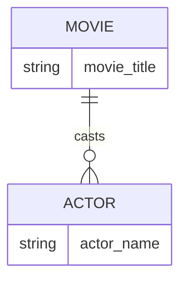

# Definition & Mechanics
**Structural constraints** define the rules that govern the relationships between entity types in an ER model. They ensure data consistency and integrity by specifying the **multiplicity** of relationships.

* **Multiplicity**: expresses the number (or range) of possible occurrences of an entity type that may relate to a single occurrence of an associated entity type.
* **Types of multiplicity constraints**: 
  + **Cardinality**: maximum number of possible relationship occurrences for an entity participating in a given relationship type.
  + **Participation**: determines whether all or only some entity occurrences participate in a relationship.

# Worked Example
Domain: Film production

Suppose we have two entity types: `Movie` and `Actor`. A movie can have multiple actors, and an actor can act in multiple movies.

| Movie Title | Actor Name |
| --- | --- |
| Inception | Leonardo DiCaprio |
| Inception | Joseph Gordon-Levitt |
| The Dark Knight | Christian Bale |
| The Dark Knight | Heath Ledger |

In this example, the relationship between `Movie` and `Actor` is many-to-many (*:*), indicating that a movie can have multiple actors and an actor can act in multiple movies.

# Edge Case
> **Q:** A university has a `Course` entity and a `Student` entity. A course can have multiple students, but a student must be enrolled in at least one course. Is the participation of `Student` in the `enrolls_in` relationship optional or mandatory?
> **A:** The participation of `Student` is **mandatory** because a student must be enrolled in at least one course. This means the minimum cardinality for `Student` in the `enrolls_in` relationship is 1.

# Connections
- **Depends on:** [[Relationship_Types]] — Understanding relationships is crucial for defining structural constraints.
- **Enables:** [[Multiplicity]] — Mastering structural constraints enables a deeper understanding of multiplicity and its application in ER models.