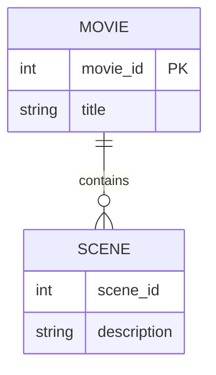

# Definition & Mechanics
A **weak entity type** is an entity type that has no **candidate key** of its own and cannot be uniquely identified without referencing an **owner entity** via an **identifying relationship**. 
* **Existence dependency**: the weak entity only exists because its owner exists (delete the owner → delete the weak entity).
* **Partial key (discriminator)**: an attribute that, *combined with the owner's primary key*, produces a unique composite identifier.
* **Drawn as**: double-border rectangle (entity) + double-border diamond (identifying relationship).

# Worked Example
Domain: Film production

Suppose we have an entity type `Movie` and a weak entity type `Scene` because a scene is meaningless without knowing which movie it belongs to.

| Entity Type | Attributes | Key | Strong/Weak |
|---|---|---|---|
| Movie | movie_id, title | movie_id | Strong |
| Scene | scene_id, description | (none alone) | Weak (owner: Movie) |

The composite identifying key for `Scene` is `(movie_id, scene_id)`.

# Edge Case
> **Q:** A university models `Course` (course_id, name) and `Enrollment` (student_id, enrollment_date). Each enrollment is for a specific course. Is `Enrollment` strong or weak?
> **A:** Weak. `student_id + enrollment_date` can repeat across courses (same student, same date, different courses). The enrollment is meaningless without knowing *which course* — it has no candidate key of its own. The identifying relationship is Course → Enrollment, and the composite key is `(course_id, student_id, enrollment_date)`.

# Connections
- **Depends on:** [[Entity_Types]] — Weak entity types are a subclassification within the entity type taxonomy.
- **Enables:** [[Relationship_Types]] — The identifying relationship is a specific relationship type that constrains the weak entity's lifecycle.