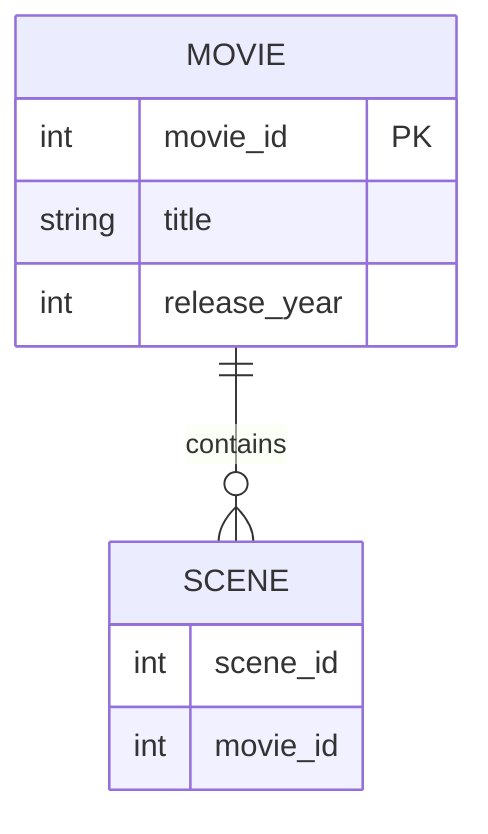

# Definition & Mechanics
A **weak entity type** is an entity type that has no **candidate key** of its own and cannot be uniquely identified without referencing an **owner entity** via an **identifying relationship**. 
* **Existence dependency**: the weak entity only exists because its owner exists (delete the owner → delete the weak entity).
* **Partial key (discriminator)**: an attribute that, *combined with the owner's primary key*, produces a unique composite identifier.
* **Drawn as**: double-border rectangle (entity) + double-border diamond (identifying relationship).

# Worked Example
Domain: Film production

Suppose we want to model `Movie` and `Scene`. A movie can have many scenes, and each scene belongs to only one movie.

| Entity Type | Attributes | Key | Strong/Weak |
|---|---|---|---|
| Movie | movie_id, title, release_year | movie_id | Strong |
| Scene | scene_id, movie_id, scene_description | (movie_id, scene_id) | Weak (owner: Movie) |

# Edge Case
> **Q:** A university models `Student` (student_id, name) and `Course_Enrollment` (enrollment_date, grade). Each enrollment is for a specific student and course. Is `Course_Enrollment` strong or weak?
> **A:** Weak. `enrollment_date + grade` can repeat across students and courses. The enrollment is meaningless without knowing *which student and course* — it has no candidate key of its own. The identifying relationships are `Student → Course_Enrollment` and `Course → Course_Enrollment`, and the composite key is `(student_id, course_id)`.

# Connections
- **Depends on:** [[Entity_Types]] — Weak entity types are a subclassification within the entity type taxonomy.
- **Enables:** [[Relationship_Types]] — The identifying relationship is a specific relationship type that constrains the weak entity's lifecycle.