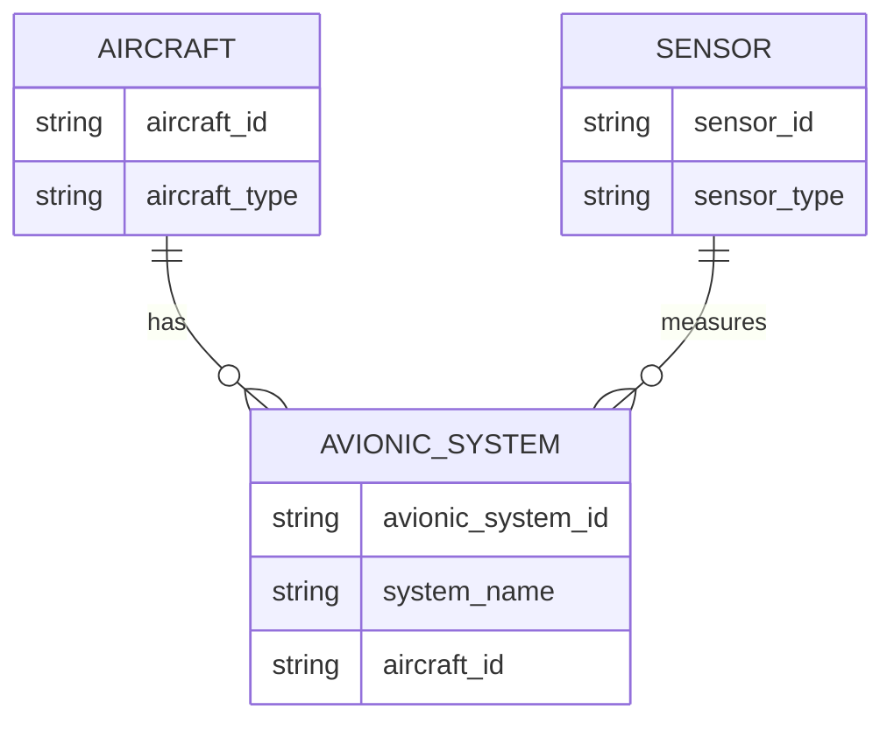

---

title: Aggregate_Functions
type: Atomic Note
course: Database Systems
semester: Autumn 2025
unit: '6'
hub: '[[6_Database_Design_Hub]]'
source: '[[Chapter_6.pdf]]'
source_pages:
- 59
mode: CS-DB
read: false
generated: true
prerequisites:
- '[[Data_Definition_Language]]'
- '[[Table_Definition]]'
- '[[Create_Table]]'
- '[[Default_Values]]'
- '[[Constraint_Definition]]'

---


# 1. Mental Model

The concept of aggregate functions in SQL can be likened to a factory's production line, where individual components (data values) are processed through various stations (functions) to produce a final product (aggregated result). Just as a factory's assembly line has different workstations for tasks like welding, painting, and quality control, aggregate functions like COUNT, SUM, MAX, MIN, and AVG serve as specialized processing stations for data. For instance, the COUNT function can be thought of as a quality control station that simply counts the number of units (rows) passing through, while the SUM function acts like a packaging station that adds up the weights (values) of all units.

# 2. Schema & Query Mechanics

Aggregate functions in SQL, such as [[Aggregate_Functions]], are used to compute a value from a set of input values. These functions are often used in conjunction with the [[Sql_Definition]] language, specifically in the [[Data_Definition_Language]] and [[Sql_Sub_Languages]]. When creating a [[Table_Definition]], one can use aggregate functions in [[Create_Table]] statements to define [[Default_Values]] or [[Constraint_Definition]]s. For example, to calculate the total number of rows in a table, you can use the [[Insert]], [[Update]], and [[Delete]] operations in conjunction with the COUNT aggregate function. Furthermore, [[Table_Creation_Steps]] often involve the use of aggregate functions to define [[Referential_Integrity_Options]] and [[Qualifying_Attribute_Names]]. 

# 3. ACID Violations & Scaling Limits

When using aggregate functions in SQL queries, ACID (Atomicity, Consistency, Isolation, Durability) violations can occur if the functions are not properly synchronized across concurrent transactions. For instance, if two transactions are executing a query with a SUM aggregate function simultaneously, the results may be inconsistent due to [[Nesting_Of_Queries]] or [[Correlated_Nested_Queries]]. As the database scales, the use of aggregate functions can lead to performance bottlenecks, particularly if the [[The_Exists_Function]] or [[Explicit_Sets]] are used extensively. 

| Scaling Issue | Description |
|---|---|
| Concurrent Modifications | Multiple transactions modifying the same data can lead to inconsistent results. |
| Query Complexity | Complex queries with multiple aggregate functions can degrade performance. |
| Data Volume | Large datasets can cause aggregate functions to become computationally expensive. |
| Indexing | Poor indexing strategies can exacerbate performance issues with aggregate functions. |

## 4. Entity-Relationship Model



In this Mermaid erDiagram, the entities `AIRCRAFT`, `AVIONIC_SYSTEM`, and `SENSOR` are represented as rectangles. The relationships between them are represented as lines with cardinality indicators: `||--o{` represents a 1:N relationship, where one `AIRCRAFT` can have multiple `AVIONIC_SYSTEM`s, and one `AVIONIC_SYSTEM` is associated with one `AIRCRAFT`. Similarly, `||--o{` represents a 1:N relationship between `AVIONIC_SYSTEM` and `SENSOR`, where one `AVIONIC_SYSTEM` can have multiple `SENSOR`s.

## 5. Walkthrough

Here are the steps to apply aggregate functions in the context of Aerospace Engineering & Avionics:

1. **Identify Data**: Suppose we have a database table `avionic_system_data` containing sensor readings from various aircraft, with columns `aircraft_id`, `sensor_id`, `reading_value`, and `timestamp`.
2. **Specify Aggregate Function**: We want to calculate the average reading value for each aircraft. We can use the `AVG` aggregate function to achieve this.
3. **Apply Aggregate Function**: We write a SQL query: `SELECT aircraft_id, AVG(reading_value) AS avg_reading FROM avionic_system_data GROUP BY aircraft_id`.
4. **Process Data**: The database processes the data, grouping rows by `aircraft_id` and calculating the average `reading_value` for each group.
5. **Analyze Results**: The query returns a result set with `aircraft_id` and `avg_reading` columns, showing the average sensor reading for each aircraft.
6. **Interpret Results**: We can now analyze the results to identify trends or anomalies in sensor readings across different aircraft, informing maintenance or performance optimization decisions.

---

## 6. The Proving Grounds

```interactive-quiz

[
  {
    "id": "q1",
    "type": "true_false",
    "difficulty": "L1",
    "question": "An aggregate function in SQL returns a single value based on a set of input values.",
    "answer": true,
    "explanation": "This statement is true. Aggregate functions, by definition, take a set of input values and return a single value as output."
  },
  {
    "id": "q2",
    "type": "scenario",
    "difficulty": "L2",
    "question": "Consider a table 'Employees' with columns 'Department' and 'Salary'. If you want to find the maximum salary for each department, but only for departments with more than 5 employees, what SQL approach would you use?",
    "answer": "You would first use the COUNT() aggregate function to count the number of employees in each department, then use a HAVING clause to filter departments with more than 5 employees, and finally apply the MAX() aggregate function to find the maximum salary for each of these departments.",
    "explanation": "This approach involves using aggregate functions in combination with the GROUP BY and HAVING clauses to first filter departments based on the number of employees and then find the maximum salary for each department that meets the criteria."
  },
  {
    "id": "q3",
    "type": "debug",
    "difficulty": "L3",
    "question": "Find the error.",
    "content": "SELECT Department, AVG(Salary) AS AverageSalary FROM Employees GROUP BY Department HAVING COUNT(*) < 5; ",
    "answer": "The bug is that the query will return departments with less than 5 employees, not more than 5. The correct operator in the HAVING clause should be '>=' instead of '<'. The corrected query is: SELECT Department, AVG(Salary) AS AverageSalary FROM Employees GROUP BY Department HAVING COUNT(*) >= 5;",
    "explanation": "The original query's logic is inverted; it filters for departments with fewer than 5 employees instead of the intended more than 5 employees."
  }
]

```