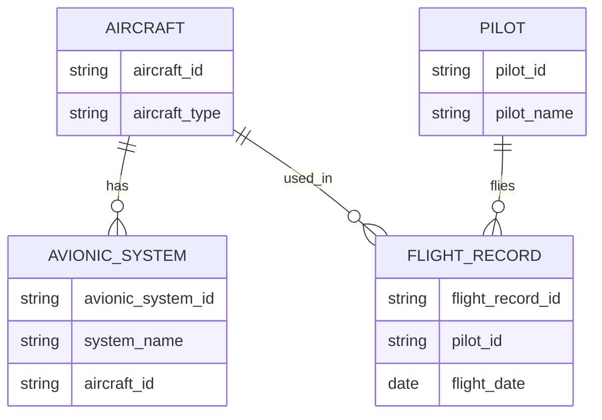

---

title: Alter_Table
type: Atomic Note
course: Database Systems
semester: Autumn 2025
unit: '6'
hub: "[[6_Database_Design_Hub]]"
source: "[[Chapter_6.pdf]]"
source_pages:
- 9
mode: CS-DB
read: false
generated: true
prerequisites:
- "[[Data_Definition_Language]]"

---

# 1. Mental Model

The concept of altering a table in a relational database can be likened to editing a highly structured and organized digital filing system. Just as files within a filing cabinet can be rearranged, added, or removed, the structure of a table, such as adding or removing columns (attributes), can be modified. This analogy maps the table to the filing cabinet and the attributes of the table to the files or folders within the cabinet, highlighting how structural changes to the table (like adding a new column) are akin to adding a new file type to the filing system.

# 2. Schema & Query Mechanics

The [[Alter_Table]] operation in SQL allows for modifications to the structure of an existing [[Table_Definition]] without affecting the data already stored within it. This can include adding new columns, modifying existing columns, or dropping columns, all of which are achieved through specific [[Sql_Sub_Languages]], notably the [[Data_Definition_Language]] (DDL). When adding a new column, a [[Data_Type]] must be specified, and optionally, a [[Default_Values]] or [[Constraint_Definition]] can be applied to the new column. The [[Alter_Table]] command must be executed within a [[Sql_Environment]] that has the necessary permissions, and changes are typically recorded in the [[System_Catalog]]. The syntax and capabilities of [[Alter_Table]] can vary slightly between different SQL database management systems.

# 3. ACID Violations & Scaling Limits

When executing an [[Alter_Table]] operation, there is a potential for [[Acid]] violations if the operation is not handled as a transaction that can be rolled back in case of failure. For instance, if adding a new column to a very large table, the operation could take significant time and system resources, potentially leading to locking issues or failures if not managed properly. Moreover, scaling limits can be reached if the table is extremely large and the operation requires more resources than available, leading to performance degradation or failure. Ensuring that such operations are conducted during low-activity periods and with adequate resource allocation can mitigate these risks.

## 4. Entity-Relationship Model



In this Mermaid `erDiagram`, rectangles represent entities (e.g., `AIRCRAFT`, `PILOT`), and lines represent relationships between them. The `||--o{` notation indicates a 1:N (one-to-many) relationship, where one instance of the entity on the left can have multiple instances of the entity on the right; for example, one `AIRCRAFT` can have multiple `AVIONIC_SYSTEM`s.

## 5. Walkthrough

Here are the steps to alter a table in a relational database within the context of Aerospace Engineering & Avionics:

1. **Initial Table Structure**: Assume we have a table named `AVIONIC_SYSTEM` with columns `avionic_system_id`, `system_name`, and `aircraft_id`. This table stores information about the avionic systems installed in various aircraft.

2. **Identify the Need for Change**: The aerospace engineering team decides that they need to track the installation date of each avionic system. This requires adding a new column to the `AVIONIC_SYSTEM` table.

3. **Prepare the Alter Table Statement**: The database administrator prepares an SQL statement to alter the `AVIONIC_SYSTEM` table. The statement will add a new column named `installation_date` with an appropriate data type, such as `DATE`.

4. **Execute the Alter Table Statement**: The SQL statement is executed:

```sql

   ALTER TABLE AVIONIC_SYSTEM
   ADD COLUMN installation_date DATE;

```

   This modifies the `AVIONIC_SYSTEM` table by adding the new column.

5. **Verify the Changes**: After executing the statement, the database administrator verifies that the `AVIONIC_SYSTEM` table has been successfully modified by adding a query to describe the table structure or by checking the database schema.

6. **Populate the New Column**: With the new `installation_date` column in place, the team proceeds to populate it with the relevant data for each avionic system. This might involve updating existing records with the installation dates:

```sql

   UPDATE AVIONIC_SYSTEM
   SET installation_date = '2022-01-01'
   WHERE avionic_system_id = 'AS-001';

```

---

## 6. The Proving Grounds

```interactive-quiz

[
  {
    "id": "q1",
    "type": "true_false",
    "difficulty": "L1",
    "question": "The ALTER TABLE statement in SQL is used to modify the structure of an existing table.",
    "answer": true,
    "explanation": "The ALTER TABLE statement is indeed used to modify the structure of an existing table, such as adding or removing columns."
  },
  {
    "id": "q2",
    "type": "scenario",
    "difficulty": "L2",
    "question": "Suppose you have a table named 'Employees' with columns 'EmployeeID', 'Name', and 'Department'. You want to add a new column 'JobTitle' to the table, but only for the rows where the Department is 'Sales'. What happens if you execute the following SQL statement: ALTER TABLE Employees ADD JobTitle VARCHAR(255);",
    "answer": "The new column 'JobTitle' will be added to all rows in the 'Employees' table, not just the rows where the Department is 'Sales'.",
    "explanation": "The ALTER TABLE statement with the ADD COLUMN clause adds the new column to all rows in the table. To add the column only to specific rows, you would need to use an UPDATE statement after adding the column."
  },
  {
    "id": "q3",
    "type": "debug",
    "difficulty": "L3",
    "question": "Find the error.",
    "content": "ALTER TABLE Employees ADD COLUMN JobTitle VARCHAR(255) DEFAULT 'Sales';",
    "answer": "The bug is that the DEFAULT constraint is not properly specified for existing rows. The correct syntax to add a column with a default value for existing rows is to use the DEFAULT keyword with a specific value or NULL, and optionally specify a column constraint.",
    "explanation": "The bug in the given SQL statement is not actually a bug but a potentially unintended behavior. When adding a new column with a DEFAULT value to an existing table, the DEFAULT value is only applied to new rows inserted after the column is added. For existing rows, the column will be populated with the DEFAULT value, but this can be avoided by using the NULL keyword or omitting the DEFAULT keyword. However, a more accurate bug would involve incorrect logic, such as ALTER TABLE Employees ADD COLUMN JobTitle VARCHAR(255) = 'Sales'; which would result in a syntax error."
  }
]

```