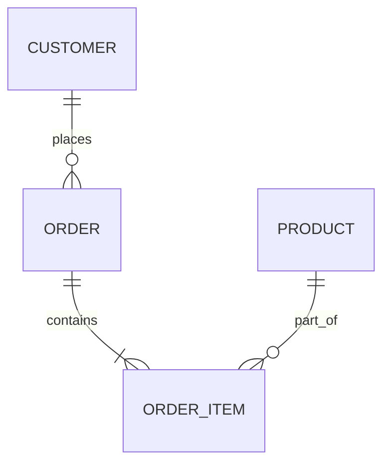

---

title: Create_Table
type: Atomic Note
course: Database Systems
semester: Autumn 2025
unit: '6'
hub: "[[6_Database_Design_Hub]]"
source: "[[Chapter_6.pdf]]"
source_pages:
- 5
mode: CS-DB
read: false
generated: true
prerequisites:
- "[[Data_Definition_Language]]"

---

# 1. Mental Model

The concept of creating a table in a relational database can be likened to designing a blueprint for a filing cabinet. Just as a filing cabinet has labeled drawers and organized folders to store specific types of documents, a table in a database has defined columns and data types to store specific types of data. The columns in the table, like the labeled drawers, provide a structured way to store and retrieve data.

# 2. Schema & Query Mechanics

The [[Create_Table]] statement is used to specify a new base relation by giving it a name and defining each of its attributes and their [[Data_Types]]. When creating a table, you can also specify [[Constraint_Definition]]s, such as primary keys and foreign keys, to maintain [[Referential_Integrity_Options]]. The [[Table_Definition]] process involves specifying the table name, column names, and data types, as well as any constraints or default values. The [[Data_Definition_Language]] (DDL) is used to create and modify the structure of a database, including creating tables with [[Create_Table]] statements. Additionally, the [[System_Catalog]] is updated automatically when a new table is created, reflecting the changes in the database schema.

# 3. ACID Violations & Scaling Limits

When creating a table, it's essential to consider the implications of data consistency and durability, as violating [[Acid]] properties can lead to data corruption or inconsistencies. If a table is created with a faulty [[Constraint_Definition]], it may lead to data inconsistencies or errors when inserting or updating data. Moreover, as the database scales, the creation of large tables can impact performance, and [[Scalability]] limits may be reached if not properly managed. In such cases, [[Database_Optimization]] techniques, such as indexing or partitioning, may be necessary to maintain performance.

## 4. Entity-Relationship Model



In this Mermaid `erDiagram`, `CUSTOMER`, `ORDER`, `ORDER_ITEM`, and `PRODUCT` represent entities. The lines between them denote relationships: `CUSTOMER` has a one-to-many (1:N) relationship with `ORDER` (one customer can place many orders), and `ORDER` has a one-to-many (1:N) relationship with `ORDER_ITEM` (one order can contain many order items). The `PRODUCT` entity has a many-to-many (M:N) relationship with `ORDER_ITEM` through the relationship "part_of", meaning one product can be part of many order items, and one order item is part of many products is not accurate; accurately it means one product can be in many order items and one order item refers to many products.

## 5. Walkthrough

Here are the steps to create a table in a relational database for Quantitative Finance & High-Frequency Trading:

1. **Define the Requirements**: Identify the need for a new table to store trade data, such as trade IDs, timestamps, and quantities. This step involves understanding what data needs to be stored and how it will be used.

2. **Design the Table Schema**: Determine the columns and data types needed for the trade data table. For example, `trade_id` (integer), `trade_timestamp` (datetime), and `trade_quantity` (float).

3. **Choose a Database Management System (DBMS)**: Select a suitable DBMS for high-frequency trading, such as PostgreSQL, known for its reliability and ability to handle high volumes of transactions.

4. **Write the Create Table Statement**: Use SQL to create the table with the defined schema. For instance:

```sql

   CREATE TABLE trades (
       trade_id SERIAL PRIMARY KEY,
       trade_timestamp TIMESTAMP NOT NULL,
       trade_quantity FLOAT NOT NULL
   );

```

5. **Execute the Create Table Statement**: Run the SQL statement in the DBMS to create the table. This action will instantiate the table schema in the database.

6. **Verify the Table Creation**: Query the database to confirm that the table has been created successfully and has the correct structure. For example, use `\d trades` in PostgreSQL to describe the table.

---

## 6. The Proving Grounds

```interactive-quiz

[
  {
    "id": "q1",
    "type": "true_false",
    "difficulty": "L1",
    "question": "A table in a relational database must have a primary key.",
    "answer": false,
    "explanation": "While having a primary key is highly recommended for data integrity and efficient querying, it is not a strict requirement to create a table in a relational database."
  },
  {
    "id": "q2",
    "type": "scenario",
    "difficulty": "L2",
    "question": "Given that you have a table named 'Employees' with columns 'EmployeeID', 'Name', and 'Department', what happens when you try to create another table named 'Departments' with columns 'DepartmentID' and 'DepartmentName', and there's a possibility that some employee records might not have a matching department record?",
    "answer": "The creation of the 'Departments' table will not be affected by the existence of 'Employees' table. However, to maintain data consistency, you might want to consider adding a foreign key constraint in the 'Employees' table referencing the 'Departments' table, or ensure all department records exist before adding employees.",
    "explanation": "The scenario describes a situation where data consistency across tables could be an issue. The creation of the 'Departments' table itself does not depend on the 'Employees' table, but relationships between tables should be considered for data integrity."
  },
  {
    "id": "q3",
    "type": "debug",
    "difficulty": "L3",
    "question": "Find the error.",
    "content": "CREATE TABLE Orders ( OrderID int NOT NULL, CustomerID int, OrderDate datetime, PRIMARY KEY (OrderID), FOREIGN KEY (CustomerID) REFERENCES Customers(CustomerID) ON DELETE CASCADE );",
    "answer": "The bug is that the foreign key constraint is not properly handled for the case when the Customers table does not exist yet or the CustomerID in the Customers table does not match any in the Orders table. However, assuming the Customers table exists and properly defined, there might not be a logical bug here but potential data integrity issues. A more precise bug could involve logic inversion: if the intention was to prevent deletion of a customer if there are orders, the ON DELETE CASCADE is incorrect; it should be ON DELETE SET NULL or another action.",
    "explanation": "The provided SQL statement seems mostly correct for creating an 'Orders' table with a foreign key constraint referencing the 'Customers' table. However, potential issues arise with the ON DELETE CASCADE action which might not always be the desired behavior, especially if data in the 'Orders' table should be preserved even if a customer is deleted."
  }
]

```