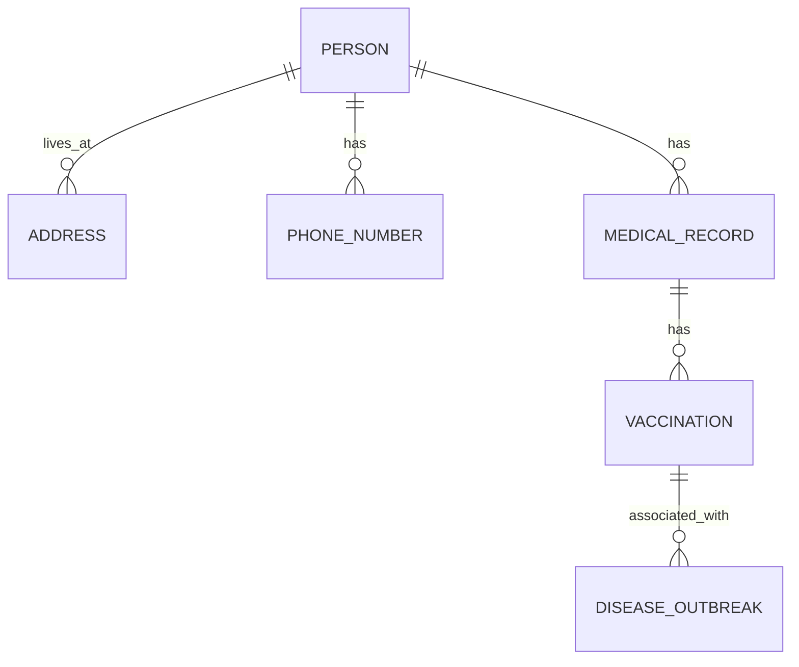

---

title: Default_Values
type: Atomic Note
course: Database Systems
semester: Autumn 2025
unit: '6'
hub: '[[6_Database_Design_Hub]]'
source: '[[Chapter_6.pdf]]'
source_pages:
- 10
mode: CS-DB
read: false
generated: true
prerequisites:
- '[[Create_Table]]'
- '[[Data_Types]]'
- '[[Constraint_Definition]]'
- '[[Data_Definition_Language]]'
- '[[Drop_Table]]'

---


# 1. Mental Model

A relational database schema can be thought of as a network of interconnected maps, where each map represents a table and its relationships with other tables. Just as a map has coordinates and labels to help navigate, a table has columns and data types to organize and store information. The relationships between tables are like roads that connect different locations, enabling efficient navigation and retrieval of data.

# 2. Schema & Query Mechanics

In a relational database, the [[Sql_Definition]] provides a set of rules and structures for creating and managing database schema. When creating a table using [[Create_Table]], you can define columns with specific [[Data_Types]] and constraints, such as [[Constraint_Definition]], to ensure data consistency. The [[Data_Definition_Language]] is used to define and modify the schema, including adding or removing tables using [[Drop_Table]] and [[Alter_Table]]. When inserting data into a table using [[Insert]], you can specify [[Default_Values]] for columns that are not provided, such as the city column in the example table. The database uses the [[System_Catalog]] to keep track of the schema and ensure data integrity.

# 3. ACID Violations & Scaling Limits

If a database does not properly handle [[Default_Values]], it may lead to inconsistencies and [[Referential_Integrity_Options]] violations, causing errors when inserting or updating data. For instance, if a table has a default value for a column, but the column is not properly defined, it may cause a failure when trying to insert data. In a distributed database, scaling limits can be reached when handling a large number of concurrent transactions, leading to potential [[Acid]] violations, such as inconsistencies or lost updates. 

| Error Type | Description | 
|---|---|
| Inconsistent Data | Data inconsistencies due to improper handling of default values | 
| Referential Integrity Violation | Errors caused by violating referential integrity constraints | 
| ACID Violation | Inconsistencies or lost updates due to scaling limits | 
| Transaction Failure | Failure of transactions due to improper handling of default values |

## 4. Entity-Relationship Model



In this Mermaid entity-relationship diagram, entities are represented as boxes (e.g., `PERSON`, `ADDRESS`), and relationships between them are depicted as lines with various notations. 
- The `||--o{` notation indicates a 1:N (one-to-many) relationship, meaning one instance of the entity on the left side can have multiple instances of the entity on the right side (e.g., one person can have multiple addresses).
- The `||--o{` and `||--||` notations are not used here but would indicate 1:1 and M:N relationships respectively.

## 5. Walkthrough

Here is a walkthrough situated in the domain of Epidemiology & Public Health Modeling, focusing on the concept of default values in a relational database schema.

1. **Initial Schema Design**: Start with a basic entity-relationship model that includes entities like `PERSON`, `ADDRESS`, and `MEDICAL_RECORD`. The goal is to track individuals' medical history and their locations.

2. **Defining Default Values for Columns**: For the `ADDRESS` entity, define a column `city` with a default value of 'Unknown' to handle cases where the city is not specified. Similarly, for the `MEDICAL_RECORD` entity, define a column `vaccination_status` with a default value of 'Not Vaccinated'.

3. **Establishing Relationships**: Establish a 1:N relationship between `PERSON` and `ADDRESS` (one person can have multiple addresses) and another 1:N relationship between `PERSON` and `MEDICAL_RECORD` (one person can have multiple medical records over time).

4. **Adding More Entities and Relationships**: Introduce a `VACCINATION` entity to track vaccination details. Establish a 1:N relationship between `MEDICAL_RECORD` and `VACCINATION` because one medical record can have multiple vaccinations listed.

5. **Incorporating Default Values in Relationships**: Consider a scenario where a person does not have an address listed; the `city` would default to 'Unknown'. For a new medical record created for a person, if the vaccination status is not immediately known, it defaults to 'Not Vaccinated'.

6. **Querying with Default Values**: When querying the database for individuals and their vaccination status, the default values ('Unknown' for city, 'Not Vaccinated' for vaccination status) are used when actual data is missing, ensuring that the queries return comprehensive results without excluding records due to null values.

---

## 6. The Proving Grounds

```interactive-quiz

[
  {
    "id": "q1",
    "type": "true_false",
    "difficulty": "L1",
    "question": "A column with a default value of NULL is equivalent to a column with no default value.",
    "answer": false,
    "explanation": "A column with a default value of NULL is not equivalent to a column with no default value. A column with no default value will be NULL if no value is provided, but it does not have an explicitly defined default value."
  },
  {
    "id": "q2",
    "type": "scenario",
    "difficulty": "L2",
    "question": "Consider a table 'users' with a column 'name' and a default value of 'Anonymous'. If an INSERT statement is executed with only one column value provided, which is the 'name', what will be the default behavior for the other columns?",
    "answer": "The other columns will be NULL, unless they have a defined default value.",
    "explanation": "When an INSERT statement is executed with fewer column values than the table has columns, the omitted columns will be filled with their default values if defined, or NULL if no default value is defined."
  },
  {
    "id": "q3",
    "type": "debug",
    "difficulty": "L3",
    "question": "Find the error.",
    "content": "CREATE TABLE orders (id INT PRIMARY KEY, total DECIMAL(10, 2) DEFAULT 0.00, created_at TIMESTAMP DEFAULT CURRENT_TIMESTAMP); ALTER TABLE orders ALTER COLUMN total SET DEFAULT 10.00;",
    "answer": "The bug is that the ALTER COLUMN syntax is incorrect for changing the default value of an existing column. The correct syntax is ALTER TABLE orders ALTER COLUMN total SET DEFAULT 10.00; however, this SQL statement itself does not cause an error but the correct way to do it is by using the following SQL: ALTER TABLE orders ALTER COLUMN total DROP DEFAULT; then ALTER TABLE orders ALTER COLUMN total SET DEFAULT 10.00; or simply use the DEFAULT constraint while adding a new column or creating a new table.",
    "explanation": "The bug involves incorrect usage of SQL syntax to modify the default value of an existing column. The correct approach involves dropping the existing default value before setting a new one."
  }
]

```