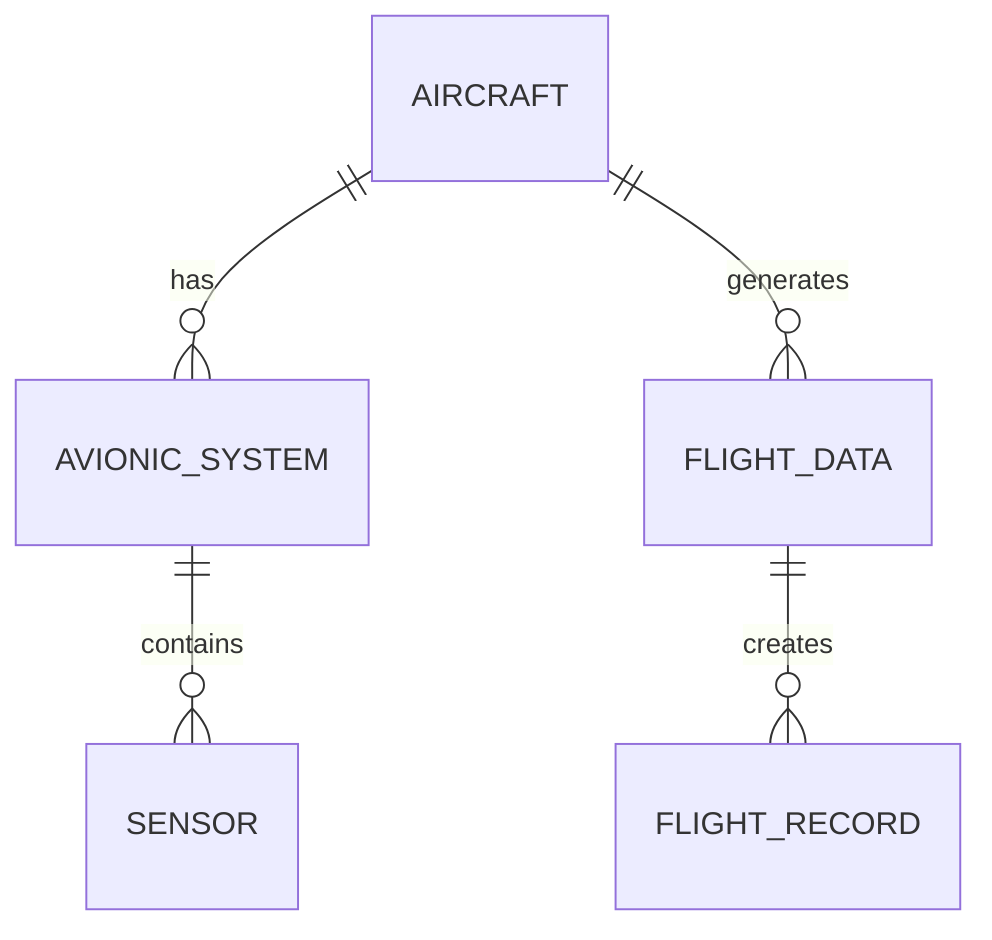

---

title: Delete
type: Atomic Note
course: Database Systems
semester: Autumn 2025
unit: '6'
hub: '[[6_Database_Design_Hub]]'
source: '[[Chapter_6.pdf]]'
source_pages:
- 28
mode: CS-DB
read: false
generated: true
prerequisites:
- '[[Constraint_Definition]]'
- '[[Referential_Integrity_Options]]'
- '[[System_Catalog]]'
- '[[Data_Definition_Language]]'

---


# 1. Mental Model

A database's delete operation can be likened to a librarian removing books from a library's catalog and shelves. Just as the librarian uses specific criteria, such as title or author, to identify the books to be removed, a delete operation uses a WHERE clause to specify which tuples to delete from a relation. The library's catalog, which lists all the books, corresponds to the relation's schema, and the act of removing books from the shelves and updating the catalog corresponds to the delete operation's effect on the relation's data.

# 2. Schema & Query Mechanics

The [[Delete]] operation in SQL is used to remove tuples from a relation. It often includes a [[Where-clause]] to select the tuples to be deleted, and if no WHERE clause is specified, all tuples in the relation are removed. The [[Delete]] statement must be used carefully, as it can be irreversible and may impact referential integrity if not properly managed with [[Constraint_Definition]] and [[Referential_Integrity_Options]]. When executing a [[Delete]] operation, the database system checks the [[System_Catalog]] to ensure that the relation exists and that the user has the necessary permissions. The [[Data_Definition_Language]] provides a way to define the structure of a relation, but it is the [[Delete]] operation that actually removes data from the relation.

# 3. ACID Violations & Scaling Limits

When a delete operation is executed, it must be done in a way that maintains [[Acid]] properties, ensuring that the database remains in a consistent state. If a delete operation is not properly atomic, it may leave the database in an inconsistent state, which can lead to errors or data loss. Additionally, delete operations can be a bottleneck in high-traffic databases, as they can lead to contention and slow performance. As a database scales, delete operations must be carefully managed to prevent [[Acid]] violations and ensure that the database can handle a high volume of transactions. 

| Scaling Issue | Description |
|---|---|
| Atomicity | Ensuring that delete operations are executed as a single, indivisible unit |
| Consistency | Maintaining data consistency across the database after a delete operation |
| Isolation | Preventing interference between delete operations and other transactions |
| Durability | Ensuring that delete operations are persisted even in the event of a failure |

## 4. Entity-Relationship Model



In this Mermaid entity-relationship diagram, the entities and their relationships are represented as follows: 
- `AIRCRAFT`, `AVIONIC_SYSTEM`, `SENSOR`, `FLIGHT_DATA`, and `FLIGHT_RECORD` are entities, which are represented as rectangles.
- The `||--o{` notation represents a 1:N (one-to-many) relationship, indicating that one instance of the entity on the left side can have multiple instances of the entity on the right side.

## 5. Walkthrough

Here are the steps to understand the delete operation in the context of Aerospace Engineering & Avionics:

1. **Initial State**: The aerospace engineering database contains information about various aircraft, their avionics systems, sensors, flight data, and flight records. For example, an aircraft with ID `AC001` has multiple avionics systems, including `AS001` and `AS002`.

2. **Identify for Deletion**: The maintenance team decides to remove the avionics system `AS002` from the aircraft `AC001` because it has been replaced with a newer model. They prepare a delete operation to remove `AS002` from the database.

3. **Delete Operation Prepared**: The SQL delete operation is prepared with a WHERE clause to specify which avionics system to delete: `DELETE FROM AVIONIC_SYSTEM WHERE AVIONIC_SYSTEM_ID = 'AS002'`.

4. **Executing Delete**: The delete operation is executed. The database management system scans the `AVIONIC_SYSTEM` relation, identifies the tuple with `AVIONIC_SYSTEM_ID = 'AS002'`, and removes it.

5. **Cascade or Update**: Depending on the database schema, if there are relationships that require updates when an avionics system is deleted (e.g., logging the removal in a maintenance record), the database either automatically cascades the delete operation or requires manual updates.

6. **Verification**: After deletion, the team verifies that `AS002` is no longer listed in the avionics systems for `AC001` by querying the database: `SELECT * FROM AVIONIC_SYSTEM WHERE AIRCRAFT_ID = 'AC001'`. The result set no longer includes `AS002`.

---

## 6. The Proving Grounds

```interactive-quiz

[
  {
    "id": "q1",
    "type": "true_false",
    "difficulty": "L1",
    "question": "A delete operation in a database removes all tuples from a relation if no WHERE clause is specified.",
    "answer": false,
    "explanation": "A delete operation without a WHERE clause removes all rows from a table, but this statement is often considered dangerous and many databases require a confirmation or have a safeguard against it. However, the statement itself is not inherently false; it is more about best practices and safety features."
  },
  {
    "id": "q2",
    "type": "scenario",
    "difficulty": "L2",
    "question": "Consider a database table 'Employees' with columns 'EmployeeID', 'Name', and 'Department'. A delete operation is executed with the condition WHERE Department = 'HR'. However, just before the operation is finalized, an insert operation adds a new employee to the 'HR' department. What happens to this newly inserted employee?",
    "answer": "The newly inserted employee will be deleted.",
    "explanation": "The delete operation with the specified WHERE clause will remove all rows from the 'Employees' table where Department = 'HR'. If a new employee is inserted into the 'HR' department before the delete operation is finalized, that new employee will also be included in the rows to be deleted, assuming the insert operation is part of the same transaction and the delete operation is executed afterwards or concurrently depending on the database's transaction handling."
  },
  {
    "id": "q3",
    "type": "debug",
    "difficulty": "L3",
    "question": "Find the error.",
    "content": "DELETE FROM Orders WHERE TotalAmount < 0",
    "answer": "The bug is that the delete operation may remove orders with a negative total amount, which could be a valid business case, such as a refund. The fix is to add a safeguard or check to ensure that only orders with a total amount of zero or a specific criteria are deleted, or change the condition to ensure it aligns with business logic, e.g., DELETE FROM Orders WHERE OrderStatus = 'Cancelled' AND TotalAmount > 0.",
    "explanation": "The provided SQL statement seems to delete orders with a negative total amount, which might not be the intended behavior. Orders with a negative total could represent refunds or corrections, and deleting them could lead to data loss. A more appropriate condition should be applied based on the actual requirement, such as order status or other criteria."
  }
]

```