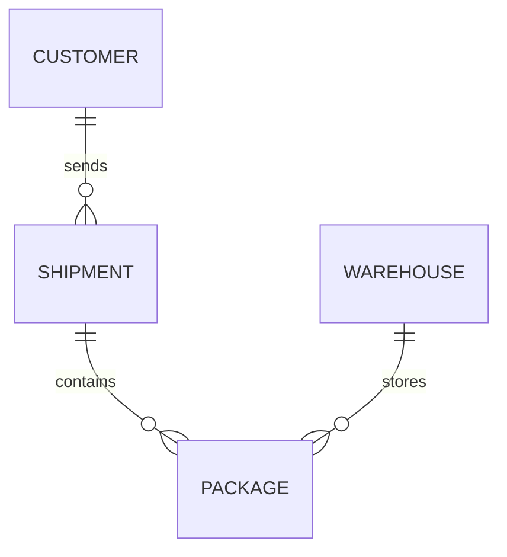

---

title: Drop_Table
type: Atomic Note
course: Database Systems
semester: Autumn 2025
unit: '6'
hub: "[[6_Database_Design_Hub]]"
source: "[[Chapter_6.pdf]]"
source_pages:
- 8
mode: CS-DB
read: false
generated: true
prerequisites:
- "[[Data_Definition_Language]]"

---

# 1. Mental Model

A database's process of dropping a table can be likened to a librarian removing a bookshelf from a library. Just as the bookshelf's structure and organization are erased from the library's catalog and physical space, dropping a table eliminates its structure and data from the database's [[System_Catalog]] and storage. The librarian must ensure that removing the bookshelf does not disrupt the cataloging system or leave dangling references, similar to how a database ensures that dropping a table does not violate referential integrity.

# 2. Schema & Query Mechanics

The [[Drop_Table]] operation is a part of [[Data_Definition_Language]] used to remove a [[Table_Definition]] and its associated data from a [[Sql_Environment]]. When a table is dropped, the database management system updates the [[System_Catalog]] to reflect the removal and frees the storage space allocated to the table. The [[Drop_Table]] statement can be used with or without a cascade option to handle dependent objects. The syntax and behavior of [[Drop_Table]] are defined within [[Sql_Definition]] and its sub-languages. A [[Drop_Table]] operation can be rolled back in systems supporting transactional [[Data_Definition_Language]].

# 3. ACID Violations & Scaling Limits

Dropping a table can lead to ACID violations if not handled properly, particularly in terms of consistency and durability. If a [[Drop_Table]] operation is not atomic, it may leave the database in an inconsistent state where the table's definition and data are partially removed. Additionally, dropping large tables can impact performance and scaling, as it requires significant resources to remove the table's data and update the [[System_Catalog]]. In distributed databases, dropping a table must be handled carefully to ensure that all nodes are updated consistently. Failure to do so can result in data inconsistencies and system instability.

## 4. Entity-Relationship Model



In this Mermaid `erDiagram`, the lines represent relationships between entities. The `||--o{` notation indicates a 1:N (one-to-many) relationship, where the entity on the left (e.g., `SHIPMENT`) can have multiple instances of the entity on the right (e.g., `PACKAGE`), but each instance on the right is associated with only one instance on the left. 

## 5. Walkthrough

Here are the steps to drop a table in a database, situated in the domain of Global Supply Chain & Maritime Logistics:

1. **Identify the table to drop**: The logistics company wants to discontinue tracking a specific type of shipment, `AIR_FREIGHT`, which is no longer a significant part of their business. The database administrator identifies the `AIR_FREIGHT` table in the database schema.

2. **Check dependencies**: The administrator checks if there are any foreign key constraints referencing the `AIR_FREIGHT` table from other tables, such as `SHIPMENT_MANIFEST` or `CUSTOMER_INVOICE`. 

3. **Drop dependent constraints**: If there are dependent constraints, the administrator must first drop them. For example, they might execute a `DROP FOREIGN KEY` statement on the `SHIPMENT_MANIFEST` table's foreign key that references `AIR_FREIGHT`.

4. **Drop the table**: With no more dependencies, the administrator can execute a `DROP TABLE AIR_FREIGHT` statement to remove the table from the database.

5. **Verify removal**: After dropping the table, the administrator queries the database's system catalog to verify that the `AIR_FREIGHT` table no longer exists.

6. **Update documentation**: Finally, the administrator updates the database documentation and notifies relevant stakeholders that the `AIR_FREIGHT` table has been dropped, ensuring that everyone is aware of the change to the database schema.

---

## 6. The Proving Grounds

```interactive-quiz

[
  {
    "id": "q1",
    "type": "true_false",
    "difficulty": "L1",
    "question": "Dropping a table in a database eliminates its structure and data from the database's system catalog and storage.",
    "answer": true,
    "explanation": "This statement is true as dropping a table removes its structure and data from the database's system catalog and storage."
  },
  {
    "id": "q2",
    "type": "scenario",
    "difficulty": "L2",
    "question": "Given that a table has a foreign key constraint referencing another table that has already been dropped, what happens when you try to drop the referencing table?",
    "answer": "The drop operation will fail due to the foreign key constraint.",
    "explanation": "When a table with a foreign key constraint referencing another table is dropped, the database checks for referential integrity. If the referenced table has already been dropped, the drop operation will fail because there's no referenced table to maintain the relationship, highlighting the need to handle such dependencies carefully."
  },
  {
    "id": "q3",
    "type": "debug",
    "difficulty": "L3",
    "question": "Find the error.",
    "content": "CREATE TABLE orders (id INT PRIMARY KEY, customer_id INT, order_date DATE);\nCREATE TABLE customers (id INT PRIMARY KEY, name VARCHAR(255));\nALTER TABLE orders ADD CONSTRAINT fk_customer_id FOREIGN KEY (id) REFERENCES customers(id);",
    "answer": "The bug is in the ALTER TABLE statement where the foreign key 'fk_customer_id' is incorrectly referencing the 'id' column of the 'orders' table instead of the 'customer_id' column. The correct statement should be: ALTER TABLE orders ADD CONSTRAINT fk_customer_id FOREIGN KEY (customer_id) REFERENCES customers(id);",
    "explanation": "The bug causes a logical error where the foreign key constraint is incorrectly established, potentially leading to data inconsistencies and incorrect relationships between the 'orders' and 'customers' tables."
  }
]

```