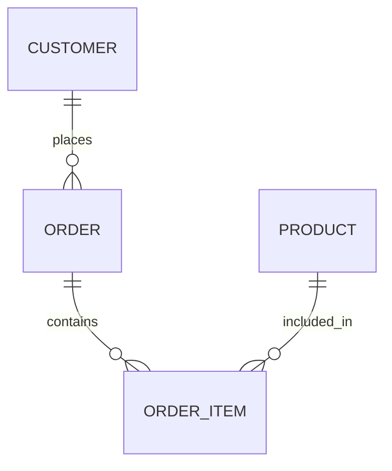

---

title: Explicit_Sets
type: Atomic Note
course: Database Systems
semester: Autumn 2025
unit: '6'
hub: '[[6_Database_Design_Hub]]'
source: '[[Chapter_6.pdf]]'
source_pages:
- 56
mode: CS-DB
read: false
generated: true
prerequisites:
- '[[Create_Table]]'
- '[[Alter_Table]]'
- '[[Drop_Table]]'
- '[[Insert]]'
- '[[Update]]'

---


# 1. Mental Model

The concept of Explicit Sets in SQL queries can be likened to a librarian who knows exactly which books to retrieve from the shelf based on a list provided by a customer. Just as the librarian matches the titles from the list to the books on the shelf, an Explicit Set in a SQL query matches specific values to filter data. The list of values in the Explicit Set is like the customer's list of book titles, and the database's WHERE clause uses it to fetch the relevant data, similar to how the librarian fetches the books.

# 2. Schema & Query Mechanics

When constructing a SQL query, particularly in the WHERE clause, one can utilize an [[Explicit_Sets|explicit_Set]] to filter data based on a predefined list of values. This is achieved by directly listing the values within parentheses after the IN keyword, as seen in queries that might use [[Sql_Sub_Languages|sql_Sub-languages]] for more complex conditions. For instance, a query might use a [[Table_Definition|table]] with specific [[Data_Types|data_Types]] and apply [[Constraint_Definition|constraints]] to ensure data integrity. The [[Data_Definition_Language|ddl]] commands like [[Create_Table]], [[Alter_Table]], and [[Drop_Table]] help in managing these [[Table_Definition|tables]]. Queries that use Explicit Sets can be particularly useful when combined with [[Insert]], [[Update]], and [[Delete]] operations to manage data effectively within an [[Sql_Environment|sql_Environment]].

# 3. ACID Violations & Scaling Limits

When using Explicit Sets in SQL queries, potential issues may arise in terms of scalability and consistency, particularly under high transaction volumes or in distributed database systems. If not properly managed, the use of large Explicit Sets could lead to [[Acid]] violations, such as inconsistencies in data retrieval due to concurrent modifications. Moreover, as the size of the Explicit Set grows, query performance may degrade, hitting scaling limits due to increased processing requirements. In failure states, such as when a query with an Explicit Set encounters a network partition or node failure, the database may struggle to maintain consistency, potentially leading to data anomalies.

## 4. Entity-Relationship Model



In this Mermaid diagram, we have three entities: `CUSTOMER`, `ORDER`, and `PRODUCT`. The lines represent the relationships between them. The `||--o{` line indicates a 1:N (one-to-many) relationship, meaning one customer can place many orders, and one order can contain many order items. The `||--o{` line between `ORDER` and `ORDER_ITEM` indicates that one order can have many order items. The `||--o{` line between `PRODUCT` and `ORDER_ITEM` indicates that one product can be included in many order items.

## 5. Walkthrough

Here are the steps to apply the concept of Entity-Relationship Model in Quantitative Finance & High-Frequency Trading:

1. **Define Entities**: Identify the key entities involved in a high-frequency trading system, such as `TRADER`, `TRADE`, and `SECURITY`. 
2. **Establish Relationships**: Determine the relationships between these entities, e.g., a trader can make many trades, and a trade is associated with one trader and one security.
3. **Model 1:N Relationship**: Represent the relationship between `TRADER` and `TRADE` as a 1:N relationship, indicating that one trader can execute many trades.
4. **Model M:N Relationship**: If a security can be part of many trades and a trade can involve many securities, model this as an M:N relationship between `TRADE` and `SECURITY` using a junction table, e.g., `TRADE_SECURITY`.
5. **Refine the Model**: Refine the entity-relationship model to include additional entities and relationships as needed, such as `ORDER` and `EXECUTION`.
6. **Implement the Model**: Implement the entity-relationship model in a database management system to support high-frequency trading operations, ensuring data consistency and efficient querying.

---

## 6. The Proving Grounds

```interactive-quiz

[
  {
    "id": "q1",
    "type": "true_false",
    "difficulty": "L1",
    "question": "An Explicit Set in SQL is used to match specific values to filter data.",
    "answer": true,
    "explanation": "An Explicit Set in SQL indeed matches specific values to filter data, similar to a librarian retrieving books based on a provided list."
  },
  {
    "id": "q2",
    "type": "scenario",
    "difficulty": "L2",
    "question": "Given a table 'employees' with columns 'name', 'age', and 'department', and an Explicit Set of departments ('HR', 'Finance'), what happens when you use this set in a WHERE clause to filter employees?",
    "answer": "Only employees from 'HR' and 'Finance' departments are retrieved.",
    "explanation": "The WHERE clause uses the Explicit Set to match specific department values, thus filtering the employees table to include only rows where the department is either 'HR' or 'Finance'."
  },
  {
    "id": "q3",
    "type": "debug",
    "difficulty": "L3",
    "question": "Find the error.",
    "content": "SELECT * FROM employees WHERE department IN ('HR', 'Finance') OR age > 30",
    "answer": "The bug is incorrect operator usage; it should be AND if the intention was to get HR/Finance employees over 30, or the condition should be properly grouped for correct logic.",
    "explanation": "The original query seems to intend to retrieve employees from 'HR' or 'Finance' departments who are over 30, but as written, it retrieves all employees from 'HR' or 'Finance' or who are over 30. The correct query depends on the intention: for employees in HR/Finance over 30, it should be WHERE department IN ('HR', 'Finance') AND age > 30."
  }
]

```