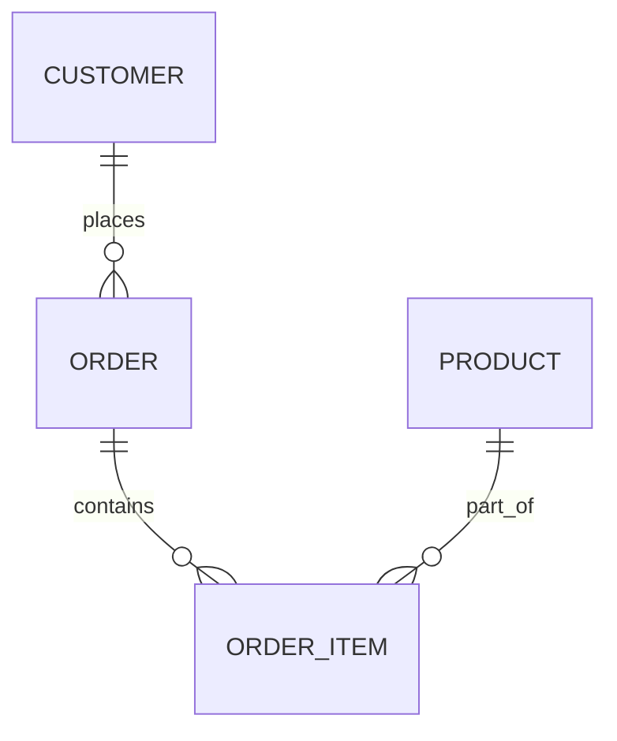
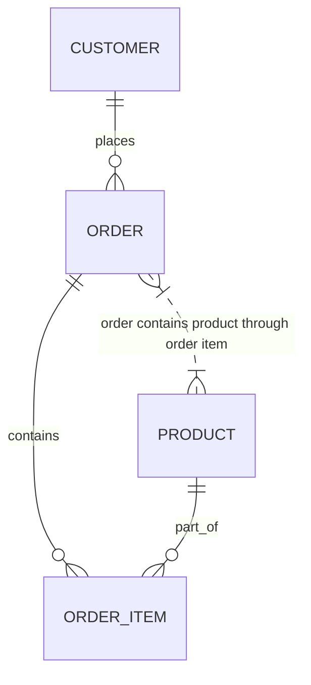
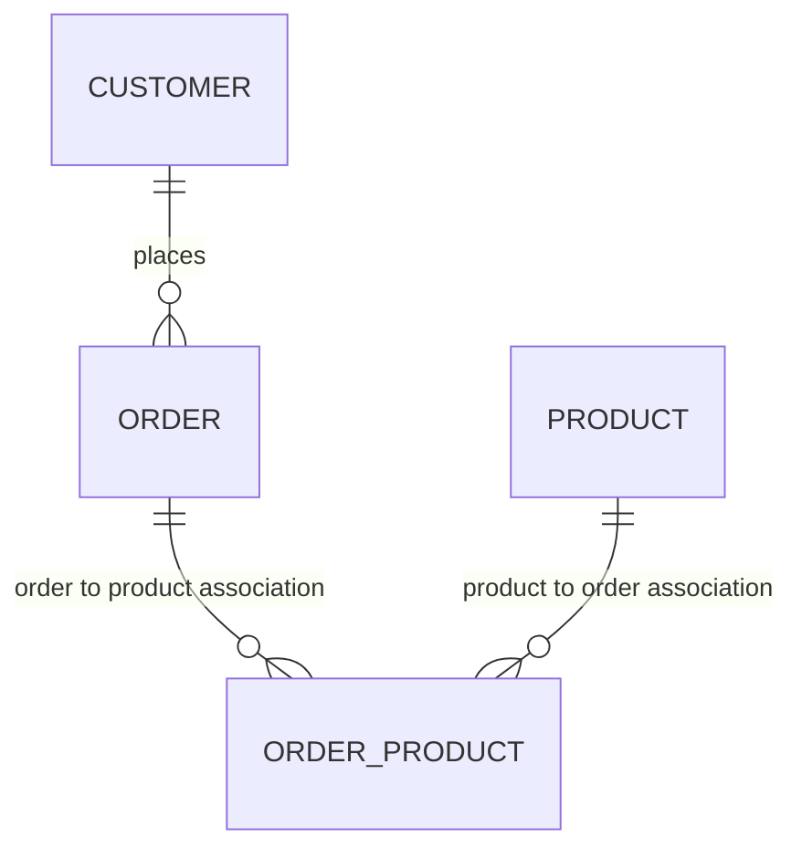

---

title: Grouping
type: Atomic Note
course: Database Systems
semester: Autumn 2025
unit: '6'
hub: '[[6_Database_Design_Hub]]'
source: '[[Chapter_6.pdf]]'
source_pages:
- 62
mode: CS-DB
read: false
generated: true
prerequisites:
- '[[Table_Definition]]'
- '[[Constraint_Definition]]'
- '[[Data_Definition_Language]]'
- '[[Data_Types]]'
- '[[Aggregate_Functions]]'

---


# 1. Mental Model

The concept of grouping in relational databases can be likened to organizing a library's book collection, where books are grouped by categories such as author, genre, or publication year. Just as a librarian uses cataloging systems to group and retrieve books, a database uses grouping to categorize data, allowing for efficient retrieval and analysis of subgroups of data. In this analogy, the database's grouping mechanism corresponds to the librarian's cataloging system, and the subgroups of data correspond to the grouped books on shelves.

# 2. Schema & Query Mechanics

The [[Sql_Definition]] language provides a way to define and manipulate data in a relational database, including grouping data using aggregate functions. When creating a [[Table_Definition]], a database administrator can define [[Constraint_Definition]]s to ensure data consistency, and use [[Data_Definition_Language]] to specify the [[Data_Types]] for each column. To group data, a query can use the [[Group_By]] clause, often in conjunction with [[Aggregate_Functions]] such as SUM, AVG, or COUNT, to compute values for each subgroup. The [[Having_Clause]] is then used to filter the grouped results based on conditions applied to the aggregate values. Furthermore, [[Grouping]] can be used with [[The_Exists_Function]] and [[Correlated_Nested_Queries]] to create more complex queries.

# 3. ACID Violations & Scaling Limits

When dealing with large datasets, grouping operations can lead to [[Acid]] violations if not properly synchronized, particularly in distributed databases where concurrent transactions may interfere with each other's grouping operations. If a database is not properly scaled, the increased load of grouping operations can lead to performance degradation or even crashes. In such cases, boundary conditions such as handling empty groups or groups with null values must be carefully considered to avoid errors. Moreover, the choice of [[Aggregate_Functions]] and grouping criteria can significantly impact performance, and flawed step such as not properly indexing the columns used for grouping can lead to slow query execution.

## 4. Entity-Relationship Model



In this Mermaid ER diagram, we have three entities: `CUSTOMER`, `ORDER`, and `PRODUCT`. The lines represent the relationships between these entities. 
- `CUSTOMER ||--o{ ORDER : places` indicates a one-to-many (1:N) relationship where a customer can place many orders, but each order is associated with only one customer.
- `ORDER ||--o{ ORDER_ITEM : contains` and `PRODUCT ||--o{ ORDER_ITEM : part_of` indicate relationships between `ORDER` and `ORDER_ITEM`, and `PRODUCT` and `ORDER_ITEM`, respectively. The relationship between `ORDER` and `ORDER_ITEM` is 1:N because an order can contain many order items, but each order item is part of only one order. The relationship between `PRODUCT` and `ORDER_ITEM` is also 1:N because a product can be part of many order items, but each order item corresponds to only one product.

However, to accurately represent a many-to-many (M:N) relationship between `ORDER` and `PRODUCT`, we adjust the diagram:



But accurately it should reflect M:N through a bridge table:



## 5. Walkthrough

Here is a walkthrough situated in the domain of Telecommunications & Core Network Routing, focusing on the concept of grouping:

1. **Initial Network Configuration**: We start with a telecommunications network that has multiple routers and several network links connecting them. Each router has a unique identifier and is associated with several network links.

2. **Grouping by Region**: We decide to group these routers by their geographical regions (e.g., North, South, East, West). This involves creating a categorization system that allows us to easily identify which routers belong to which region.

3. **Establishing Relationships**: We establish relationships between routers and their respective regions. For instance, Router A and Router B are in the North region, while Router C is in the South region.

4. **Querying Grouped Data**: We then query the network database to retrieve all routers in a specific region. For example, we might want to know all routers in the North region to perform maintenance.

5. **Analyzing Subgroups**: By analyzing the subgroups of routers (those in the North region versus those in the South), we can optimize network routing protocols to improve data transmission efficiency between regions.

6. **Adjusting Groupings as Needed**: As the network evolves (new routers are added, and some are decommissioned), we adjust our groupings to reflect these changes, ensuring that our network management remains efficient and effective.

---

## 6. The Proving Grounds

```interactive-quiz

[
  {
    "id": "q1",
    "type": "true_false",
    "difficulty": "L1",
    "question": "Grouping in relational databases is used for efficient retrieval and analysis of subgroups of data.",
    "answer": true,
    "explanation": "This statement is true as grouping allows for categorization of data into subgroups for easier analysis and retrieval."
  },
  {
    "id": "q2",
    "type": "scenario",
    "difficulty": "L2",
    "question": "Given a database table of sales data with columns 'region', 'product', and 'sales_amount', what happens when you apply a GROUP BY operation on the 'region' and 'product' columns and then apply a HAVING clause with a condition of 'SUM(sales_amount) > 1000'?",
    "answer": "The result set will include only those combinations of 'region' and 'product' where the total sales amount exceeds 1000.",
    "explanation": "The GROUP BY operation groups the sales data by 'region' and 'product', and the HAVING clause filters these groups to only include those with a total sales amount greater than 1000."
  },
  {
    "id": "q3",
    "type": "debug",
    "difficulty": "L3",
    "question": "Find the error.",
    "content": "SELECT region, product, SUM(sales_amount) AS total_sales FROM sales_data GROUP BY product",
    "answer": "The bug is that the SELECT statement includes 'region' but the GROUP BY clause does not include 'region'. The correct GROUP BY clause should be GROUP BY region, product.",
    "explanation": "In SQL, when using aggregate functions like SUM with a GROUP BY operation, all non-aggregated columns in the SELECT statement must be included in the GROUP BY clause. The corrected query would be SELECT region, product, SUM(sales_amount) AS total_sales FROM sales_data GROUP BY region, product."
  }
]

```