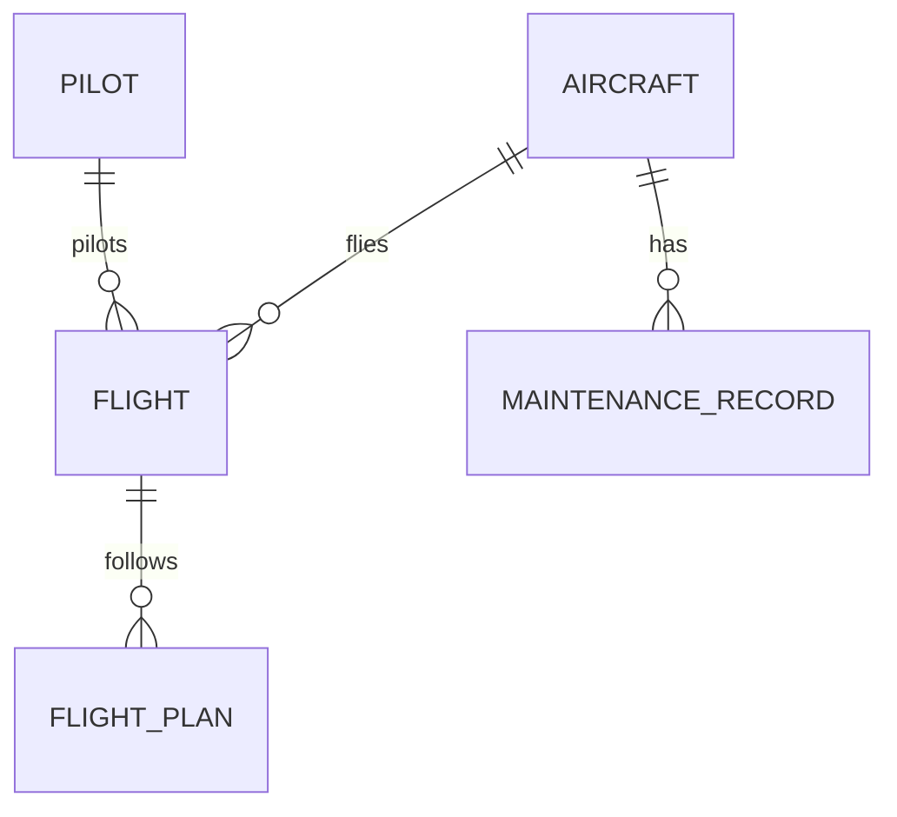

---

title: Insert
type: Atomic Note
course: Database Systems
semester: Autumn 2025
unit: '6'
hub: '[[6_Database_Design_Hub]]'
source: '[[Chapter_6.pdf]]'
source_pages:
- 21
mode: CS-DB
read: false
generated: true
prerequisites:
- '[[Table_Definition]]'
- '[[Data_Types]]'
- '[[Constraint_Definition]]'
- '[[Table_Creation_Steps]]'
- '[[Create_Table]]'

---


# 1. Mental Model

A database's insertion mechanism can be likened to a librarian cataloging new books into a library's collection. Just as the librarian takes in new book information (title, author, publication date, etc.) and adds it to the library's catalog system, which is organized by specific classification rules (e.g., Dewey Decimal System), the database insertion process takes in new data values and adds them to a table, which is structured according to a predefined schema. The schema acts as the cataloging system, ensuring that each piece of data (like a book) is properly categorized and stored.

# 2. Schema & Query Mechanics

The [[Insert]] statement is a part of [[Sql_Definition]] and is used to add data into a [[Table_Definition]]. When executing an [[Insert]], one must specify the [[Table_Name]] and the [[Column]] names that will be populated with data, ensuring that the number and data types of the [[Data_Types]] provided in the [[Values]] clause match the [[Column]] definitions. The [[Insert]] operation is governed by [[Constraint_Definition]] rules, such as [[Primary_Key]] and [[Foreign_Key]] constraints, which are defined during [[Table_Creation_Steps]] using [[Create_Table]]. Additionally, [[Default_Values]] can be specified for columns not included in the [[Insert]] statement, and [[Referential_Integrity_Options]] must be respected to maintain database consistency. The [[System_Catalog]] is implicitly updated with the new data, reflecting changes in a [[Sql_Environment]].

# 3. ACID Violations & Scaling Limits

Insert operations must adhere to [[Acid]] properties to ensure database reliability; failure in any of these (Atomicity, Consistency, Isolation, Durability) can lead to data corruption or inconsistencies. A violation, such as partial insertion due to a failure during the process, can compromise data integrity. At scale, high volumes of concurrent [[Insert]] operations can lead to performance bottlenecks and increased latency, potentially causing [[Deadlocks]] or timeouts. Under heavy load, databases may also experience difficulties maintaining [[Isolation]] levels, leading to anomalies like dirty reads or lost updates.

## 4. Entity-Relationship Model



In this Mermaid `erDiagram`, rectangles represent entities (e.g., `AIRCRAFT`, `PILOT`), and lines with crow's feet represent relationships. The `||--o{` notation indicates a 1:N (one-to-many) relationship, where one instance of the entity on the left can have multiple instances of the entity on the right; for example, one `AIRCRAFT` can be involved in many `FLIGHT`s.

## 5. Walkthrough

1. **Initial Database State**: In an aerospace engineering database, we have two tables: `AIRCRAFT` and `FLIGHT`. The `AIRCRAFT` table stores information about each aircraft, and the `FLIGHT` table stores information about each flight. The `AIRCRAFT` table has columns for `aircraft_id`, `model`, and `year_manufactured`, while the `FLIGHT` table has columns for `flight_id`, `aircraft_id`, `flight_date`, and `pilot_id`.

2. **Insertion Preparation**: We need to insert a new flight into the `FLIGHT` table. The flight is of an existing aircraft with `aircraft_id` = 101, and it will be piloted by a pilot with `pilot_id` = 201. The new flight details are: `flight_date` = '2023-04-01', and the flight will follow a predefined `FLIGHT_PLAN`.

3. **Checking Referential Integrity**: Before inserting the new flight, we verify that the `aircraft_id` (101) exists in the `AIRCRAFT` table and that the `pilot_id` (201) exists in the `PILOT` table to maintain referential integrity.

4. **Inserting the Flight**: We execute an SQL `INSERT` statement into the `FLIGHT` table with the provided details: 

```sql

   INSERT INTO FLIGHT (aircraft_id, flight_date, pilot_id, flight_plan_id)
   VALUES (101, '2023-04-01', 201, 301);

```

5. **Verifying the Insertion**: After executing the `INSERT` statement, we query the `FLIGHT` table to verify that the new flight has been successfully added.

6. **Updating Related Information**: We also need to update the `AIRCRAFT` table's usage records or related maintenance schedules if necessary, based on the new flight insertion, ensuring that all related data is up-to-date.

---

## 6. The Proving Grounds

```interactive-quiz

[
  {
    "id": "q1",
    "type": "true_false",
    "difficulty": "L1",
    "question": "A database's insertion mechanism can be likened to a librarian cataloging new books into a library's collection.",
    "answer": false,
    "explanation": "The statement is an analogy, not a definition. The core concept definition of insert is to add new data to a database table."
  },
  {
    "id": "q2",
    "type": "scenario",
    "difficulty": "L2",
    "question": "Given that a table has a unique constraint on a column, what happens when you try to insert a duplicate value into that column?",
    "answer": "The insertion will fail and an error will be raised.",
    "explanation": "When a table has a unique constraint on a column, it ensures that each value in that column is unique. If you try to insert a duplicate value, the database will prevent the insertion to maintain data integrity."
  },
  {
    "id": "q3",
    "type": "debug",
    "difficulty": "L3",
    "question": "Find the error.",
    "content": "CREATE TABLE customers (id INT PRIMARY KEY, name VARCHAR(255));\nINSERT INTO customers (id, name) VALUES (1, 'John');\nINSERT INTO customers (id, name) VALUES (1, 'Jane');",
    "answer": "The bug is that the second insert statement tries to insert a duplicate primary key value (1). The fix is to use a different id value or to update the existing record.",
    "explanation": "The bug is a logic error. The primary key constraint ensures that each id value is unique. The second insert statement tries to insert a duplicate id value, which will cause an error."
  }
]

```