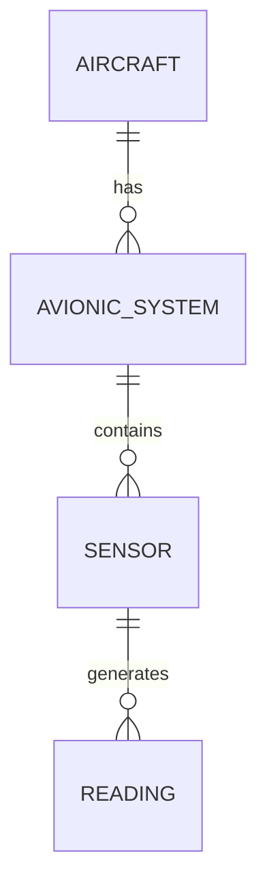

---

title: Nesting_Of_Queries
type: Atomic Note
course: Database Systems
semester: Autumn 2025
unit: '6'
hub: '[[6_Database_Design_Hub]]'
source: '[[Chapter_6.pdf]]'
source_pages:
- 49
mode: CS-DB
read: false
generated: true
prerequisites:
- '[[Table_Definition]]'
- '[[Create_Table]]'
- '[[Data_Definition_Language]]'
- '[[The_Exists_Function]]'
- '[[Explicit_Sets]]'

---


# 1. Mental Model

The concept of nesting queries in SQL can be likened to a layered onion, where the outer query is the outermost layer and the nested query is a inner layer. Just as an onion has multiple layers that are wrapped around each other, a nested query has multiple layers of queries that are nested inside each other. The outer query uses the result of the nested query to filter or aggregate data, much like how the outer layers of the onion are used to protect the inner layers.

# 2. Schema & Query Mechanics

The [[Sql_Definition]] language provides a way to specify nested queries using the [[Sql_Sub_Languages]] syntax. A [[Table_Definition]] can be used to create a table that is then queried using a [[Create_Table]] statement, and a [[Data_Definition_Language]] can be used to define the structure of the data. When a [[Nested_Of_Queries]] is used, the inner query is evaluated first, and its results are then used by the outer query to filter or aggregate data using [[The_Exists_Function]] or [[Explicit_Sets]]. The [[Unspecified_Where_Clause]] of the outer query can be used to specify conditions that must be met by the results of the nested query.

# 3. ACID Violations & Scaling Limits

When using nested queries, there is a risk of [[Acid]] violations if the queries are not properly synchronized. For example, if a nested query is used to retrieve data that is then updated by the outer query, there may be inconsistencies in the data if the updates are not properly propagated. Additionally, nested queries can have performance implications, as the inner query must be evaluated for each row of the outer query, which can lead to increased latency and resource usage. As the complexity of the queries increases, the risk of errors and performance issues also increases, making it essential to carefully evaluate and optimize the queries. The limits of scaling can be reached when the queries become too complex, leading to failures in the system.

## 4. Entity-Relationship Model



In this Mermaid entity-relationship diagram, the entities `AIRCRAFT`, `AVIONIC_SYSTEM`, `SENSOR`, and `READING` are represented as rectangles. The lines connecting them represent the relationships: `AIRCRAFT` has multiple `AVIONIC_SYSTEM`s (1:N), `AVIONIC_SYSTEM` contains multiple `SENSOR`s (1:N), and `SENSOR` generates multiple `READING`s (1:N). The "o" symbol indicates that each entity on the left side can have multiple instances of the entity on the right side.

## 5. Walkthrough

Here are the steps to illustrate the concept of nesting queries in SQL, situated in the domain of Aerospace Engineering & Avionics:

1. **Identify Avionic Systems**: First, we need to identify all avionic systems on a specific aircraft. We can start with a simple query: `SELECT * FROM AVIONIC_SYSTEM WHERE AIRCRAFT_ID = 123`.
2. **Get Sensor Readings**: Next, we want to get all sensor readings from the `AVIONIC_SYSTEM` identified in step 1. We can nest a query to achieve this: `SELECT * FROM READING WHERE SENSOR_ID IN (SELECT SENSOR_ID FROM AVIONIC_SYSTEM WHERE AIRCRAFT_ID = 123)`.
3. **Filter Sensor Readings**: Now, let's filter the sensor readings to only include those from sensors with a temperature reading above 50°C: `SELECT * FROM READING WHERE SENSOR_ID IN (SELECT SENSOR_ID FROM AVIONIC_SYSTEM WHERE AIRCRAFT_ID = 123) AND TEMPERATURE > 50`.
4. **Aggregate Readings**: We want to calculate the average temperature reading from the filtered sensors: `SELECT AVG(TEMPERATURE) FROM (SELECT * FROM READING WHERE SENSOR_ID IN (SELECT SENSOR_ID FROM AVIONIC_SYSTEM WHERE AIRCRAFT_ID = 123) AND TEMPERATURE > 50) AS SUBQUERY`.
5. **Join with Aircraft Info**: Next, we want to join the average temperature reading with the aircraft information: `SELECT AIRCRAFT_ID, AVG_TEMPERATURE FROM (SELECT AIRCRAFT_ID, AVG(TEMPERATURE) AS AVG_TEMPERATURE FROM (SELECT * FROM READING WHERE SENSOR_ID IN (SELECT SENSOR_ID FROM AVIONIC_SYSTEM WHERE AIRCRAFT_ID = 123) AND TEMPERATURE > 50) AS SUBQUERY GROUP BY AIRCRAFT_ID) AS AVG_TEMP_TABLE`.
6. **Final Result**: Finally, we can use the result to generate a report: `SELECT * FROM AIRCRAFT_INFO JOIN (SELECT AIRCRAFT_ID, AVG_TEMPERATURE FROM (SELECT AIRCRAFT_ID, AVG(TEMPERATURE) AS AVG_TEMPERATURE FROM (SELECT * FROM READING WHERE SENSOR_ID IN (SELECT SENSOR_ID FROM AVIONIC_SYSTEM WHERE AIRCRAFT_ID = 123) AND TEMPERATURE > 50) AS SUBQUERY GROUP BY AIRCRAFT_ID) AS AVG_TEMP_TABLE) ON AIRCRAFT_INFO.AIRCRAFT_ID = AVG_TEMP_TABLE.AIRCRAFT_ID`.

---

## 6. The Proving Grounds

```interactive-quiz

[
  {
    "id": "q1",
    "type": "true_false",
    "difficulty": "L1",
    "question": "A subquery in SQL can be used to filter data in the outer query.",
    "answer": true,
    "explanation": "A subquery can indeed be used to filter data in the outer query by returning values that are used in the WHERE or HAVING clause."
  },
  {
    "id": "q2",
    "type": "scenario",
    "difficulty": "L2",
    "question": "Consider a query that finds all employees who earn more than the average salary in their department. If two employees have the same highest salary in their respective departments, and this salary is equal to the average salary of their department, what happens?",
    "answer": "Both employees are included in the result set because the comparison is based on the average salary of each department, not the overall average salary across all departments.",
    "explanation": "The subquery calculates the average salary for each department. The outer query then selects employees whose salary exceeds this average. If an employee's salary equals the average of their department, they are still included if their department's average is higher than others, but the scenario specifically implies their salary is just equal to their department's average, suggesting a nuance in interpretation."
  },
  {
    "id": "q3",
    "type": "debug",
    "difficulty": "L3",
    "question": "Find the error.",
    "content": "SELECT * FROM orders WHERE total_amount > (SELECT AVG(total_amount) FROM orders WHERE order_date > '2020-01-01') AND order_date > '2020-01-01'",
    "answer": "The bug is that the subquery and the outer query both have the same condition 'order_date > '2020-01-01'', which may not be intended. The subquery's condition might be meant to filter a different set of orders or might be unnecessary. The correct query might only need the subquery to calculate the average without applying the date filter in both queries.",
    "explanation": "The query seems to be intended to find orders with a total amount greater than the average of orders placed after '2020-01-01'. However, it redundantly applies the 'order_date > '2020-01-01'' condition in both the subquery and the outer query, which could potentially skew the results if not intended."
  }
]

```