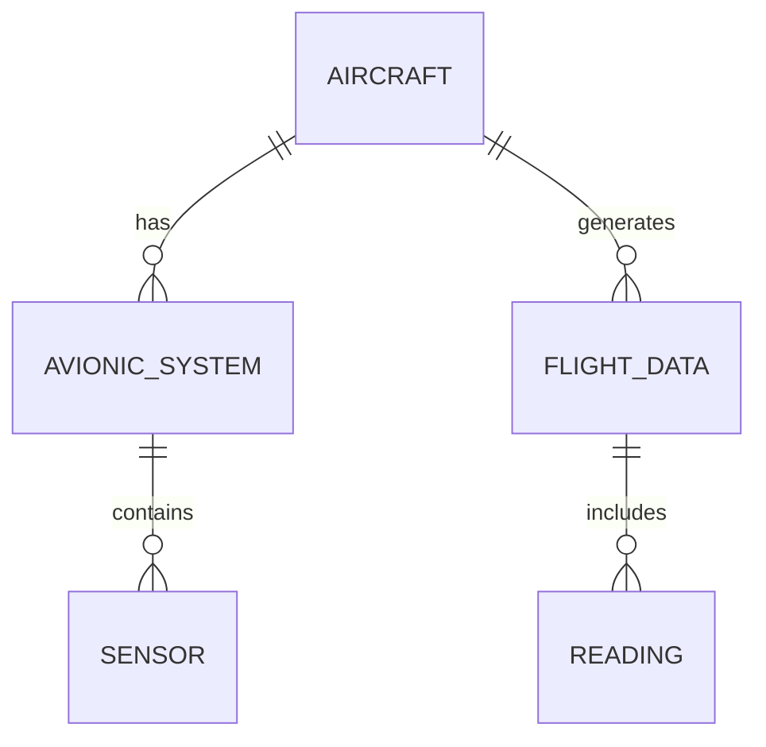

---

title: Nulls_In_Sql_Queries
type: Atomic Note
course: Database Systems
semester: Autumn 2025
unit: '6'
hub: '[[6_Database_Design_Hub]]'
source: '[[Chapter_6.pdf]]'
source_pages:
- 58
mode: CS-DB
read: false
generated: true
prerequisites:
- '[[Table_Definition]]'
- '[[Data_Definition_Language]]'
- '[[Create_Table]]'
- '[[Alter_Table]]'
- '[[Constraint_Definition]]'

---


# 1. Mental Model

A database's handling of null values can be likened to a librarian managing books with missing information. Just as a librarian might use a special notation to indicate that a book's publication date is unknown, a database uses null to signify that a value is missing or undefined. When querying the database, the query mechanism searches through these entries much like a patron searching through a catalog for books with specific publication dates, and the database must accurately retrieve or exclude entries based on whether they have a null value.

# 2. Schema & Query Mechanics

In SQL, the [[Sql_Definition]] allows for the presence of null values in a [[Table_Definition]], which can be managed through [[Data_Definition_Language]] statements like [[Create_Table]] and [[Alter_Table]]. When creating a table, one can specify [[Constraint_Definition]]s to limit the type of data entered, but [[Nulls_In_Sql_Queries]] require special handling. The [[Sql_Sub_Languages]] include mechanisms to check for null values, such as the [[Using_Distinct]] and [[The_Exists_Function]] clauses, and [[Aggregate_Functions]] can be used to group and analyze data while handling nulls. Queries that include [[Nulls_In_Sql_Queries]] must carefully consider how to evaluate and return results.

# 3. ACID Violations & Scaling Limits

When dealing with [[Nulls_In_Sql_Queries]], databases must ensure that transactions adhere to ACID principles to maintain data consistency, particularly in the presence of null values that might lead to inconsistencies. A failure to properly handle nulls can lead to [[Acid]] violations, such as inconsistent reads or writes, especially in a distributed database system. If a database is not properly scaled, the increased load can exacerbate issues with null handling, leading to slower query performance or incorrect results. Ensuring that databases are designed and scaled with proper handling of null values is crucial for maintaining data integrity.

## 4. Entity-Relationship Model



In this Mermaid diagram, we illustrate entity-relationship models relevant to aerospace engineering and avionics. The lines represent relationships: `||--o{` denotes a 1:N (one-to-many) relationship, where one instance of the entity on the left can have multiple instances of the entity on the right. For example, an `AIRCRAFT` can have multiple `AVIONIC_SYSTEM`s, and an `AVIONIC_SYSTEM` can contain multiple `SENSOR`s.

## 5. Walkthrough

1. **Initial Schema Setup**: Consider a database schema for an aerospace engineering application that tracks `AIRCRAFT`, their `AVIONIC_SYSTEM`s, and related `SENSOR` data. Initially, the schema might look like the entity-relationship diagram above, with `AIRCRAFT`, `AVIONIC_SYSTEM`, `SENSOR`, `FLIGHT_DATA`, and `READING` entities and their defined relationships.

2. **Introducing Null Values**: When inserting data into this schema, some values might be unknown or missing, such as the `SENSOR` type for a newly installed `AVIONIC_SYSTEM`. In SQL, we would represent such a missing value with `NULL`.

3. **Querying with Nulls**: Suppose we want to query all `AVIONIC_SYSTEM`s that have an unknown `SENSOR` type. We could use a SQL query like `SELECT * FROM AVIONIC_SYSTEM WHERE SENSOR_TYPE IS NULL;` to find these entries.

4. **Handling Nulls in Comparisons**: When comparing values in SQL queries, `NULL` can behave unexpectedly. For instance, `NULL = NULL` evaluates to `NULL`, not `TRUE`. Therefore, to check if two values are equal, including when they are `NULL`, we use `IS NOT DISTINCT FROM` in some SQL dialects.

5. **Using COALESCE for Defaults**: The `COALESCE` function returns the first non-`NULL` value from a list. We can use it to provide default values when `NULL` is encountered, such as `SELECT COALESCE(SENSOR_TYPE, 'Unknown') FROM AVIONIC_SYSTEM;`.

6. **Indexing for Efficient Queries**: To improve the performance of queries that frequently filter on `NULL` values, consider creating an index on the relevant column, such as `CREATE INDEX idx_SENSOR_TYPE ON AVIONIC_SYSTEM (SENSOR_TYPE);`. This can speed up queries like the one in step 3.

---

## 6. The Proving Grounds

```interactive-quiz

[
  {
    "id": "q1",
    "type": "true_false",
    "difficulty": "L1",
    "question": "In SQL, a null value represents a missing or undefined value.",
    "answer": true,
    "explanation": "This is a fundamental concept in SQL, where null values are used to indicate missing or unknown data."
  },
  {
    "id": "q2",
    "type": "scenario",
    "difficulty": "L2",
    "question": "Suppose you have a table 'employees' with a column 'salary' that can be null. You want to find all employees with a salary greater than 50000. What happens if you use the query 'SELECT * FROM employees WHERE salary > 50000'?",
    "answer": "The query will not return any rows where salary is null, because null cannot be compared to a number using the greater-than operator. To include rows with null salaries, you would need to use 'IS NOT NULL' or 'IS NULL' conditions.",
    "explanation": "This scenario tests understanding of how null values interact with comparison operators in SQL queries."
  },
  {
    "id": "q3",
    "type": "debug",
    "difficulty": "L3",
    "question": "Find the error.",
    "content": "SELECT name, AVG(salary) AS average_salary FROM employees GROUP BY name HAVING AVG(salary) > 50000 OR salary IS NULL",
    "answer": "The bug is that the column 'salary' is not included in the GROUP BY clause or an aggregate function. The correct query should be 'SELECT name, AVG(salary) AS average_salary FROM employees GROUP BY name HAVING AVG(salary) > 50000 OR MAX(salary) IS NULL'. However, the logic might still be flawed depending on the exact requirements.",
    "explanation": "The error is a non-trivial logic issue related to the use of aggregate functions and null values in SQL queries."
  }
]

```