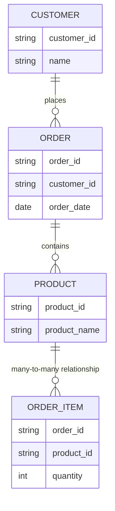

---

title: Qualifying_Attribute_Names
type: Atomic Note
course: Database Systems
semester: Autumn 2025
unit: '6'
hub: '[[6_Database_Design_Hub]]'
source: '[[Chapter_6.pdf]]'
source_pages:
- 41
mode: CS-DB
read: false
generated: true
prerequisites:
- '[[Table_Definition]]'
- '[[Data_Definition_Language]]'
- '[[Constraint_Definition]]'
- '[[Create_Table]]'
- '[[Data_Types]]'

---


# 1. Mental Model

A relational database's attribute qualification mechanism can be likened to a large library's book cataloging system, where each book (representing a relation) has multiple attributes (like title, author, publication date) that must be uniquely identified. Just as books are organized with unique identifiers (like ISBN) and catalog entries specify which book an attribute (like author name) belongs to, in a relational database, qualifying an attribute name with its relation name disambiguates attributes with the same name across different relations. This ensures that queries accurately retrieve or manipulate data from the correct relation.

# 2. Schema & Query Mechanics

In relational databases, the [[Sql_Definition]] includes mechanisms for defining and manipulating data. When creating a [[Table_Definition]], one must consider the [[Data_Definition_Language]] and the use of [[Constraint_Definition]] to enforce data integrity. The [[Create_Table]] statement allows for the specification of [[Data_Types]] and [[Default_Values]], and modifications can be made with [[Alter_Table]] or [[Drop_Table]]. Queries that involve multiple tables with common attribute names must use [[Qualifying_Attribute_Names]] to avoid ambiguity, ensuring that the correct attributes are referenced in [[Insert]], [[Update]], and [[Delete]] operations.

# 3. ACID Violations & Scaling Limits

When qualifying attribute names is neglected, it can lead to ambiguity in queries, potentially causing incorrect data retrieval or modification, which violates the consistency principle of ACID (Atomicity, Consistency, Isolation, Durability). In a scaled database environment, such ambiguity can lead to increased latency and decreased performance as the system struggles to accurately process queries. Failure to properly qualify attribute names can result in [[Unspecified_Where_Clause]] and [[Using_Star]] issues, complicating query optimization. Moreover, as databases grow and more relations are added, the likelihood and impact of such errors increase, necessitating careful schema design and rigorous query validation.

## 4. Entity-Relationship Model



In this Mermaid entity-relationship diagram, `CUSTOMER`, `ORDER`, `PRODUCT`, and `ORDER_ITEM` represent entities, and the lines between them denote relationships: a customer can place many orders (1:N), an order is associated with one customer, an order can contain many products through order items (M:N), and a product can be part of many orders. Each entity's attributes are listed within its box.

## 5. Walkthrough

1. **Initial Schema State**: In a relational database for a telecommunications company, we have two tables: `CALLS` and `CUSTOMERS`. The `CALLS` table has attributes `call_id`, `customer_id`, and `call_date`, while the `CUSTOMERS` table has attributes `customer_id`, `name`, and `address`. However, there's a need to uniquely identify each customer's call records.

2. **Identifying Qualification Need**: We notice that both `CALLS` and `CUSTOMERS` have a `customer_id` attribute. If we want to join these tables on this attribute, we must qualify the attribute name to avoid ambiguity.

3. **Qualifying Attribute Names**: When we write a SQL query to join these tables, we qualify the `customer_id` attribute with its table name. For example: `SELECT CALLS.customer_id, CUSTOMERS.name FROM CALLS JOIN CUSTOMERS ON CALLS.customer_id = CUSTOMERS.customer_id`.

4. **Introducing a New Table**: To manage core network routing information, we introduce a new table `ROUTES` with attributes `route_id`, `route_name`, and `customer_id`. This table will store routing information for each customer.

5. **Qualification in Joined Tables**: When joining `CALLS`, `CUSTOMERS`, and `ROUTES` tables, we must qualify attribute names to ensure clarity. For instance, `CALLS.customer_id` refers to the customer ID in the `CALLS` table, while `CUSTOMERS.customer_id` and `ROUTES.customer_id` refer to their respective tables.

6. **Final Qualified Query**: A final query that joins these tables and qualifies all attribute names could look like: `SELECT CALLS.call_id, CUSTOMERS.name, ROUTES.route_name FROM CALLS JOIN CUSTOMERS ON CALLS.customer_id = CUSTOMERS.customer_id JOIN ROUTES ON CUSTOMERS.customer_id = ROUTES.customer_id`. This ensures that there's no confusion about which table each attribute comes from.

---

## 6. The Proving Grounds

```interactive-quiz

[
  {
    "id": "q1",
    "type": "true_false",
    "difficulty": "L1",
    "question": "In a relational database, qualifying an attribute name with its relation name is necessary to avoid ambiguity when two relations have attributes with the same name.",
    "answer": true,
    "explanation": "Qualifying an attribute name with its relation name helps to uniquely identify the attribute, especially when multiple relations have attributes with the same name."
  },
  {
    "id": "q2",
    "type": "scenario",
    "difficulty": "L2",
    "question": "Consider two relations, 'Employees' and 'Departments', both having an attribute named 'Location'. If a query joins these two relations on a common attribute, what happens when the attribute 'Location' is referenced without qualification?",
    "answer": "The query will be ambiguous and may produce incorrect results or an error, because the database system cannot determine which relation's 'Location' attribute is being referred to.",
    "explanation": "Without qualification, the database system cannot uniquely identify which 'Location' attribute to use, leading to potential errors or ambiguity in query results."
  },
  {
    "id": "q3",
    "type": "debug",
    "difficulty": "L3",
    "question": "Find the error.",
    "content": "SELECT * FROM Employees e JOIN Departments d ON e.DepartmentID = d.DepartmentID SELECT e.Name, d.Location",
    "answer": "The bug is that the SELECT clause is repeated. The correct query should be 'SELECT e.Name, d.Location FROM Employees e JOIN Departments d ON e.DepartmentID = d.DepartmentID'.",
    "explanation": "The SQL query has a repeated SELECT clause which is syntactically incorrect. The corrected query properly specifies the columns to select and the relations to join."
  }
]

```