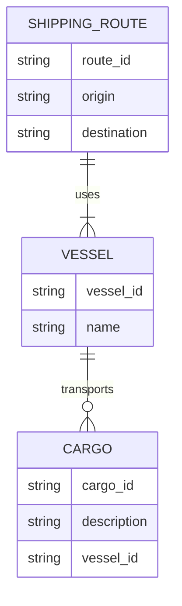

---

title: Referential_Integrity_Options
type: Atomic Note
course: Database Systems
semester: Autumn 2025
unit: '6'
hub: "[[6_Database_Design_Hub]]"
source: "[[Chapter_6.pdf]]"
source_pages:
- 12
mode: CS-DB
read: false
generated: true
prerequisites:
- "[[Create_Table]]"

---

# 1. Mental Model

The concept of Referential Integrity Options can be likened to a library's cataloging system, where books are associated with specific authors. In this analogy, the primary key of an author's record (e.g., author ID) is like a unique identifier in the catalog, and the foreign key in a book's record (e.g., author ID) ensures that only existing authors can be referenced. When an author's record is updated or deleted, the library's catalog must be updated accordingly to maintain consistency, much like how referential integrity options (e.g., ON UPDATE CASCADE, ON DELETE SET NULL) dictate the fate of dependent records.

# 2. Schema & Query Mechanics

In relational databases, [[Referential_Integrity_Options]] are defined using [[Foreign_Key]] constraints, which link a [[Table_Definition]] to another table's [[Primary_Key]]. When creating a table, [[Create_Table]] statements can include [[Constraint_Definition]]s that specify referential integrity options, such as [[On_Delete]] and [[On_Update]] actions. For example, the [[Create_Table]] statement for the DEPT table includes a [[Foreign_Key]] constraint that references the EMP table's ESSN column, with [[On_Delete_Set_Null]] and [[On_Update_Cascade]] options. The [[Data_Definition_Language]] (DDL) is used to define and modify these constraints. The [[System_Catalog]] maintains metadata about these constraints, ensuring that the database enforces referential integrity.

# 3. ACID Violations & Scaling Limits

When referential integrity options are not properly configured, it can lead to [[Acid]] violations, such as inconsistent data states. For instance, if a parent table's primary key is updated, but dependent tables are not updated accordingly, it can result in orphaned or inconsistent records. In a high-traffic database, poorly designed referential integrity options can become a scaling bottleneck, as the database must perform additional checks to maintain consistency. If not properly managed, these issues can lead to data corruption or system crashes, highlighting the importance of carefully designing and testing referential integrity options.

## 4. Entity-Relationship Model



In this Mermaid entity-relationship diagram, we have three entities: `VESSEL`, `CARGO`, and `SHIPPING_ROUTE`. The lines connecting them represent relationships: a vessel can transport many cargo items (1:N), and a shipping route can be used by many vessels (M:N), but for simplicity and focus, we've depicted a direct relationship between `VESSEL` and `CARGO` and another between `SHIPPING_ROUTE` and `VESSEL`. Each entity's attributes are listed within its box.

## 5. Walkthrough

Here is a walkthrough on Referential Integrity Options in the context of Global Supply Chain & Maritime Logistics:

1. **Initial Setup**: Consider a database schema for managing maritime logistics, including tables for `VESSELS`, `CARGO`, and `SHIPPING_ROUTES`. A vessel can transport many cargo items, establishing a 1:N relationship between `VESSELS` and `CARGO`.

2. **Defining Relationships**: When creating the `CARGO` table, we include a foreign key `vessel_id` that references the `vessel_id` in the `VESSELS` table. This establishes the relationship between cargo items and their respective vessels.

3. **Applying Referential Integrity**: To ensure data consistency, we can apply referential integrity options. For instance, if a vessel is deleted from the `VESSELS` table, we might want to automatically delete all cargo items associated with it. This can be achieved by setting `ON DELETE CASCADE` for the foreign key `vessel_id` in the `CARGO` table.

4. **Update Scenario**: If the `vessel_id` of a vessel in the `VESSELS` table is updated, we might want all associated cargo items in the `CARGO` table to reflect this change automatically. This can be achieved by setting `ON UPDATE CASCADE` for the foreign key.

5. **Choosing Actions**: The choice of referential integrity action (e.g., `ON DELETE SET NULL`, `ON DELETE RESTRICT`, `ON UPDATE CASCADE`) depends on the business requirements. For example, `ON DELETE SET NULL` might be used if we want to allow deletion of a vessel but still keep the cargo items, marking them as disassociated.

6. **Implementation**: Implementing these referential integrity options requires careful consideration of the potential impacts on data and database operations. For instance, setting `ON DELETE CASCADE` could lead to unintended deletions if not thoroughly understood. Therefore, testing these settings in a development environment before deployment is crucial.

---

## 6. The Proving Grounds

```interactive-quiz

[
  {
    "id": "q1",
    "type": "true_false",
    "difficulty": "L1",
    "question": "Referential integrity ensures that a foreign key value exists in the referenced table's primary key column.",
    "answer": true,
    "explanation": "This statement is true. Referential integrity is a concept in database design that ensures the consistency of relationships between tables. It guarantees that a foreign key value in one table corresponds to an existing primary key value in another table."
  },
  {
    "id": "q2",
    "type": "scenario",
    "difficulty": "L2",
    "question": "Suppose you have two tables, 'authors' and 'books', with a foreign key 'author_id' in 'books' referencing 'id' in 'authors'. If an author's record is deleted from the 'authors' table, what happens to the related books in the 'books' table by default?",
    "answer": "The related books will not be automatically deleted and will have a 'dangling reference', i.e., they will still exist in the 'books' table but will no longer have a valid author associated with them.",
    "explanation": "By default, if an author's record is deleted from the 'authors' table, the related books in the 'books' table will still exist but will have an invalid or null reference to the author. This could lead to inconsistencies and errors when trying to access or manipulate the data. To maintain referential integrity, actions like ON DELETE CASCADE, ON DELETE SET NULL, or ON DELETE SET DEFAULT can be specified."
  },
  {
    "id": "q3",
    "type": "debug",
    "difficulty": "L3",
    "question": "Find the error.",
    "content": "CREATE TABLE authors (\n  id INT PRIMARY KEY,\n  name VARCHAR(255)\n);\n\nCREATE TABLE books (\n  id INT PRIMARY KEY,\n  title VARCHAR(255),\n  author_id INT,\n  FOREIGN KEY (author_id) REFERENCES authors(id) ON DELETE SET NULL\n);",
    "answer": "The bug is that the author_id column in the books table is not nullable. When an author's record is deleted, the corresponding books will have their author_id set to NULL, but since author_id is not nullable, this will cause an error. The fix is to make the author_id column nullable by changing its definition to author_id INT NULL.",
    "explanation": "The bug in the given SQL code is that it does not allow the author_id in the books table to be null, but the ON DELETE SET NULL action specified in the foreign key constraint would set the author_id to null when the referenced author is deleted. This inconsistency will cause an error when trying to delete an author. To fix this, the author_id column should be defined as nullable."
  }
]

```