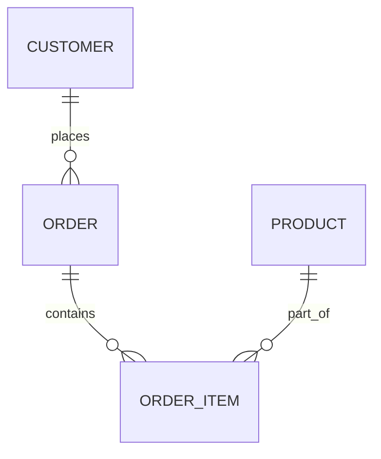

---

title: Sql_Sub_Languages
type: Atomic Note
course: Database Systems
semester: Autumn 2025
unit: '6'
hub: "[[6_Database_Design_Hub]]"
source: "[[Chapter_6.pdf]]"
source_pages:
- 2
mode: CS-DB
read: false
generated: true
prerequisites:
- "[[Sql_Definition]]"

---

# 1. Mental Model

The concept of SQL sublanguages can be likened to the different sections of a library, where each section serves a specific purpose. Just as a library has separate sections for fiction, non-fiction, reference materials, and archives, SQL sublanguages have distinct roles: DDL (Data Definition Language) is like the library's cataloging system, defining and organizing the books (data structures); DML (Data Manipulation Language) is like the circulation desk, handling the borrowing and returning of books (data); DCL (Data Control Language) is like the library's security and access control, determining who can access which materials; and TCL (Transaction Control Language) is like the librarian's tools for managing the circulation process, ensuring that transactions are properly handled. This analogy highlights how each SQL sublanguage has a specific function in managing and interacting with data.

# 2. Schema & Query Mechanics

SQL sublanguages, including [[Data_Definition_Language]], [[Data_Manipulation_Language]], [[Data_Control_Language]], and [[Transaction_Control_Language]], work together to provide a comprehensive environment for database management. The [[Data_Definition_Language]] is used for defining and modifying the structure of database objects through statements like [[Create_Table]], [[Alter_Table]], and [[Drop_Table]], which interact with the [[System_Catalog]]. The [[Data_Manipulation_Language]] allows for the manipulation of data within these structures using [[Insert]], [[Update]], and [[Delete]] statements. Meanwhile, [[Data_Control_Language]] and [[Transaction_Control_Language]] manage access and transactions, ensuring data integrity through mechanisms like [[Constraint_Definition]] and [[Referential_Integrity_Options]]. The [[Sql_Environment]] relies on these sublanguages to manage and interact with database objects effectively.

# 3. ACID Violations & Scaling Limits

When SQL sublanguages are not properly utilized, it can lead to ACID (Atomicity, Consistency, Isolation, Durability) violations, particularly in transaction management handled by [[Transaction_Control_Language]]. For instance, if transactions are not correctly committed or rolled back, it can compromise the atomicity and consistency of database operations. As databases scale, the improper use of [[Data_Manipulation_Language]] and [[Data_Control_Language]] can lead to isolation issues, where transactions interfere with each other. Furthermore, durability can be affected if [[Data_Definition_Language]] operations are not properly synchronized across the system, potentially leading to data loss or inconsistencies in the event of a failure. Ensuring strict adherence to ACID principles across all SQL sublanguages is crucial for maintaining database integrity under scaling conditions.

## 4. Entity-Relationship Model



In this Mermaid `erDiagram`, the lines represent relationships between entities. A line with a "||--o{" indicates a 1:N (one-to-many) relationship, where the entity on the left can have multiple instances of the entity on the right; for example, a single `CUSTOMER` can place multiple `ORDER`s.

## 5. Walkthrough

Here are the steps for a walkthrough in the context of Telecommunications & Core Network Routing, focusing on SQL sublanguages:

1. **Network Planning**: The telecommunications company needs to plan its network infrastructure. Using DDL (Data Definition Language), the network architect creates a database schema to define the structure of the network, including tables for `CUSTOMERS`, `ORDERS` (for service requests), and `PRODUCTS` (for network devices).

2. **Service Request**: A customer requests a new network service. The request is recorded in the database using DML (Data Manipulation Language), which involves inserting a new record into the `ORDERS` table and specifying the type of service and products required.

3. **Order Processing**: The order is processed by updating the status in the `ORDERS` table and adding specific network configurations to the `ORDER_ITEMS` table. This step heavily involves DML to manipulate the data.

4. **Access Control**: To ensure that only authorized personnel can access or modify network configurations, DCL (Data Control Language) is used. The network administrator grants specific permissions to users or roles, controlling who can view or modify the network service orders.

5. **Inventory Management**: When new network devices are acquired, the inventory database needs to be updated. DML is used again to insert records into the `PRODUCTS` table, reflecting the addition of new devices.

6. **Auditing and Reporting**: For auditing purposes, a report of all network service orders and their current status is needed. This involves querying the database using DQL (Data Query Language), a subset of SQL focused on retrieving data, to generate the report based on the data in the `ORDERS` and `ORDER_ITEMS` tables.

---

## 6. The Proving Grounds

```interactive-quiz

[
  {
    "id": "q1",
    "type": "true_false",
    "difficulty": "L1",
    "question": "Is DDL (Data Definition Language) used for modifying data in a database?",
    "answer": false,
    "explanation": "DDL is used for defining and modifying the structure of a database, not for modifying data. DML (Data Manipulation Language) is used for modifying data."
  },
  {
    "id": "q2",
    "type": "scenario",
    "difficulty": "L2",
    "question": "Given that a database administrator wants to add a new column to an existing table without losing any data, what SQL sublanguage would they use and why?",
    "answer": "The administrator would use DDL. This is because DDL allows for the definition and modification of the database structure, such as adding a new column to an existing table, which can be done using the ALTER TABLE statement.",
    "explanation": "DDL is used for such structural modifications, ensuring that the existing data remains intact."
  },
  {
    "id": "q3",
    "type": "debug",
    "difficulty": "L3",
    "question": "Find the error.",
    "content": "CREATE TABLE users (id INT PRIMARY KEY, name VARCHAR(255));\nINSERT INTO users (id, name) VALUES (1, 'John');\nALTER TABLE users ADD COLUMN email VARCHAR(255) NOT NULL DEFAULT '';",
    "answer": "The bug is that the new column 'email' is being added with a NOT NULL constraint and a default value of an empty string. This will cause an error for existing rows because there is no value provided for the new column. The fix is to allow NULL values or provide a DEFAULT value that is not an empty string, or to add the column with a NULL constraint and then update the column with a valid value.",
    "explanation": "The ALTER TABLE statement adds a new column with a NOT NULL constraint but does not provide a value for existing rows, which will result in an error."
  }
]

```