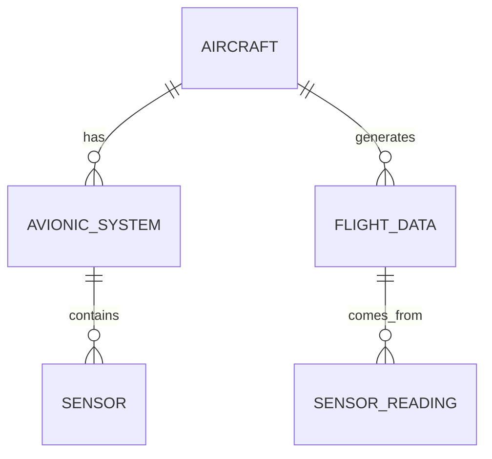

---

title: Set_Operations
type: Atomic Note
course: Database Systems
semester: Autumn 2025
unit: '6'
hub: '[[6_Database_Design_Hub]]'
source: '[[Chapter_6.pdf]]'
source_pages:
- 48
mode: CS-DB
read: false
generated: true
prerequisites:
- '[[Table_Definition]]'
- '[[Data_Definition_Language]]'
- '[[Data_Types]]'
- '[[System_Catalog]]'
- '[[Table_Creation_Steps]]'

---


# 1. Mental Model

A relational database's set operations can be thought of as similar to a librarian managing books from different collections. Just as the librarian combines books from various shelves (tables) to fulfill a request, set operations in SQL combine rows from different tables to produce a unified result set. The `UNION` operation, for instance, is akin to merging two shelves of books into one, ensuring that each book (or row) appears only once, much like how a librarian would avoid duplicates.

# 2. Schema & Query Mechanics

The mechanics of set operations in SQL involve combining rows from two or more tables based on specific conditions. [[Sql_Definition]] provides the foundation for understanding how [[Sql_Sub_Languages]] interact with [[Table_Definition]] and [[Data_Definition_Language]] to create and manage data. When performing set operations like `UNION`, `INTERSECT`, or `EXCEPT`, SQL queries draw from [[Table_Definition]] and [[Data_Types]] to ensure compatibility between the tables being combined. For example, a `UNION` operation between two tables requires that both tables have the same number of columns and compatible [[Data_Types]] in each column. The [[System_Catalog]] plays a crucial role in managing these operations by keeping track of [[Table_Creation_Steps]] and [[Constraint_Definition]].

# 3. ACID Violations & Scaling Limits

Set operations in SQL can lead to ACID violations if not handled properly, particularly in terms of consistency and isolation. For instance, if two transactions are executing a `UNION` operation simultaneously, there's a risk of inconsistent results if one transaction modifies the tables being queried by the other. Moreover, as databases scale, set operations can become a bottleneck, especially when dealing with large tables. This is because operations like `INTERSECT` and `EXCEPT` require the database to scan through entire tables to find matching or non-matching rows, which can lead to performance degradation. 

| Operation | Description | Potential Issue |
|-----------|-------------|---------------|
| UNION     | Combines rows from two tables | Duplicate rows if not handled |
| INTERSECT | Returns rows common to both tables | Performance degradation with large tables |
| EXCEPT    | Returns rows from one table not in another | Inconsistent results if transactions interfere | 

To debug, one might start by checking for [[Nulls_In_Sql_Queries]] and ensuring proper use of [[Aggregate_Functions]] and [[Grouping]]. A flawed step could involve forgetting to use [[The_Having_Clause]] to filter grouped results, leading to incorrect outcomes.

## 4. Entity-Relationship Model



In this Mermaid diagram, we have entities representing `AIRCRAFT`, `AVIONIC_SYSTEM`, `SENSOR`, `FLIGHT_DATA`, and `SENSOR_READING`. The `||--o{` notation represents a 1:N (one-to-many) relationship. For example, an `AIRCRAFT` can have multiple `AVIONIC_SYSTEM`s, but each `AVIONIC_SYSTEM` belongs to only one `AIRCRAFT`. The relationships illustrate how avionics and flight data are connected through sensors.

## 5. Walkthrough

Here are the steps for applying set operations in the context of Aerospace Engineering & Avionics:

1. **Identify Data Sources**: Suppose we have two tables, `Flight_Data_2022` and `Flight_Data_2023`, each containing sensor readings from various aircraft. The tables have identical structures with columns for `Aircraft_ID`, `Sensor_Reading`, and `Timestamp`.

2. **Understand Set Operations**: We need to combine these tables to analyze all flight data from 2022 and 2023. SQL provides set operations like `UNION`, `INTERSECT`, and `EXCEPT` to combine or compare results from different queries.

3. **Apply UNION Operation**: To get all unique sensor readings from both years, we use the `UNION` operation. This ensures that duplicate readings (e.g., same `Aircraft_ID`, `Sensor_Reading`, and `Timestamp`) are eliminated.

```sql

    SELECT Aircraft_ID, Sensor_Reading, Timestamp FROM Flight_Data_2022
    UNION
    SELECT Aircraft_ID, Sensor_Reading, Timestamp FROM Flight_Data_2023;

```

4. **Apply INTERSECT Operation**: If we want to find sensor readings that are identical in both years (e.g., same reading at the same time from the same aircraft), we use `INTERSECT`.

```sql

    SELECT Aircraft_ID, Sensor_Reading, Timestamp FROM Flight_Data_2022
    INTERSECT
    SELECT Aircraft_ID, Sensor_Reading, Timestamp FROM Flight_Data_2023;

```

5. **Apply EXCEPT Operation**: To find sensor readings that exist in `Flight_Data_2022` but not in `Flight_Data_2023`, we use `EXCEPT`.

```sql

    SELECT Aircraft_ID, Sensor_Reading, Timestamp FROM Flight_Data_2022
    EXCEPT
    SELECT Aircraft_ID, Sensor_Reading, Timestamp FROM Flight_Data_2023;

```

6. **Analyze Results**: Finally, analyze the combined or compared results to draw insights, such as identifying trends in sensor readings over time or ensuring data consistency across different years.

---

## 6. The Proving Grounds

```interactive-quiz

[
  {
    "id": "q1",
    "type": "true_false",
    "difficulty": "L1",
    "question": "The UNION operator in SQL removes duplicate rows from the result set.",
    "answer": true,
    "explanation": "The UNION operator in SQL combines the result sets of two or more SELECT statements. It removes duplicate rows between the result sets."
  },
  {
    "id": "q2",
    "type": "scenario",
    "difficulty": "L2",
    "question": "Given two tables, 'Employees' and 'Contractors', with identical structures, what happens when you use the INTERSECT operator on these tables?",
    "answer": "The INTERSECT operator returns only the rows that exist in both 'Employees' and 'Contractors' tables.",
    "explanation": "The INTERSECT operator returns only the rows that are common to both result sets, effectively giving you the intersection of the two sets."
  },
  {
    "id": "q3",
    "type": "debug",
    "difficulty": "L3",
    "question": "Find the error.",
    "content": "SELECT * FROM Employees UNION SELECT * FROM Contractors WHERE ContractorID = 5",
    "answer": "The bug is that the UNION operator requires both SELECT statements to have the same number of columns, and the columns must have similar data types. The fix is to ensure that both SELECT statements have the same structure, or use INTERSECT or EXCEPT if the goal is to compare results.",
    "explanation": "The bug arises because one SELECT statement has a WHERE clause, potentially altering the number of columns or their data types compared to the other SELECT statement. This could lead to incorrect results or errors."
  }
]

```