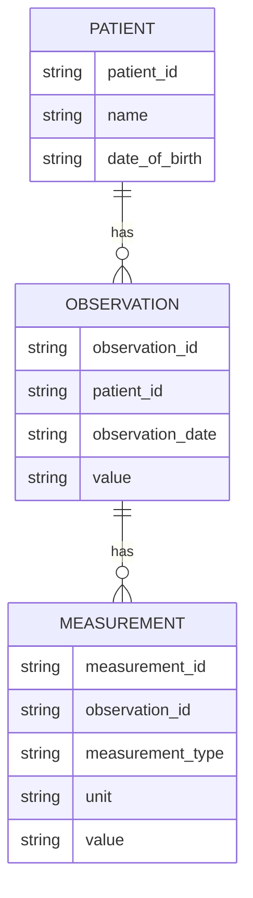

---

title: System_Catalog
type: Atomic Note
course: Database Systems
semester: Autumn 2025
unit: '6'
hub: "[[6_Database_Design_Hub]]"
source: "[[Chapter_6.pdf]]"
source_pages:
- 17
mode: CS-DB
read: false
generated: true
prerequisites:
- "[[Sql_Environment]]"

---

# 1. Mental Model

A database's System Catalog can be thought of as a librarian's catalog system, where the librarian (database management system) maintains a detailed record of all books (database objects) in the library (database). Just as a librarian's catalog system keeps track of book titles, authors, publication dates, and shelf locations, a System Catalog keeps track of database object names, data types, and storage locations. The catalog system also helps the librarian to quickly locate specific books, similarly, the System Catalog enables the database management system to efficiently retrieve and manage database objects.

# 2. Schema & Query Mechanics

The System Catalog is a critical component of a database management system, providing a centralized repository for metadata about database objects. When a user executes a [[Create_Table]] statement, the database management system updates the System Catalog with information about the new table, including its name, structure, and constraints defined using [[Constraint_Definition]]. The System Catalog is also used to enforce [[Referential_Integrity_Options]] and to manage [[Data_Definition_Language]] operations, such as [[Alter_Table]] and [[Drop_Table]]. Users can query the System Catalog using [[Sql_Definition]] and [[Sql_Sub_Languages]] to retrieve information about database objects, and the catalog is typically stored in a [[System_Catalog]] table that can be queried like any other table. The System Catalog plays a crucial role in managing the database schema and ensuring data consistency.

# 3. ACID Violations & Scaling Limits

If multiple transactions attempt to update the System Catalog simultaneously, it can lead to [[Acid]] violations, such as inconsistencies in the catalog data. For example, if two transactions try to create tables with the same name, the System Catalog may become inconsistent, leading to errors. To avoid such issues, database management systems use concurrency control mechanisms to ensure that only one transaction can update the System Catalog at a time. As the database scales, the System Catalog can become a bottleneck, requiring careful tuning and optimization to ensure that it can handle a large volume of transactions and queries.

## 4. Entity-Relationship Model



In this Mermaid entity-relationship diagram, `PATIENT`, `OBSERVATION`, and `MEASUREMENT` represent entities, and the lines between them represent relationships. The `||--o{` notation indicates a 1:N (one-to-many) relationship, meaning one patient can have many observations, and one observation can have many measurements.

## 5. Walkthrough

Here are the steps to understand the System Catalog in the context of Epidemiology & Public Health Modeling:

1. **Initial System Catalog State**: The database management system initializes an empty System Catalog for a new epidemiology database, which will store metadata about patients, observations, and measurements.

2. **Registering Patients**: The database management system adds an entry to the System Catalog for the `PATIENT` table, including its name, data type, and storage location. This allows the system to keep track of patient data.

3. **Adding Observations**: When a new observation is recorded for a patient, the system adds an entry to the System Catalog for the `OBSERVATION` table, including its relationship to the `PATIENT` table.

4. **Creating Measurements**: For each observation, multiple measurements can be recorded (e.g., blood pressure, heart rate). The system updates the System Catalog to reflect the `MEASUREMENT` table and its relationship to the `OBSERVATION` table.

5. **Querying the System Catalog**: When a query is made to retrieve patient data, the database management system uses the System Catalog to locate the relevant data, ensuring efficient data retrieval.

6. **Updating the System Catalog**: As new data is added or existing data is modified, the System Catalog is updated to reflect these changes, maintaining data consistency and accuracy across the epidemiology database.

---

## 6. The Proving Grounds

```interactive-quiz

[
  {
    "id": "q1",
    "type": "true_false",
    "difficulty": "L1",
    "question": "The System Catalog in a database is used to store the actual data.",
    "answer": false,
    "explanation": "The System Catalog in a database is used to store metadata about database objects, such as table names, column names, data types, and storage locations, not the actual data."
  },
  {
    "id": "q2",
    "type": "scenario",
    "difficulty": "L2",
    "question": "Suppose a database has two tables, 'Employees' and 'Departments', with a relationship established between them through a foreign key. If a new department is added to the 'Departments' table, what happens to the System Catalog?",
    "answer": "The System Catalog is updated to reflect the new department, including its department ID, name, and any other relevant details.",
    "explanation": "When a new department is added to the 'Departments' table, the System Catalog must be updated to include the new department's metadata, such as its department ID, name, and storage location."
  },
  {
    "id": "q3",
    "type": "debug",
    "difficulty": "L3",
    "question": "Find the error.",
    "content": "CREATE TABLE Employees (EmployeeID int, Name varchar(255), DepartmentID int); CREATE TABLE Departments (DepartmentID int, DepartmentName varchar(255), PRIMARY KEY (DepartmentID)); ALTER TABLE Employees ADD CONSTRAINT FK_DepartmentID FOREIGN KEY (DepartmentID) REFERENCES Departments(DepartmentID); INSERT INTO Departments (DepartmentID, DepartmentName) VALUES (1, 'Sales'); INSERT INTO Employees (EmployeeID, Name, DepartmentID) VALUES (1, 'John Doe', 2);",
    "answer": "The bug is that the INSERT statement for the 'Employees' table references a DepartmentID of 2, which does not exist in the 'Departments' table. The fix is to either insert a DepartmentID of 1 into the 'Employees' table or add a DepartmentID of 2 to the 'Departments' table.",
    "explanation": "The bug is a referential integrity issue, where the 'Employees' table references a department that does not exist in the 'Departments' table. This would cause a foreign key constraint error when trying to insert the employee record."
  }
]

```