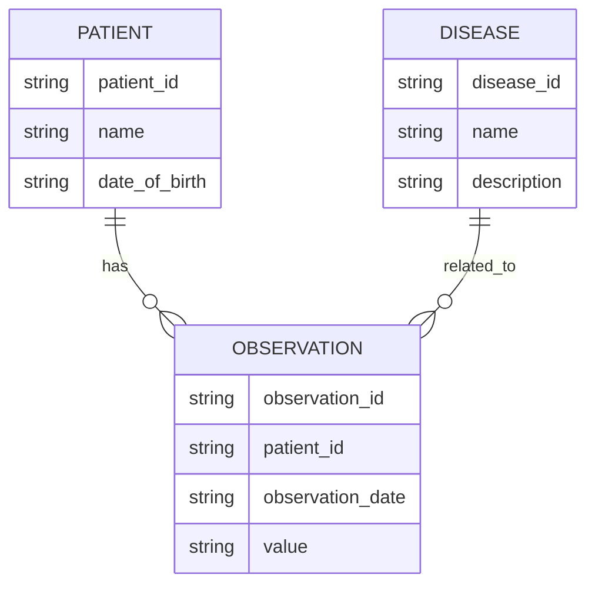

---

title: Table_Creation_Steps
type: Atomic Note
course: Database Systems
semester: Autumn 2025
unit: '6'
hub: "[[6_Database_Design_Hub]]"
source: "[[Chapter_6.pdf]]"
source_pages:
- 7
mode: CS-DB
read: false
generated: true
prerequisites:
- "[[Create_Table]]"

---

# 1. Mental Model

A relational database table can be thought of as a structured library catalog system, where each book represents a row in the table. Just as a library catalog organizes books by title, author, and publication date, a table organizes data into columns and rows, with each column representing a specific attribute, such as a book's title or author, and each row representing a single book. The table's schema, like the catalog system's classification structure, defines the organization and relationships between these attributes.

# 2. Schema & Query Mechanics

The process of creating a table involves defining its [[Table_Definition]] using [[Data_Definition_Language]] (DDL) statements, such as [[Create_Table]], which specifies the table's structure, including column names, [[Data_Types]], and [[Constraint_Definition]]s. The [[Sql_Environment]] and [[System_Catalog]] work together to manage and store the table's metadata. When creating a table, one must consider [[Table_Creation_Steps]], including defining [[Default_Values]] and [[Referential_Integrity_Options]]. The [[Sql_Definition]] and [[Sql_Sub_Languages]] provide the foundation for working with tables, while [[Using_Aliases]] and [[Qualifying_Attribute_Names]] help to clarify and simplify queries.

# 3. ACID Violations & Scaling Limits

When creating tables, it's essential to consider the potential for [[Acid]] violations, which can occur when multiple transactions access and modify the table simultaneously. If not properly managed, this can lead to inconsistencies and errors. As the table grows, scaling limits can be reached, and the database may become vulnerable to failures, such as [[Unspecified_Where_Clause]] or [[Nulls_In_Sql_Queries]], which can cause queries to return incorrect results or fail altogether. To mitigate these risks, database administrators must carefully design and monitor the table's structure and query mechanics.

## 4. Entity-Relationship Model



In this Mermaid entity-relationship diagram, `PATIENT`, `OBSERVATION`, and `DISEASE` represent entities, and the lines between them represent relationships. The `||--o{` notation indicates a 1:N (one-to-many) relationship, meaning one patient can have many observations, and one disease can be related to many observations.

## 5. Walkthrough

Here are the steps to create tables for epidemiology and public health modeling:

1. **Define the Patient Table**: Create a `PATIENT` table with columns for `patient_id`, `name`, and `date_of_birth` to store information about individuals in the study.
2. **Define the Observation Table**: Create an `OBSERVATION` table with columns for `observation_id`, `patient_id`, `observation_date`, and `value` to store data collected from patients over time.
3. **Establish the Patient-Observation Relationship**: Add a foreign key constraint to the `OBSERVATION` table referencing the `patient_id` in the `PATIENT` table to link observations to their corresponding patients.
4. **Define the Disease Table**: Create a `DISEASE` table with columns for `disease_id`, `name`, and `description` to store information about different diseases being studied.
5. **Establish the Disease-Observation Relationship**: Add a many-to-many relationship table or a bridge table (not shown) to link diseases to observations, as a single observation can be related to multiple diseases and a single disease can be related to multiple observations.
6. **Populate the Tables with Data**: Insert sample data into each table to test the schema and prepare for querying and analysis.

---

## 6. The Proving Grounds

```interactive-quiz

[
  {
    "id": "q1",
    "type": "true_false",
    "difficulty": "L1",
    "question": "A relational database table is a collection of data organized into rows and columns.",
    "answer": true,
    "explanation": "This statement is true by definition of a relational database table."
  },
  {
    "id": "q2",
    "type": "scenario",
    "difficulty": "L2",
    "question": "Given that a table has an existing row with a primary key value of 1, what happens when you try to insert another row with the same primary key value?",
    "answer": "The insertion will fail to maintain data integrity.",
    "explanation": "This is because a primary key uniquely identifies each row in a table, and duplicate primary key values are not allowed."
  },
  {
    "id": "q3",
    "type": "debug",
    "difficulty": "L3",
    "question": "Find the error.",
    "content": "CREATE TABLE customers (id INT, name VARCHAR(255), PRIMARY KEY (id)); ALTER TABLE customers ADD UNIQUE (name);",
    "answer": "The bug is that the UNIQUE constraint on the 'name' column may cause issues if there are duplicate names, a more suitable approach would be to create a composite primary key or use a separate index.",
    "explanation": "The provided SQL code creates a table with a primary key 'id' and then adds a unique constraint on the 'name' column. However, this might not be the best approach if there can be multiple customers with the same name, it could lead to data inconsistencies."
  }
]

```