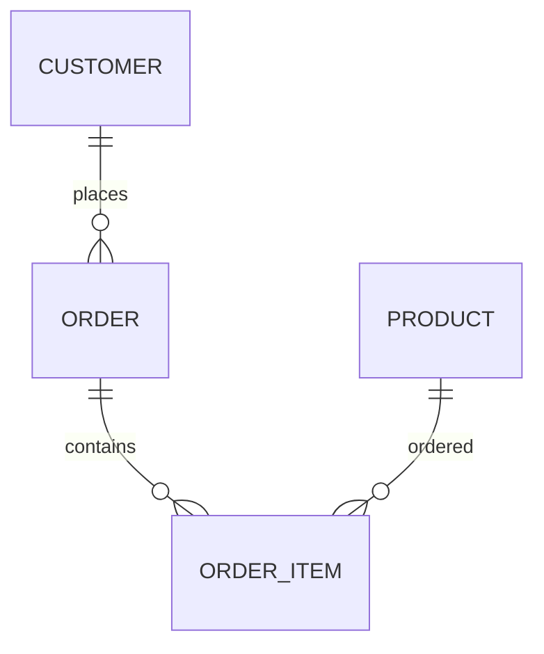

---

title: Table_Definition
type: Atomic Note
course: Database Systems
semester: Autumn 2025
unit: '6'
hub: "[[6_Database_Design_Hub]]"
source: "[[Chapter_6.pdf]]"
source_pages:
- 3
mode: CS-DB
read: false
generated: true
prerequisites:
- "[[Sql_Definition]]"

---

# 1. Mental Model

A relational database table can be thought of as a structured grid, similar to a spreadsheet, where rows represent individual records and columns represent the attributes of those records. Just as a spreadsheet has rows and columns with defined properties, a table in a relational database has rows (tuples) and columns (attributes) with defined data types and constraints. The structure of the table, including the column names and data types, is analogous to the header row in a spreadsheet, which defines the organization of the data.

# 2. Schema & Query Mechanics

A [[Table_Definition]] in a relational database is created using the [[Create_Table]] statement, which specifies the column names, [[Data_Types]], and [[Constraint_Definition]]s. The [[Table_Definition]] is part of the database [[Sql_Environment]] and is stored in the [[System_Catalog]]. When creating a table, one can specify [[Default_Values]] for columns and establish [[Referential_Integrity_Options]] to maintain data consistency. The [[Data_Definition_Language]] (DDL) is used to define and modify the structure of tables, including adding or dropping columns and constraints using [[Alter_Table]] and [[Drop_Table]] statements. 

# 3. ACID Violations & Scaling Limits

When a [[Table_Definition]] is not properly designed, it can lead to [[Acid]] violations, such as inconsistent data or failed transactions, particularly if [[Constraint_Definition]]s are not properly established. For instance, if a table lacks a primary key, it may lead to duplicate rows, causing inconsistencies. As the database scales, poorly designed tables can become a bottleneck, leading to slower query performance and increased storage needs. In failure states, such as a [[Table_Definition]] being altered while transactions are in progress, the database may encounter errors or roll back changes to maintain data integrity.

## 4. Entity-Relationship Model



In this Mermaid `erDiagram`, the lines represent relationships between entities. A line with a "||--o{" indicates a 1:N (one-to-many) relationship, where the entity on the left can have multiple instances of the entity on the right; for example, a single `CUSTOMER` can place multiple `ORDER`s.

## 5. Walkthrough

Here are the steps to understand and apply the entity-relationship model in the context of Telecommunications & Core Network Routing:

1. **Define the Entities**: Identify key entities in the telecommunications domain, such as `CUSTOMER`, `ORDER` (for service requests), and `PRODUCT` (representing network services or equipment).

2. **Establish Relationships**: Determine how these entities relate to each other. For instance, a `CUSTOMER` can place multiple `ORDER`s, establishing a 1:N relationship between `CUSTOMER` and `ORDER`.

3. **Order Composition**: Recognize that an `ORDER` can contain multiple `ORDER_ITEM`s, each representing a specific product or service requested. This establishes another 1:N relationship between `ORDER` and `ORDER_ITEM`.

4. **Product Ordering**: Understand that a `PRODUCT` can be part of multiple `ORDER_ITEM`s across different orders, indicating a many-to-many (M:N) relationship between `PRODUCT` and `ORDER_ITEM`. This requires the `ORDER_ITEM` entity to act as a junction table.

5. **Apply to Core Network Routing**: In core network routing, similar relationships can model how customers (or services) request and receive network resources. For example, a customer might request multiple network services (orders), and each service could involve multiple network products (like bandwidth, routing protocols).

6. **Refine and Implement**: Refine the entity-relationship model based on specific requirements, such as adding attributes to each entity (e.g., customer details, order status, product specifications). Implement this schema in a relational database to support telecommunications operations.

---

## 6. The Proving Grounds

```interactive-quiz

[
  {
    "id": "q1",
    "type": "true_false",
    "difficulty": "L1",
    "question": "In a relational database table, rows represent individual records and columns represent the attributes of those records.",
    "answer": true,
    "explanation": "This statement is true and defines the core concept of a relational database table."
  },
  {
    "id": "q2",
    "type": "scenario",
    "difficulty": "L2",
    "question": "Given a table with a primary key constraint on column 'id', what happens when you try to insert a duplicate 'id' value?",
    "answer": "The insertion will be rejected to maintain data integrity.",
    "explanation": "The primary key constraint ensures that each row in the table has a unique 'id' value, so attempting to insert a duplicate 'id' will result in an error."
  },
  {
    "id": "q3",
    "type": "debug",
    "difficulty": "L3",
    "question": "Find the error.",
    "content": "CREATE TABLE customers (id INT, name VARCHAR(255), email VARCHAR(255) UNIQUE); INSERT INTO customers (name, email, id) VALUES ('John Doe', 'john@example.com', 1); INSERT INTO customers (name, email, id) VALUES ('Jane Doe', 'jane@example.com', 1);",
    "answer": "The bug is a duplicate primary key. The 'id' column should be defined as PRIMARY KEY. The fix is to add the PRIMARY KEY constraint to the 'id' column.",
    "explanation": "The provided SQL code does not explicitly define the 'id' column as the primary key, which can lead to duplicate 'id' values being inserted. To fix this, the 'id' column should be defined as the primary key."
  }
]

```