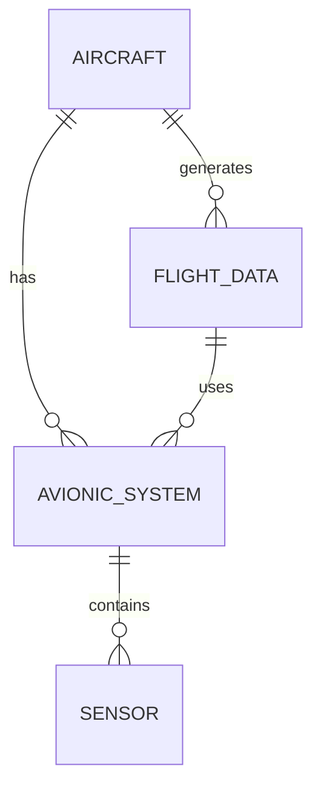

---

title: The_Exists_Function
type: Atomic Note
course: Database Systems
semester: Autumn 2025
unit: '6'
hub: '[[6_Database_Design_Hub]]'
source: '[[Chapter_6.pdf]]'
source_pages:
- 54
mode: CS-DB
read: false
generated: true
prerequisites:
- '[[Nesting_Of_Queries]]'
- '[[Correlated_Nested_Queries]]'
- '[[Unspecified_Where_Clause]]'
- '[[Explicit_Sets]]'

---


# 1. Mental Model

The Exists Function in SQL can be thought of as a gatekeeper that checks if a specific condition is met within a subquery. Just as a librarian checks if a book exists on the shelf by searching through the catalog, the Exists Function searches through a subquery to determine if at least one row meets the specified condition. The mechanism matches in that both the librarian and the Exists Function return a boolean value indicating whether something exists or not.

# 2. Schema & Query Mechanics

The Exists Function is used in SQL to check whether the result of a correlated nested query [[Nesting_Of_Queries]] is empty or not. It returns TRUE if the subquery [[Correlated_Nested_Queries]] returns at least one row, and FALSE otherwise. When using the Exists Function, the subquery is often correlated with the outer query [[The_Exists_Function]], meaning it references columns from the outer query. The Exists Function is typically used in the WHERE clause [[Unspecified_Where_Clause]] of a query to filter results based on the existence of related data in a subquery. The syntax for the Exists Function involves the EXISTS keyword followed by a subquery [[Explicit_Sets]].

# 3. ACID Violations & Scaling Limits

The Exists Function does not directly impact the ACID properties [[Acid]] of a database transaction, but it can affect performance if not used efficiently. If the subquery is not properly optimized, it can lead to slow query execution times or even cause the database to lock up. In terms of scaling limits, the Exists Function can become a bottleneck if the subquery is very large or complex, causing the database to struggle with handling a large number of concurrent queries. If not properly handled, this can lead to errors such as timeouts or even crashes.

## 4. Entity-Relationship Model



In this Mermaid ER diagram, we have entities representing `AIRCRAFT`, `AVIONIC_SYSTEM`, `SENSOR`, and `FLIGHT_DATA`. The `||--o{` notation represents a 1:N (one-to-many) relationship. For example, an `AIRCRAFT` can have multiple `AVIONIC_SYSTEM`s, but each `AVIONIC_SYSTEM` belongs to only one `AIRCRAFT`. The `||--o{` line with `AVIONIC_SYSTEM` and `SENSOR` represents a 1:N relationship where an `AVIONIC_SYSTEM` can contain multiple `SENSOR`s.

## 5. Walkthrough

Here are the steps to understand and apply the Exists Function in the context of Aerospace Engineering & Avionics:

1. **Identify the Database Schema**: First, consider a database schema that stores information about aircraft, their avionics systems, and the sensors these systems contain. The schema might look something like the entity-relationship model provided above.

2. **Formulate the Query Need**: Suppose we need to find all aircraft that have at least one avionics system that contains a specific type of sensor, say, a temperature sensor.

3. **Write the Subquery**: We start by writing a subquery that selects the avionics system IDs that contain a temperature sensor. This subquery would look something like: 

```sql

   SELECT avionic_system_id
   FROM sensor
   WHERE sensor_type = 'temperature'

```

4. **Apply the Exists Function**: Next, we use the Exists Function in a query to check if for each aircraft, there exists at least one avionics system that is listed in our subquery. The Exists Function would be used like this:

```sql

   SELECT aircraft_id
   FROM aircraft
   WHERE EXISTS (
       SELECT 1
       FROM avionics_system
       WHERE avionics_system.aircraft_id = aircraft.aircraft_id
       AND avionics_system.avionic_system_id IN (
           SELECT avionic_system_id
           FROM sensor
           WHERE sensor_type = 'temperature'
       )
   )

```

5. **Understand the Query Execution**: When this query is executed, for each row in the `aircraft` table, the database checks if there is at least one matching row in the `avionics_system` table that also has a matching sensor. If such a match exists, the aircraft ID is returned.

6. **Analyze the Results**: Finally, analyze the results to identify all aircraft that have an avionics system containing a temperature sensor. This information could be crucial for ensuring that certain safety or monitoring requirements are met in aerospace applications.

---

## 6. The Proving Grounds

```interactive-quiz

[
  {
    "id": "q1",
    "type": "true_false",
    "difficulty": "L1",
    "question": "The Exists Function in SQL returns a boolean value indicating whether at least one row meets the specified condition in a subquery.",
    "answer": true,
    "explanation": "The Exists Function indeed returns a boolean value indicating the existence of rows in a subquery that meet a specified condition."
  },
  {
    "id": "q2",
    "type": "scenario",
    "difficulty": "L2",
    "question": "Consider a database with two tables, 'Customers' and 'Orders'. The 'Customers' table has a column 'CustomerID' and the 'Orders' table has a column 'CustomerID'. If you want to find all customers who have placed at least one order, how would you use the Exists Function?",
    "answer": "You would use the Exists Function in a subquery to check if a CustomerID exists in the Orders table.",
    "explanation": "The Exists Function can be used to check if a CustomerID in the Customers table exists in the Orders table, indicating that the customer has placed at least one order."
  },
  {
    "id": "q3",
    "type": "debug",
    "difficulty": "L3",
    "question": "Find the error.",
    "content": "SELECT * FROM Customers c WHERE EXISTS (SELECT 1 FROM Orders o WHERE o.CustomerID = c.CustomerID AND o.OrderDate > '2020-01-01');",
    "answer": "The bug is in the subquery condition. It should be checking for the existence of a matching CustomerID without the date condition for a general check of existing orders. However, if the intention is to check for customers with orders after '2020-01-01', then no bug exists in the logic provided.",
    "explanation": "The provided SQL seems correct for its apparent purpose: to find customers who have placed orders after '2020-01-01'. However, if the goal is to simply verify the existence of any order for a customer, the date condition might be considered unnecessary or even incorrect."
  }
]

```