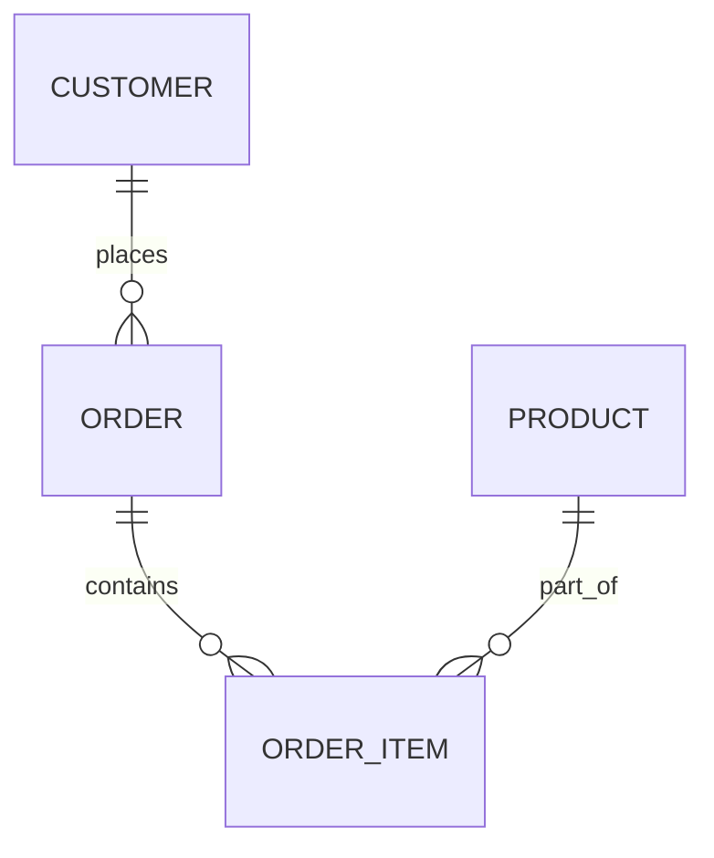

---

title: Unspecified_Where_Clause
type: Atomic Note
course: Database Systems
semester: Autumn 2025
unit: '6'
hub: '[[6_Database_Design_Hub]]'
source: '[[Chapter_6.pdf]]'
source_pages:
- 44
mode: CS-DB
read: false
generated: true
prerequisites:
- '[[Table_Definition]]'
- '[[Data_Definition_Language]]'
- '[[Create_Table]]'
- '[[Constraint_Definition]]'
- '[[Insert]]'

---


# 1. Mental Model

The concept of an Unspecified Where Clause can be likened to a library's catalog system, where a search query without specific filters is akin to a completely open-ended search. Just as the library's catalog system would return all books in its database when no filters are applied, a SQL query with an Unspecified Where Clause returns all tuples from the specified relations. The relations in the FROM clause can be thought of as the various sections of the library, and the absence of a WHERE clause means that no specific section or filter (like author, title, or genre) is applied to narrow down the search.

# 2. Schema & Query Mechanics

In SQL, when a query is formulated without a WHERE clause, it is considered to have an Unspecified Where Clause, implying that all rows from the specified tables should be returned. This is directly related to [[Sql_Definition]] and how queries are structured within a [[Sql_Environment]]. The [[Table_Definition]] and [[Data_Definition_Language]] play crucial roles in defining the structure of the data that is being queried. When creating tables with [[Create_Table]], constraints such as [[Constraint_Definition]] can be applied, but these do not affect the basic principle of an Unspecified Where Clause. Queries that utilize [[Insert]], [[Update]], and [[Delete]] operations also rely on the understanding of how data is selected, even if that selection is based on an Unspecified Where Clause.

# 3. ACID Violations & Scaling Limits

An Unspecified Where Clause can lead to performance issues and potential ACID (Atomicity, Consistency, Isolation, Durability) violations if not handled properly, especially in large databases. When a query unintentionally returns a large dataset due to a missing WHERE clause, it can cause increased load on the database, potentially leading to bottlenecks and decreased performance. In terms of scaling limits, databases may have mechanisms to handle such queries more efficiently, but these can still lead to boundary conditions where the database's performance degrades. For instance, if a query with an Unspecified Where Clause is executed on a very large table, it could result in a full table scan, which is resource-intensive and can lead to failure states such as timeouts or even crashes if the database server lacks sufficient resources.

## 4. Entity-Relationship Model



In this Mermaid erDiagram, we have three entities: CUSTOMER, ORDER, and PRODUCT, with ORDER_ITEM being a relationship entity. The `||--o{` notation represents a 1:N (one-to-many) relationship, where one CUSTOMER can place many ORDERS, and one ORDER can contain many ORDER_ITEMs. The `||--o{` and `||--o}` are sometimes used interchangeably but here we use `||--o{` consistently for 1:N relationships; a CUSTOMER is associated with multiple ORDERS (one-to-many), an ORDER has multiple ORDER_ITEMs (one-to-many), and a PRODUCT can be part of multiple ORDER_ITEMs (many-to-many through ORDER_ITEM).


## 5. Walkthrough

Here is a walkthrough for an Unspecified Where Clause in the context of Industrial Manufacturing & Robotics:

1. **Initial Database State**: Suppose we have a database for an industrial robotics manufacturing company with a `ROBOTS` table containing information about each robot produced, including its model, production date, and type. Initially, the table has 50 records of robots produced over the past year.

2. **Query Formulation**: The manager wants to analyze all robots produced in the past year to assess overall production. An SQL query is formulated to select all robots without specifying any conditions: `SELECT * FROM ROBOTS;`

3. **Query Execution**: When this query is executed, the database management system (DBMS) returns all 50 records from the `ROBOTS` table because there are no conditions specified in the WHERE clause.

4. **Result Analysis**: The manager reviews the results, noticing that the data includes various robot models, types, and production dates. This comprehensive data is useful for overall assessments but does not directly help in identifying specific subsets of robots, such as those of a certain type or model.

5. **Adding a Condition**: To analyze a specific subset, for example, robots of a certain type, a condition can be added to the WHERE clause: `SELECT * FROM ROBOTS WHERE TYPE = 'Welding';` This query would return only the records of robots used for welding.

6. **Result Comparison**: After executing the new query, the manager finds that it returns 10 records of welding robots. This focused data helps in making targeted decisions, such as assessing the demand for welding robots or planning for their maintenance.

---

## 6. The Proving Grounds

```interactive-quiz

[
  {
    "id": "q1",
    "type": "true_false",
    "difficulty": "L1",
    "question": "A SQL query with an Unspecified Where Clause returns no rows from the specified relations.",
    "answer": false,
    "explanation": "An Unspecified Where Clause returns all tuples from the specified relations, not no rows."
  },
  {
    "id": "q2",
    "type": "scenario",
    "difficulty": "L2",
    "question": "Given a database with a 'users' table containing columns 'name' and 'age', what happens when a SQL query with an Unspecified Where Clause is executed: 'SELECT * FROM users'?",
    "answer": "The query returns all rows from the 'users' table.",
    "explanation": "Since the Where Clause is unspecified, the query returns all tuples from the 'users' table, effectively retrieving all users' information."
  },
  {
    "id": "q3",
    "type": "debug",
    "difficulty": "L3",
    "question": "Find the error.",
    "content": "SELECT * FROM users WHERE age = '25'",
    "answer": "The bug is implicit type coercion. The 'age' column is likely an integer type, but it's being compared to a string literal '25'. The fix is to use an integer literal: SELECT * FROM users WHERE age = 25",
    "explanation": "The bug arises from comparing an integer column 'age' with a string literal, which may lead to unexpected behavior or errors depending on the database system."
  }
]

```