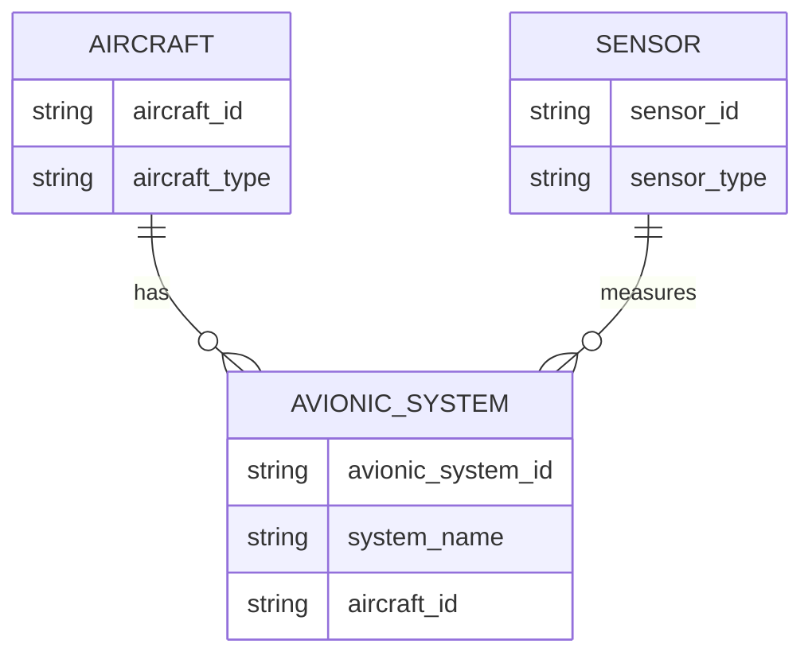

---

title: Update
type: Atomic Note
course: Database Systems
semester: Autumn 2025
unit: '6'
hub: '[[6_Database_Design_Hub]]'
source: '[[Chapter_6.pdf]]'
source_pages:
- 31
mode: CS-DB
read: false
generated: true
prerequisites:
- '[[Table_Definition]]'
- '[[Constraint_Definition]]'
- '[[Data_Types]]'
- '[[Using_Aliases]]'
- '[[Qualifying_Attribute_Names]]'

---


# 1. Mental Model

The update mechanism in a relational database can be likened to a librarian who corrects the information on a set of books. Just as the librarian selects specific books to update based on certain criteria (e.g., author, title), the update operation in a database selects specific tuples to modify based on a given condition. The librarian then changes the relevant details on the selected books, similar to how the update operation changes the attribute values of the selected tuples.

# 2. Schema & Query Mechanics

The [[Update]] operation in SQL is used to modify attribute values of one or more selected tuples in a [[Table_Definition]]. This operation is a part of [[Sql_Definition]] and utilizes [[Sql_Sub_Languages]] for specifying the changes. When performing an [[Update]], one must specify the [[Table_Definition]] to be modified, the [[Constraint_Definition]] to ensure data integrity, and the [[Data_Types]] of the attributes being updated. The [[Update]] statement often involves a [[Where]] clause to specify which tuples to update, and it can also use [[Using_Aliases]] and [[Qualifying_Attribute_Names]] to avoid ambiguity. The [[System_Catalog]] is implicitly involved as it keeps track of the schema and the changes made to the data.

# 3. ACID Violations & Scaling Limits

When an [[Update]] operation is executed, it must adhere to the ACID properties to ensure database consistency. If an update operation fails after partially modifying tuples, it can lead to an inconsistent state, violating the atomicity property. In a highly scaled environment, concurrent update operations can lead to conflicts and decreased performance, necessitating the use of locking mechanisms or optimistic concurrency control. If not properly managed, these issues can result in [[Acid]] violations and limit the scalability of the database system.

## 4. Entity-Relationship Model



In this Mermaid ER diagram, we have three entities: `AIRCRAFT`, `AVIONIC_SYSTEM`, and `SENSOR`. The `AIRCRAFT` entity has a 1:N relationship with `AVIONIC_SYSTEM`, meaning one aircraft can have multiple avionic systems. The `SENSOR` entity has a M:N relationship with `AVIONIC_SYSTEM`, meaning one sensor can measure multiple avionic systems and one avionic system can be measured by multiple sensors. Each entity has its own attributes, such as `aircraft_id`, `avionic_system_id`, and `sensor_id`.

## 5. Walkthrough

Here are the steps to update avionic system information in an aerospace engineering database:

1. **Identify the Avionic System**: The aerospace engineer wants to update the `system_name` attribute of an avionic system with `avionic_system_id` = 'AS-123'. The engineer queries the database to retrieve the current information about this avionic system.

2. **Specify the Update Condition**: The engineer specifies the condition for the update operation: `avionic_system_id` = 'AS-123'. This ensures that only the desired avionic system is updated.

3. **Determine the New Values**: The engineer determines the new value for the `system_name` attribute, which is 'Advanced Navigation System'.

4. **Execute the Update Operation**: The engineer executes the SQL update operation: `UPDATE AVIONIC_SYSTEM SET system_name = 'Advanced Navigation System' WHERE avionic_system_id = 'AS-123';`

5. **Verify the Update**: The engineer queries the database again to verify that the `system_name` attribute of the avionic system with `avionic_system_id` = 'AS-123' has been updated to 'Advanced Navigation System'.

6. **Confirm Data Consistency**: The engineer checks the relationships between the updated avionic system and other entities, such as the aircraft and sensors, to ensure that the update has not introduced any data inconsistencies.

---

## 6. The Proving Grounds

```interactive-quiz

[
  {
    "id": "q1",
    "type": "true_false",
    "difficulty": "L1",
    "question": "An UPDATE operation in a relational database modifies all tuples by default.",
    "answer": false,
    "explanation": "An UPDATE operation in a relational database modifies specific tuples that match a given condition, not all tuples by default."
  },
  {
    "id": "q2",
    "type": "scenario",
    "difficulty": "L2",
    "question": "Given that a table 'Employees' has columns 'EmployeeID', 'Name', and 'Department', and there is an UPDATE statement: UPDATE Employees SET Department = 'HR' WHERE Department = 'Finance'; what happens if there are no rows in the 'Employees' table where Department = 'Finance'?",
    "answer": "The UPDATE statement executes without error, but no rows are updated because there are no rows that meet the condition Department = 'Finance'. The table 'Employees' remains unchanged.",
    "explanation": "The UPDATE statement does not throw an error if no rows match the condition. It simply does not update any rows."
  },
  {
    "id": "q3",
    "type": "debug",
    "difficulty": "L3",
    "question": "Find the error.",
    "content": "UPDATE Employees SET Department = 'Management' WHERE EmployeeID = 123 OR EmployeeID = 456;",
    "answer": "The bug is the use of the bitwise OR operator (OR) instead of the logical OR operator. The correct statement should use the logical OR operator. However, in SQL, the correct syntax is to use the 'OR' keyword which is actually correct in this context. A more likely bug could be if the intention was to update all employees except 123 and 456, then the bug would be in the logic. Assuming a more complex scenario where a syntax error or logical bug could occur: A possible bug could be in a more complex scenario like UPDATE Employees SET Department = 'Management' WHERE EmployeeID = 123 & EmployeeID = 456; which would be incorrect. The correct fix depends on the actual intention.",
    "explanation": "The provided SQL statement seems correct for its apparent purpose. A potential bug could involve incorrect operator usage in more complex conditions."
  }
]

```