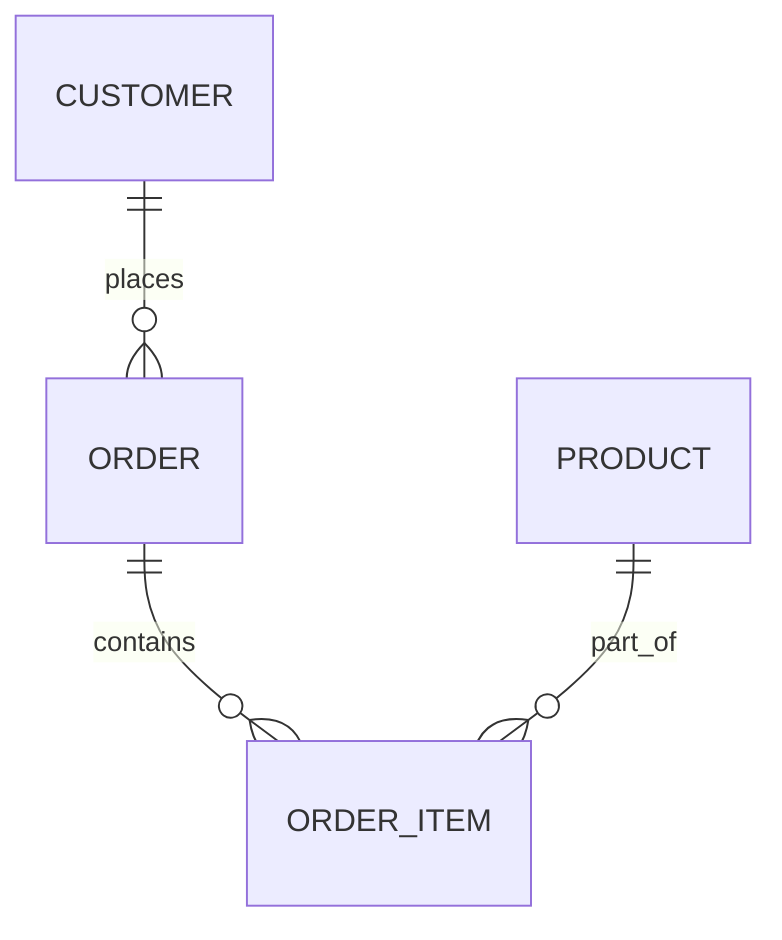

---

title: Using_Distinct
type: Atomic Note
course: Database Systems
semester: Autumn 2025
unit: '6'
hub: '[[6_Database_Design_Hub]]'
source: '[[Chapter_6.pdf]]'
source_pages:
- 47
mode: CS-DB
read: false
generated: true
prerequisites:
- '[[Table_Definition]]'
- '[[Data_Definition_Language]]'

---


# 1. Mental Model

The concept of `USING DISTINCT` in SQL queries can be likened to a librarian who is tasked with compiling a list of unique book titles from a collection of books. Just as the librarian must sift through the books and only record each title once, even if multiple copies of the same book exist, `USING DISTINCT` ensures that only unique rows are returned from a query, eliminating duplicates. This process maps to the database's mechanism of storing and retrieving data, where duplicate tuples (rows) can be present unless specifically filtered out.

# 2. Schema & Query Mechanics

In SQL, when a query is executed without specifying `DISTINCT`, the database returns all rows that match the query conditions, including duplicates. The [[Sql_Definition]] language allows for the use of `DISTINCT` keyword in a [[Select]] statement to eliminate duplicate rows from the result set. For instance, if a [[Table_Definition]] contains multiple rows with the same values for certain columns, using `SELECT DISTINCT column1, column2 FROM tablename` ensures that each combination of values for `column1` and `column2` is only listed once. This functionality is particularly useful when working with [[Data_Definition_Language]] to manage data and ensure data integrity. The [[Sql_Sub_Languages]] support for `DISTINCT` enables more precise control over query results.

# 3. ACID Violations & Scaling Limits

When using `DISTINCT` in SQL queries, potential performance issues can arise, especially with large datasets, as the database must perform additional operations to eliminate duplicate rows. This can lead to increased processing time and resource utilization. In terms of ACID (Atomicity, Consistency, Isolation, Durability) properties, using `DISTINCT` does not directly impact atomicity or durability but can affect isolation if the query relies on a consistent view of the data that is being modified concurrently. If not properly managed, this could lead to inconsistent results or [[Acid]] violations. Furthermore, as databases scale, the impact of such operations on performance and resource allocation must be carefully considered to avoid bottlenecks. 

| Scaling Issue | Description |
|---|---|
| Performance Overhead | Increased processing time due to duplicate elimination |
| Resource Utilization | Higher resource usage for large datasets | 
| Isolation Concerns | Potential for inconsistent results in concurrent modifications | 
| Data Consistency | Ensuring data consistency when using `DISTINCT` in queries |

## 4. Entity-Relationship Model



In this Mermaid `erDiagram`, the lines represent relationships between entities. A line with a "crow's foot" (o{) indicates a 1:N (one-to-many) relationship, meaning one customer can place many orders, one order can contain many order items, and one product can be part of many order items.

## 5. Walkthrough

Here are the steps for a walkthrough on using `USING DISTINCT` in the context of Global Supply Chain & Maritime Logistics:

1. **Identify Duplicate Records**: Suppose we have a table of shipments with columns for shipment ID, vessel name, and cargo type. Due to a logging error, some shipments were recorded multiple times. The table might look like this:

```

   +------------+-------------+-----------+

   | shipment_id | vessel_name | cargo_type |

   +------------+-------------+-----------+

   | 1          | Vessel A    | Containers |
   | 1          | Vessel A    | Containers |
   | 2          | Vessel B    | Bulk      |
   | 3          | Vessel C    | Containers |
   | 3          | Vessel C    | Containers |

   +------------+-------------+-----------+

```

2. **Formulate the Query Without DISTINCT**: To retrieve all unique shipment IDs and their corresponding vessel names and cargo types, a simple `SELECT` query might be used:

```sql

   SELECT shipment_id, vessel_name, cargo_type
   FROM shipments;

```

3. **Execute the Query Without DISTINCT**: Running this query would return all rows, including duplicates:

```

   +------------+-------------+-----------+

   | shipment_id | vessel_name | cargo_type |

   +------------+-------------+-----------+

   | 1          | Vessel A    | Containers |
   | 1          | Vessel A    | Containers |
   | 2          | Vessel B    | Bulk      |
   | 3          | Vessel C    | Containers |
   | 3          | Vessel C    | Containers |

   +------------+-------------+-----------+

```

4. **Modify the Query to Use DISTINCT**: To eliminate duplicate rows, the query can be modified to use `USING DISTINCT`:

```sql

   SELECT DISTINCT shipment_id, vessel_name, cargo_type
   FROM shipments;

```

5. **Execute the Query With DISTINCT**: After adding `DISTINCT`, the query returns:

```

   +------------+-------------+-----------+

   | shipment_id | vessel_name | cargo_type |

   +------------+-------------+-----------+

   | 1          | Vessel A    | Containers |
   | 2          | Vessel B    | Bulk      |
   | 3          | Vessel C    | Containers |

   +------------+-------------+-----------+

```

6. **Verify the Results**: By comparing the results with and without `DISTINCT`, it's clear that using `DISTINCT` successfully removed duplicate rows, ensuring that each shipment is only listed once. This is particularly useful in logistics for accurate reporting and analysis, where duplicate records could skew inventory levels, shipping costs, or cargo types.

---

## 6. The Proving Grounds

```interactive-quiz

[
  {
    "id": "q1",
    "type": "true_false",
    "difficulty": "L1",
    "question": "The SQL keyword 'DISTINCT' is used to return only duplicate rows from a query.",
    "answer": false,
    "explanation": "The SQL keyword 'DISTINCT' is used to return only unique rows from a query, eliminating duplicates."
  },
  {
    "id": "q2",
    "type": "scenario",
    "difficulty": "L2",
    "question": "Suppose you have a table 'Employees' with columns 'EmployeeID', 'Name', and 'Department'. You want to find all unique departments in the company. What happens when you run the query: SELECT DISTINCT Department FROM Employees;",
    "answer": "The query returns a list of unique department names from the 'Employees' table.",
    "explanation": "The query uses 'DISTINCT' to eliminate duplicate department names, returning a list of unique departments."
  },
  {
    "id": "q3",
    "type": "debug",
    "difficulty": "L3",
    "question": "Find the error.",
    "content": "SELECT * FROM Orders o1 INNER JOIN Orders o2 ON o1.OrderID = o2.OrderID",
    "answer": "The bug is a self-join without a condition to distinguish between the tables, likely intended to be a DISTINCT or GROUP BY operation. The fix is to add a condition, e.g., SELECT DISTINCT o1.OrderID FROM Orders o1 INNER JOIN Orders o2 ON o1.OrderID = o2.OrderID AND o1.CustomerID != o2.CustomerID.",
    "explanation": "The original query joins the 'Orders' table to itself without a proper condition, likely causing a Cartesian product. Adding a condition to distinguish between rows, such as a different customer ID, fixes the issue."
  }
]

```