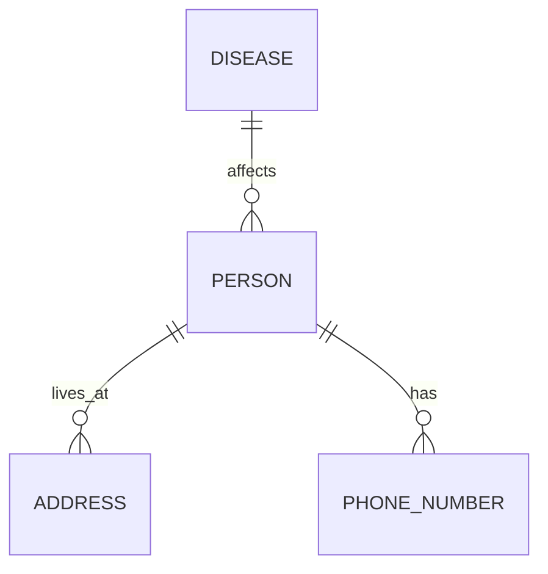

---

title: Using_Star
type: Atomic Note
course: Database Systems
semester: Autumn 2025
unit: '6'
hub: '[[6_Database_Design_Hub]]'
source: '[[Chapter_6.pdf]]'
source_pages:
- 46
mode: CS-DB
read: false
generated: true
prerequisites:
- '[[Create_Table]]'
- '[[Data_Types]]'
- '[[Table_Definition]]'
- '[[Constraint_Definition]]'
- '[[System_Catalog]]'

---


# 1. Mental Model

A relational database schema can be thought of as a blueprint for a library's cataloging system, where tables are like bookshelves and columns are like specific pieces of information about each book, such as title or author. Just as a bookshelf can hold many books, a table can hold many rows of data, and just as each book has specific details, each column in a table has a specific data type. This analogy helps to understand how structural components like tables and columns are organized.

# 2. Schema & Query Mechanics

In SQL, the [[Sql_Definition]] provides the foundation for creating and managing database structures. When creating a table, the [[Create_Table]] statement is used, which involves defining the table's columns and their respective [[Data_Types]]. The [[Table_Definition]] includes specifying [[Constraint_Definition]]s to maintain data integrity. The [[System_Catalog]] maintains metadata about the database, which can be queried using [[Sql_Sub_Languages]] like [[Data_Definition_Language]]. To retrieve data, queries can be formed using various commands, and when selecting all columns, the [[Using_Star]] approach can be applied for simplicity.

# 3. ACID Violations & Scaling Limits

When using the star (*) in SQL queries with [[Using_Star]], if the underlying table structure changes, such as adding or removing columns, the query's output will also change, potentially leading to inconsistencies. This can cause issues with applications relying on a fixed structure, especially in environments where [[Acid]] properties are crucial. Furthermore, as databases scale, queries using the star (*) can become less efficient due to the potential for retrieving unnecessary data, impacting performance. In failure states, such as during a [[Drop_Table]] operation, using the star (*) does not provide a safeguard against data loss.

## 4. Entity-Relationship Model



In this Mermaid entity-relationship diagram, `PERSON`, `ADDRESS`, `PHONE_NUMBER`, and `DISEASE` are entities represented as rectangles. The lines connecting them show the relationships: `PERSON` has a 1:N relationship with `ADDRESS` (one person can live at many addresses) and `PHONE_NUMBER` (one person can have many phone numbers), and a M:N relationship is not directly shown but can be imagined with another entity; however, a 1:N relationship is shown between `DISEASE` and `PERSON` (one disease can affect many people).

## 5. Walkthrough

Here are the steps for creating an entity-relationship model in the context of Epidemiology & Public Health Modeling:

1. **Identify Entities**: In epidemiology, key entities might include `PERSON`, `DISEASE`, `ADDRESS`, and `PHONE_NUMBER`. Each of these entities represents a table in our database.

2. **Define Relationships**: Determine how these entities relate to each other. For instance, a person can live at many addresses, so there's a 1:N relationship between `PERSON` and `ADDRESS`.

3. **Establish Cardinality**: Define the cardinality of each relationship. A person can have many phone numbers, establishing a 1:N relationship between `PERSON` and `PHONE_NUMBER`.

4. **Model Disease Impact**: Consider how diseases relate to people. One disease can affect many people, and one person can have many diseases, suggesting a M:N relationship, but for simplicity, we focus on 1:N relationships where applicable.

5. **Visualize with Mermaid**: Use Mermaid syntax to create a visual representation of these entities and relationships, as shown in the entity-relationship diagram.

6. **Refine and Iterate**: Based on the model, refine your understanding of the data structure needed for epidemiology and public health modeling, ensuring it captures necessary information for tracking diseases and their impact on populations.

---

## 6. The Proving Grounds

```interactive-quiz

[
  {
    "id": "q1",
    "type": "true_false",
    "difficulty": "L1",
    "question": "In a relational database schema, a table can be thought of as a bookshelf and columns as specific pieces of information about each book.",
    "answer": false,
    "explanation": "The correct mental model analogy is that a relational database schema can be thought of as a blueprint for a library's cataloging system, where tables are like bookshelves and columns are like specific pieces of information about each book."
  },
  {
    "id": "q2",
    "type": "scenario",
    "difficulty": "L2",
    "question": "Given two tables, 'authors' and 'books', with a many-to-many relationship, what happens when you delete an author who has written 5 books?",
    "answer": "The deletion of the author would require a cascading delete or a similar mechanism to handle the related books, otherwise, the books would still exist in the 'books' table but lose their association with the deleted author.",
    "explanation": "In a relational database, when a primary key is deleted, the database needs to handle the related foreign keys to maintain data consistency."
  },
  {
    "id": "q3",
    "type": "debug",
    "difficulty": "L3",
    "question": "Find the error.",
    "content": "CREATE TABLE orders (id INT PRIMARY KEY, customer_id INT, order_date DATE); CREATE TABLE order_items (id INT PRIMARY KEY, order_id INT, product_id INT, FOREIGN KEY (order_id) REFERENCES orders(id) ON DELETE SET NULL);",
    "answer": "The bug is that the ON DELETE action is set to SET NULL, which could lead to orphaned order items. The fix is to use ON DELETE CASCADE or ON DELETE RESTRICT.",
    "explanation": "The ON DELETE SET NULL action could result in inconsistent data if not handled properly, as it would set the order_id in the order_items table to NULL when an order is deleted."
  }
]

```