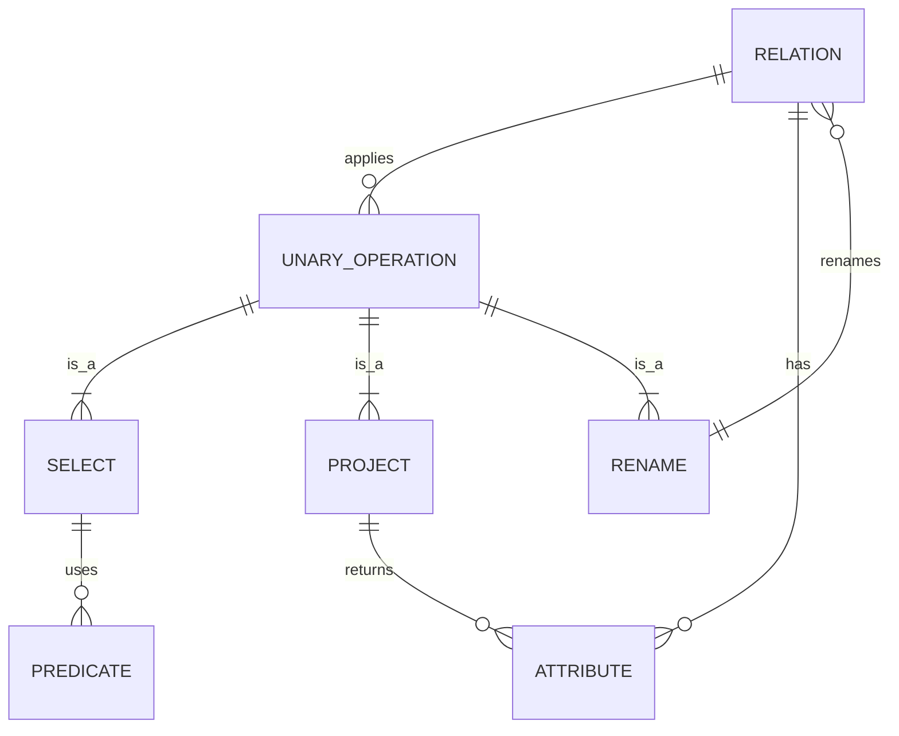

# 1. Mental Model
Imagine you have a big box of different colored pens, and you want to pick out only the red ones or show only the pens with their colors written on them. Unary relational operations work similarly by taking one set of data and applying a single rule to filter or change it, like selecting specific items or showing only certain details.

# 2. Schema & Query Mechanics
Unary relational operations involve applying a single operation to a relation. The SELECT operation, denoted as `σ`, works by applying a [[Predicate]] to filter tuples from a relation. For example, `σ age > 18 (Customers)` selects only the customers older than 18. The PROJECT operation, denoted as `π`, works by returning a subset of the relation's attributes. For instance, `π name, email (Customers)` returns only the name and email of each customer. The RENAME operation, denoted as `ρ`, changes the name of a relation or its attributes. Mechanically, these operations are executed using [[Iterator_Interface]]s and [[Tuple_Streams]], which allow for efficient processing of large relations.

# 3. ACID Violations & Scaling Limits
Unary relational operations can lead to [[Dirty_Reads]] if not properly synchronized, especially when dealing with concurrent transactions. For instance, a SELECT operation may see an inconsistent view of the data if a transaction modifying the data is not properly [[Locked]]. Additionally, large-scale projections can lead to [[Data_Skew]], causing some nodes in a distributed database to handle much larger loads than others. As the size of the relation increases, the time complexity of these operations can become a bottleneck, especially for operations like SELECT, which may require a full [[Index_Scan]]. Therefore, efficient indexing and partitioning strategies are crucial to scaling unary relational operations.
# 4. Entity-Relationship Model
```markdown
```

### Entity-Relationship Diagram for Unary Relational Operations



To read this diagram, start with the `RELATION` entity, which represents a set of data. The `UNARY_OPERATION` entity represents a single operation applied to this relation, which can be a `SELECT`, `PROJECT`, or `RENAME` operation. Each of these operations has its own specific characteristics, such as `SELECT` using a `PREDICATE` to filter tuples, `PROJECT` returning a subset of `ATTRIBUTE`s, and `RENAME` changing the name of a `RELATION` or its `ATTRIBUTE`s.
```

```

## 5. Walkthrough
Here's a step-by-step walkthrough of applying unary relational operations:

Suppose we have a relation `Customers` with attributes `name`, `age`, and `email`.

| name  | age | email          |
|-------|-----|----------------|
| John  | 25  | john@example.com|
| Alice | 30  | alice@example.com|
| Bob   | 20  | bob@example.com  |

1. **SELECT Operation**: We want to select only the customers older than 25. We apply the `SELECT` operation with the predicate `age > 25`.
   - `σ age > 25 (Customers)`
   - Result:
     | name  | age | email          |
     |-------|-----|----------------|
     | Alice | 30  | alice@example.com|

2. **PROJECT Operation**: We want to show only the names and emails of all customers.
   - `π name, email (Customers)`
   - Result:
     | name  | email          |
     |-------|----------------|
     | John  | john@example.com|
     | Alice | alice@example.com|
     | Bob   | bob@example.com  |

3. **RENAME Operation**: We want to rename the `name` attribute to `customer_name`.
   - `ρ Customers (name -> customer_name) (Customers)`
   - Result:
     | customer_name | age | email          |
     |---------------|-----|----------------|
     | John          | 25  | john@example.com|
     | Alice         | 30  | alice@example.com|
     | Bob           | 20  | bob@example.com  |

---

## 6. The Proving Grounds

```interactive-quiz
[
  {
    "id": "q1",
    "type": "true_false",
    "difficulty": "L1",
    "question": "The SELECT operation in relational algebra is used to return a subset of the relation's attributes.",
    "answer": "False",
    "explanation": "The SELECT operation is used to filter tuples from a relation based on a predicate, not to return a subset of attributes."
  },
  {
    "id": "q2",
    "type": "scenario",
    "difficulty": "L2",
    "question": "Given a relation `Employees` with attributes `id`, `name`, and `department`, apply a PROJECT operation to show only the `name` and `department` of employees.",
    "answer": "π name, department (Employees)",
    "explanation": "The PROJECT operation is used to return a subset of the relation's attributes."
  },
  {
    "id": "q3",
    "type": "debug",
    "difficulty": "L3",
    "question": "Find the bug in the following relational algebra expression: `σ age > 18 AND age < 18 (Customers)`",
    "content": "σ age > 18 AND age < 18 (Customers)",
    "answer": "The condition 'age > 18 AND age < 18' will always be false because a value cannot be both greater than 18 and less than 18 at the same time. The correct condition should be 'age > 18' or another valid predicate.",
    "explanation": "The given condition is a contradiction and will result in an empty set."
  }
]
```