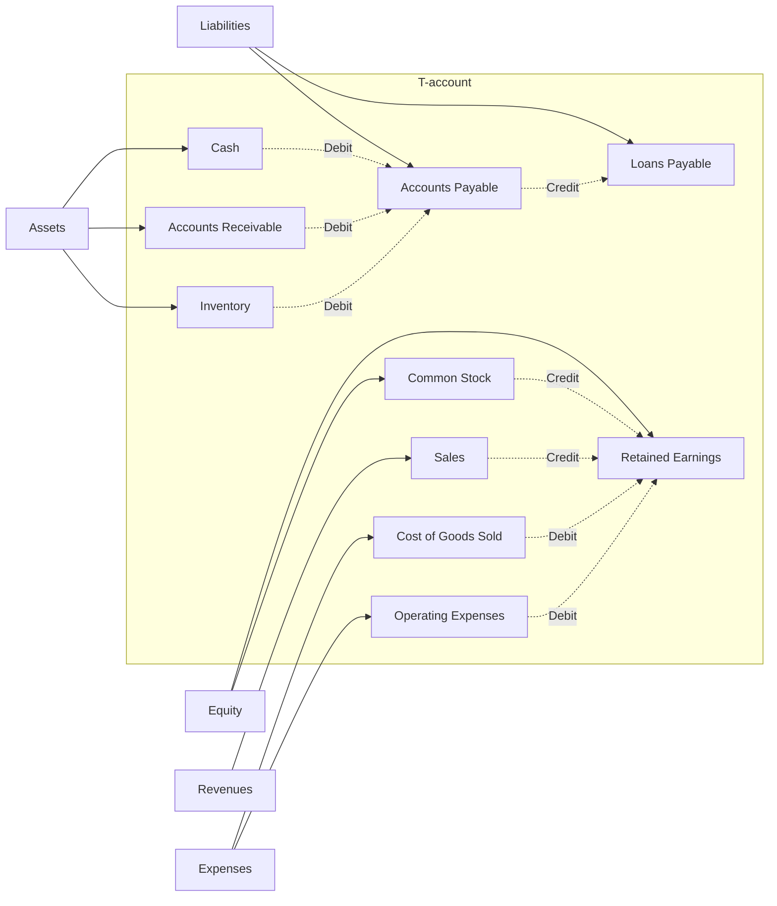

---

title: Barriers_To_Employment
type: Atomic Note
course: Inclusiveness
semester: Autumn 2025
unit: '3'
hub: "[[3_Inclusive_Education_Hub]]"
source: "[[3.pdf]]"
source_pages:
- 48
mode: ECON-FINANCE
read: false
generated: true
prerequisites:
- "[[Inclusive_Job_Opportunities]]"

---

# 1. Mental Model

The concept of Barriers To Employment can be mapped to a river navigation system, where individuals with disabilities are like boats trying to reach their destination. The inaccessible transportation services, lack of accessible information and communications services, and other barriers act as dams or shallow waters that hinder the boats' progress, making it difficult for them to navigate through the labor market. Just as a river's navigability depends on the presence of locks, canals, or other waterway infrastructure, the employability of individuals with disabilities depends on the presence of supportive policies, accessible technologies, and inclusive practices.

# 2. Cash Flow Mechanics & Valuation

The valuation of an individual's employability is impacted by various factors, including [[Current_Life_Circumstances]], [[Support_System]], and [[Economic_Factors]]. The [[Impact_Of_Disability_On_Daily_Life]] and [[Nature_Of_Impairment]] can affect an individual's ability to participate in the labor market, while [[Inclusive_Job_Opportunities]] and [[Assistive_Technology]] can enhance their employability. Furthermore, [[Barriers_To_Employment]] such as inaccessible transportation services and lack of accessible information can limit an individual's ability to access job opportunities, resulting in a lower valuation of their employability. The [[Rehabilitation_Team_Members]] and [[Disability_Inclusive_Intervention]] can play a crucial role in mitigating these barriers and enhancing the individual's employability. Effective [[Strategies_For_Employment]] can also help to address the [[Special_Needs_Of_Pwds]] and promote their inclusion in the labor market.

# 3. Liquidity Crunches & Solvency Risk

The liquidity crunches and solvency risk associated with Barriers To Employment can be understood by examining the boundary conditions that lead to failure states. When individuals with disabilities face significant barriers to employment, they may experience a liquidity crunch, where their financial resources are depleted due to limited access to income-generating opportunities. If these barriers persist, they can lead to solvency risk, where the individual's financial stability is compromised, and they may require external support to meet their basic needs. The table below illustrates the potential consequences of Barriers To Employment:

| Barrier | Consequence |
| --- | --- |
| Inaccessible transportation | Limited access to job opportunities |
| Lack of accessible information | Difficulty navigating the labor market |
| Benefit trap | Dependence on external support | 
| Preference of employers for candidates without disabilities | Limited job prospects | 
| Discouragement of family and community members | Lower self-efficacy and motivation |

## 4. Financial Ledger

### Advanced Markdown T-account ledger table



In this T-account ledger table, **Assets**, **Liabilities**, and **Equity** are the main categories, with individual accounts like **Cash**, **Accounts Receivable**, and **Accounts Payable** listed underneath. Each account is represented by a node, and debit and credit transactions are represented by arrows, illustrating how the accounting equation (Assets = Liabilities + Equity) remains balanced.

## 5. Walkthrough

### Bioinformatics & Genomic Sequencing: Navigating Barriers to Employment

1. **Identify the Barrier**: In the bioinformatics lab, a researcher with a disability, Dr. Maria, faces a barrier to employment when she realizes that the lab's software is not compatible with her assistive technology. This inaccessible software acts as a dam, hindering her progress.

2. **Assess the Barrier**: Dr. Maria's colleague, Dr. John, assesses the barrier and determines that the software's incompatibility is due to a lack of accessible information and communications services. This assessment helps to identify the root cause of the barrier.

3. **Develop a Plan**: Dr. Maria and Dr. John develop a plan to address the barrier by requesting that the lab's administration provide alternative software that is compatible with Dr. Maria's assistive technology. This plan involves navigating through the lab's policies and procedures.

4. **Implement the Solution**: The lab's administration implements the solution by providing the alternative software, which enables Dr. Maria to access the lab's resources. This solution acts as a lock, allowing Dr. Maria's "boat" to continue navigating through the labor market.

5. **Monitor Progress**: Dr. Maria and Dr. John monitor Dr. Maria's progress, ensuring that the solution is effective and that she is able to perform her job duties without hindrance. This monitoring process helps to identify any remaining barriers.

6. **Evaluate and Refine**: After implementing the solution, Dr. Maria and Dr. John evaluate its effectiveness and refine it as needed. This refinement process involves continuously assessing and addressing any new barriers that may arise, ensuring that Dr. Maria can successfully navigate through the labor market.

---

## 6. The Proving Grounds

```interactive-quiz

[
  {
    "id": "q1",
    "type": "true_false",
    "difficulty": "L1",
    "question": "Is a mental model analogy for Barriers To Employment that involves a river navigation system used to describe the challenges faced by individuals with disabilities in the labor market?",
    "answer": true,
    "explanation": "The mental model analogy for Barriers To Employment uses a river navigation system to describe the challenges faced by individuals with disabilities in the labor market, where individuals are like boats and barriers are like dams or shallow waters."
  },
  {
    "id": "q2",
    "type": "scenario",
    "difficulty": "L2",
    "question": "An individual with a disability applies for a job that requires working in a building with no wheelchair ramps. What happens?",
    "answer": "The individual with a disability may be unable to access the building and therefore may not be able to perform the job, highlighting a barrier to employment.",
    "explanation": "The lack of wheelchair ramps acts as a physical barrier, preventing the individual with a disability from accessing the building and potentially leading to their exclusion from the hiring process."
  },
  {
    "id": "q3",
    "type": "debug",
    "difficulty": "L3",
    "question": "Find the error.",
    "content": "A company claims to be inclusive by providing a job application that can only be accessed online, and also states that it will consider accommodations for employees with disabilities 'on a case-by-case basis'.",
    "answer": "The bug is that the company's online-only application process may inadvertently exclude individuals with disabilities who rely on assistive technologies or alternative formats, and the vague accommodation policy may not ensure equal access.",
    "explanation": "The company's approach may lead to unintentional exclusion of individuals with disabilities and may not comply with equal employment opportunity regulations, highlighting a need for more proactive and inclusive strategies."
  }
]

```