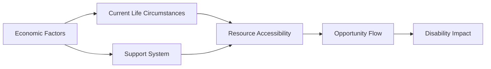

---

title: Economic_Factors
type: Atomic Note
course: Inclusiveness
semester: Autumn 2025
unit: '3'
hub: "[[3_Inclusive_Education_Hub]]"
source: "[[3.pdf]]"
source_pages:
- 13
mode: ECON-MACRO
read: false
generated: true
prerequisites:
- "[[Impact_Of_Disability_On_Daily_Life]]"

---

# 1. Mental Model

The economic factors influencing disability can be likened to a complex river system, where the flow of resources and opportunities is akin to the flow of water. Just as a river's flow can be affected by structural components like dams and canals, economic factors such as [[Economic_Factors]] and [[Current_Life_Circumstances]] can create barriers or pathways for individuals with disabilities. The river's navigability, representing the individual's ability to access resources, is impacted by the riverbed's topography, symbolizing the [[Support_System]] and [[Family_And_Disability]].

# 2. Market Dynamics & Capital Flow

The interaction between economic factors and disability is characterized by a complex interplay of [[Psychological_Factors]], [[Personality_Disposition]], and [[Self_Efficacy_Beliefs]], which influence an individual's ability to navigate the labor market and access resources. The availability of [[Inclusive_Job_Opportunities]] and [[Assistive_Technology]] can significantly enhance the participation of individuals with disabilities in the workforce, thereby affecting [[Economic_Factors]] and overall market dynamics. Conversely, [[Barriers_To_Employment]] and limited access to [[Rehabilitation_Team_Members]] can hinder this participation. The [[Impact_Of_Disability_On_Daily_Life]] and [[Meaning_Of_Impairment_To_Individual]] also play crucial roles in shaping an individual's economic prospects. Furthermore, [[Coping_Patterns]] and [[Special_Needs_Of_Pwds]] are essential considerations for policymakers aiming to create a more inclusive economy.

# 3. Market Failures & Externalities

Market failures occur when the presence of [[Disability_Inclusive_Intervention]] and [[Community_Based_Rehabilitation]] are not adequately reflected in market prices, leading to a mismatch between the social and private benefits of such interventions. This can result in underinvestment in [[Prevention]] and [[Twin_Track_Approach]] initiatives. The externalities associated with disability, such as the impact on [[Family_And_Disability]] and [[Current_Life_Circumstances]], can also lead to market failures if not internalized by policymakers. 

| Market Failure | Description |
|---|---|
| Underinvestment | Insufficient investment in disability prevention and rehabilitation |
| Externalities | Unaccounted impacts on families and communities | 
| Information Asymmetry | Lack of information on disability and its effects on daily life | 
| Social Stigma | Negative perceptions of disability affecting market outcomes |

## 4. Macro Flowchart



The flowchart represents the economic factors influencing disability, with each node representing a concept: Economic Factors, Current Life Circumstances, Support System, Resource Accessibility, Opportunity Flow, and Disability Impact. The arrows indicate the flow of influence from one concept to another, showing how economic factors can affect the accessibility of resources and opportunities, ultimately impacting individuals with disabilities.

## 5. Walkthrough

1. **Initial Condition**: In the field of Bioinformatics & Genomic Sequencing, a researcher with a disability is facing challenges in accessing specialized equipment due to limited funding, which represents the **Economic Factors** node.
2. **Current Life Circumstances**: The researcher's current life circumstances, such as having a family to support, are affected by the economic factors, creating a higher demand for resources, and thus influencing the **Current Life Circumstances** node.
3. **Support System**: The researcher has a strong support system, including colleagues and a disability services office, which aids in navigating the challenges posed by economic factors, influencing the **Support System** node.
4. **Resource Accessibility**: The combination of current life circumstances and support system affects the accessibility of resources, such as funding for research projects or access to adaptive technology, which is represented by the **Resource Accessibility** node.
5. **Opportunity Flow**: When resources become more accessible, the flow of opportunities, such as collaborative research projects or career advancement, increases, influencing the **Opportunity Flow** node.
6. **Disability Impact**: Ultimately, the increased opportunity flow can mitigate the impact of disability on the researcher's career and well-being, represented by the **Disability Impact** node, leading to a more positive outcome.

---

## 6. The Proving Grounds

```interactive-quiz

[
  {
    "id": "q1",
    "type": "true_false",
    "difficulty": "L1",
    "question": "The economic factors influencing disability include only static, unchanging elements.",
    "answer": false,
    "explanation": "The economic factors influencing disability are dynamic and include both static elements like socioeconomic status and dynamic elements like current life circumstances."
  },
  {
    "id": "q2",
    "type": "scenario",
    "difficulty": "L2",
    "question": "Given that an individual with a disability faces a sudden loss of income due to job loss, what happens to their access to resources and opportunities?",
    "answer": "Their access to resources and opportunities is likely to decrease, making it more difficult to navigate the 'river system' of economic factors.",
    "explanation": "The loss of income can create a barrier to accessing resources and opportunities, similar to a dam or blockage in the river system, making it more challenging for the individual to navigate and access what they need."
  },
  {
    "id": "q3",
    "type": "writing",
    "difficulty": "L3",
    "question": "Explain how the mental model of a complex river system can be used to compare and contrast the impact of socioeconomic status and current life circumstances on the economic factors influencing disability.",
    "answer": "The mental model of a complex river system can be used to compare and contrast the impact of socioeconomic status and current life circumstances by considering the former as a structural component, like a dam or canal, that can create a long-term barrier or pathway, while the latter can be seen as a dynamic change in the river's flow, such as a flood or drought, that can suddenly affect access to resources. Both factors interact to affect the navigability of the river, representing the individual's ability to access resources. Understanding these factors can help policymakers and support systems create more effective interventions.",
    "explanation": "This question requires the student to construct an explanation comparing two concepts and applying them to a novel scenario, demonstrating a deep understanding of the mental model and its application to economic factors influencing disability."
  }
]

```