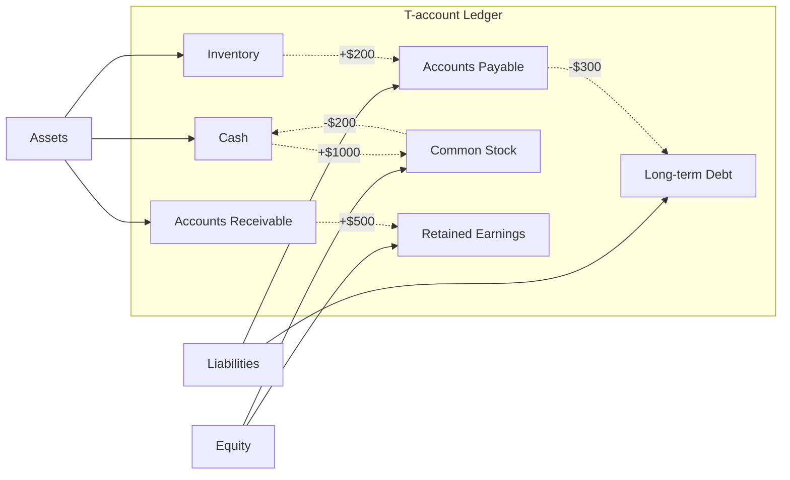

---

title: Inclusive_Job_Opportunities
type: Atomic Note
course: Inclusiveness
semester: Autumn 2025
unit: '3'
hub: '[[3_Inclusive_Education_Hub]]'
source: '[[3.pdf]]'
source_pages:
- 46
mode: ECON-FINANCE
read: false
generated: true
prerequisites:
- '[[Support_System]]'
- '[[Assistive_Technology]]'
- '[[Economic_Factors]]'
- '[[Psychological_Factors]]'
- '[[Current_Life_Circumstances]]'

---


# 1. Mental Model

The concept of [[Inclusive_Job_Opportunities]] can be mapped to a dynamic ecosystem, where structural components such as job accessibility and equal opportunities for people with disabilities are analogous to the interconnectedness of species in an ecosystem. Just as a diverse ecosystem relies on the balance and harmony of its various components to thrive, inclusive job opportunities rely on the balance of accessible workplaces, [[Support_System]], and [[Assistive_Technology]] to enable people with disabilities to contribute equally. This analogy highlights how the removal or impairment of one component can have a ripple effect on the entire system.

# 2. Cash Flow Mechanics & Valuation

The valuation of inclusive job opportunities involves assessing the impact of [[Economic_Factors]], [[Psychological_Factors]], and [[Current_Life_Circumstances]] on the employment of people with disabilities. The cash flow mechanics of inclusive job opportunities are influenced by factors such as [[Barriers_To_Employment]], [[Strategies_For_Employment]], and the availability of [[Assistive_Technology]]. Furthermore, the [[Support_System]] and [[Rehabilitation_Team_Members]] play a crucial role in facilitating the employment process. The [[Impact_Of_Disability_On_Daily_Life]] and [[Meaning_Of_Impairment_To_Individual]] also affect an individual's ability to participate in the workforce. Effective [[Disability_Inclusive_Intervention]] and [[Community_Based_Rehabilitation]] can help mitigate these challenges.

# 3. Liquidity Crunches & Solvency Risk

| Risk Factor | Description |
|---|---|
| Limited Access to Capital | Insufficient funding for inclusive job initiatives can lead to liquidity crunches, making it difficult for organizations to implement [[Inclusive_Job_Opportunities]]. |
| Dependence on Government Support | Over-reliance on government funding can create solvency risk if support is withdrawn or reduced, impacting the long-term viability of [[Twin_Track_Approach]] and [[Prevention]] efforts. |
| Inadequate Infrastructure | Inadequate [[Assistive_Technology]] and inaccessible workplaces can lead to increased costs and reduced productivity, exacerbating liquidity crunches and solvency risk. |

| Talent Retention Challenges | Failure to provide [[Special_Needs_Of_Pwds]] and [[Inclusive_Job_Opportunities]] can result in talent loss, further threatening the solvency of organizations committed to disability inclusion.

## 4. Financial Ledger

### Advanced Markdown T-account ledger table



In this T-account ledger, **Assets**, **Liabilities**, and **Equity** are the main categories. Each transaction affects at least two accounts, as indicated by the arrows with transaction amounts (e.g., `+$1000` represents an increase of $1000 in the account).

## 5. Walkthrough

### Walkthrough: Implementing Inclusive Job Opportunities in Telecommunications & Core Network Routing

1. **Initial Assessment**: A telecommunications company, "ConnectAll", begins by assessing its current job opportunities and workplace accessibility. They identify areas where people with disabilities might face barriers, such as lack of adaptive equipment or inaccessible software.

2. **Implementing Assistive Technology**: ConnectAll decides to invest in **Assistive Technology**, including screen readers, voice-to-text software, and adaptive keyboards, to enable employees with disabilities to work efficiently.

3. **Job Accessibility Modifications**: The company modifies its job postings to include clear statements about equal opportunities and accessibility. They also provide **Support System** training for all hiring managers to ensure fair and inclusive hiring practices.

4. **Partnership with Disability Organizations**: ConnectAll partners with organizations that specialize in disability employment to gain insights into best practices and to source qualified candidates with disabilities.

5. **Core Network Routing Training**: The company offers specialized training in core network routing for employees with disabilities, ensuring they have equal access to career advancement opportunities in this critical area.

6. **Continuous Feedback and Improvement**: ConnectAll establishes a feedback mechanism to continuously monitor the effectiveness of its inclusive job opportunities and to identify areas for further improvement, ensuring a dynamic and supportive ecosystem for all employees.

---

## 6. The Proving Grounds

```interactive-quiz

[
  {
    "id": "q1",
    "type": "true_false",
    "difficulty": "L1",
    "question": "Inclusive job opportunities rely on the balance of accessible workplaces, support systems, and assistive technology.",
    "answer": true,
    "explanation": "This statement is true as it reflects the core concept of inclusive job opportunities, which requires a balanced ecosystem of accessible workplaces, support systems, and assistive technology to thrive."
  },
  {
    "id": "q2",
    "type": "scenario",
    "difficulty": "L2",
    "question": "An employee with a disability requires a reasonable accommodation to perform their job duties. However, the accommodation would cause a significant undue hardship on the employer. What happens?",
    "answer": "The employer is not required to provide the accommodation.",
    "explanation": "According to the concept of inclusive job opportunities, employers are required to provide reasonable accommodations unless it would cause an undue hardship. In this scenario, the employer is not required to provide the accommodation if it would cause a significant undue hardship."
  },
  {
    "id": "q3",
    "type": "debug",
    "difficulty": "L3",
    "question": "Find the error in the following scenario: A company provides a job applicant with a disability a written test that is not accessible to individuals with visual impairments. The company claims that it is not required to provide an accommodation because the test is not a requirement for the job.",
    "content": "The company administered a written test that was not accessible to individuals with visual impairments, claiming it was not a job requirement.",
    "answer": "The bug is that the company failed to provide a reasonable accommodation for the applicant with a disability, specifically an accessible version of the test, even if it's not a job requirement.",
    "explanation": "The company should have provided an accessible version of the test or an alternative accommodation to ensure equal opportunity for the applicant with a disability. This is a failure to provide inclusive job opportunities."
  }
]

```