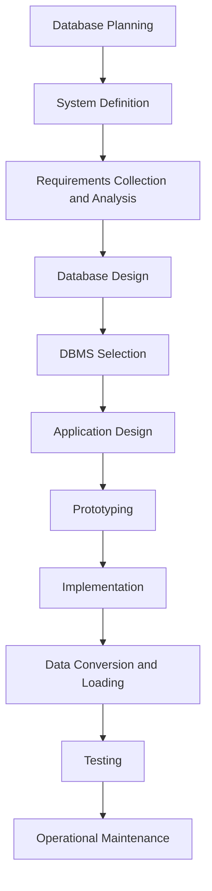

> **Prerequisite:** Before diving into this, ensure you understand [[Information_System]] because it provides foundational knowledge on the role of databases within an organization.

# Definition
Database Development Methodology (DDLC) refers to a structured approach used to design, develop, and implement databases within an organization. It encompasses a series of phases and activities aimed at ensuring that the database meets the organization's information needs efficiently and effectively.

# The Mental Model (ELI5)
Imagine you're building a new library. You need to plan how books will be organized, stored, and accessed. This involves several steps: deciding what books (data) you need, how they relate to each other, and how users will find them. Similarly, Database Development Methodology is a step-by-step guide for creating and managing databases.


```text
This Mermaid diagram illustrates the phases involved in the Database System Development Lifecycle, from planning and system definition to operational maintenance.
```
**Bridge:** 
- **Database Planning**: Initial phase where the scope and objectives of the database project are defined.
- **System Definition**: Defines the boundaries and context of the database within the organization.
- **Requirements Collection and Analysis**: Gathering and analyzing user requirements to understand data needs.
- **Database Design**: Creating a conceptual, logical, and physical design of the database.
- **DBMS Selection**: Choosing a suitable Database Management System.
- **Application Design**: Designing applications that will interact with the database.
- **Prototyping**: Creating a prototype to test and refine the database and applications.
- **Implementation**: Deploying the database and applications.
- **Data Conversion and Loading**: Converting data from existing systems and loading it into the new database.
- **Testing**: Verifying that the database and applications work as expected.
- **Operational Maintenance**: Ongoing support, updates, and maintenance of the database.

# The Deep Dive: PRACTITIONER Perspective
### The Protocol
The Database Development Methodology involves a series of systematic steps to ensure that the database is well-designed, implemented, and maintained.

1. **Database Planning**: Define the project scope, identify stakeholders, and establish objectives.
2. **System Definition**: Understand the current system and its limitations.
3. **Requirements Collection and Analysis**: Use techniques like interviews, surveys, and document analysis to gather requirements.
4. **Database Design**: Apply ER modeling and normalization techniques.
5. **DBMS Selection**: Evaluate and select an appropriate DBMS based on performance, scalability, and compatibility needs.
6. **Application Design**: Design user interfaces and application logic.
7. **Prototyping**: Develop a prototype to validate assumptions and gather feedback.
8. **Implementation**: Install the DBMS, create database structures, and migrate data.
9. **Data Conversion and Loading**: Transform and load data into the new database.
10. **Testing**: Perform unit, integration, and user acceptance testing.
11. **Operational Maintenance**: Monitor performance, fix issues, and implement changes.

### Common Failure Points
- Inadequate requirements gathering leading to a database that doesn’t meet user needs.
- Poor database design causing performance issues.
- Insufficient testing resulting in data corruption or loss.

### The Recovery Drill
- **Identify and Document Issues**: Clearly document problems and their impacts.
- **Analyze Root Causes**: Determine why issues occurred.
- **Develop and Implement Fixes**: Create and deploy solutions.
- **Test Fixes**: Verify that fixes resolve issues without introducing new problems.

# The Worked Example
Consider a scenario where a retail company wants to develop a database to manage its inventory and sales.

1. **Database Planning**: Define project scope and objectives.
2. **System Definition**: Understand current manual processes.
3. **Requirements Collection**: Interview staff to gather requirements.
4. **Database Design**: Create an ER diagram and normalize tables.
5. **DBMS Selection**: Choose a suitable DBMS.
6. **Implementation**: Deploy the database and migrate data.
7. **Testing**: Perform thorough testing.

# Key Takeaways
* Database Development Methodology is a structured approach to database development.
* It involves multiple phases from planning to maintenance.
* Proper execution reduces risks and ensures the database meets organizational needs.

# The Proving Ground
### Level 1: The Sanity Check
**The Question:** What is the primary goal of Database Development Methodology?
> **Solution:** To provide a structured approach to designing, developing, and implementing databases.

### Level 2: The Crucible
**The Scenario:** A company is developing a new database but has not adequately gathered user requirements. What are potential issues, and how can they be addressed?
> **Solution:** Potential issues include a database that does not meet user needs, leading to poor adoption and inefficiencies. Address by ensuring thorough requirements collection and analysis, involving users throughout the process.
