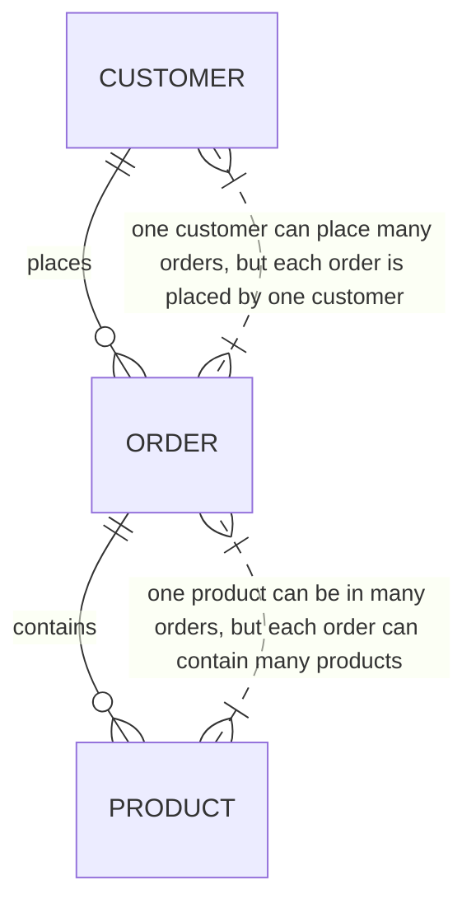

---

title: Cardinality
type: Atomic Note
course: Database Systems
semester: Winter 2026
unit: '3'
hub: "[[3_Database_Design_Hub]]"
source: "[[Chapter_3.pdf]]"
source_pages:
- 51
mode: CS-DB
read: false
generated: true
prerequisites:
- "[[Multiplicity]]"

---

# 1. Mental Model

The concept of cardinality in database design can be likened to the seating arrangement in a theater. Just as a specific seat can be occupied by only one person at a time, representing a one-to-one relationship, a single row in a database table can have a specific cardinality with another table, defining how many instances of one entity can relate to another. For example, in a one-to-many relationship, one row in the parent table can be associated with multiple rows in the child table, much like one theater seat being reserved for multiple performances.

# 2. Schema & Query Mechanics

In database design, cardinality is a critical aspect that emerges during [[Logical_Database_Design]], building upon the foundation established in [[Conceptual_Database_Design]]. It is formally defined through the [[Entity_Relationship_Model]], which utilizes [[Er_Diagram]]s to visualize [[Entity_Type]]s, [[Relationship_Type]]s, [[Attribute]]s, [[Multiplicity]], [[Cardinality]], and [[Participation]]. The [[Database_Development_Methodology]] and [[Database_System_Development_Lifecycle]] guide the incorporation of cardinality into [[Physical_Database_Design]], ensuring alignment with [[Database_Planning]] and [[Requirements_Collection_And_Analysis]]. Effective management of cardinality is crucial for selecting an appropriate [[Dbms_Selection]] and designing an efficient [[Information_System]]. By accurately representing cardinality, designers can ensure data consistency and optimize query performance.

# 3. ACID Violations & Scaling Limits

Cardinality constraints help maintain data integrity by preventing inconsistencies that could arise from incorrect relationships between entities. However, violations of these constraints can lead to [[Acid]] violations, particularly affecting atomicity and consistency. For instance, if a one-to-one relationship is not properly enforced, it could result in orphaned records or duplicate entries, compromising data integrity. As databases scale, poorly managed cardinality can become a bottleneck, leading to decreased performance and increased complexity in maintaining data consistency across distributed systems.

## 4. Entity-Relationship Model



In this Mermaid diagram, `CUSTOMER`, `ORDER`, and `PRODUCT` represent entities. The `||--o{` and `}|..|{` symbols denote 1:N (one-to-many) relationships. For example, a customer can place many orders (one-to-many), but each order is associated with only one customer.

## 5. Walkthrough

Here are the steps to understand cardinality in the context of telecommunications and core network routing:

1. **Initial Network Configuration**: A telecommunications company has a database with two tables: `CUSTOMERS` and `CONNECTIONS`. Each customer can have multiple connections, but each connection is associated with only one customer. This represents a 1:N relationship.

2. **Adding a New Customer**: A new customer, John, is added to the `CUSTOMERS` table. This action does not change the cardinality but adds a new entity instance.

3. **Assigning Connections**: John is assigned three new connections. In the database, three new rows are added to the `CONNECTIONS` table, each linked to John's customer ID. This demonstrates the 1:N relationship, as one customer (John) now has multiple connections.

4. **Introducing a New Entity - Plans**: The company introduces a new table, `PLANS`, which can be associated with multiple customers and allows for multiple plans per customer. This changes the model to include an M:N relationship between `CUSTOMERS` and `PLANS`.

5. **Establishing M:N Relationships**: John subscribes to two plans, and another customer, Jane, subscribes to one of the same plans. This requires updating the relationship model to show that customers can have multiple plans and plans can be associated with multiple customers.

6. **Querying Relationships**: A query is run to find all connections associated with customers on a specific plan. This query leverages the established relationships to aggregate data across the `CUSTOMERS`, `CONNECTIONS`, and `PLANS` tables, demonstrating how understanding cardinality facilitates complex data retrieval in telecommunications.

---

## 6. The Proving Grounds

```interactive-quiz

[
  {
    "id": "q1",
    "type": "true_false",
    "difficulty": "L1",
    "question": "In a one-to-one relationship, can one row in a parent table be associated with multiple rows in a child table?",
    "answer": false,
    "explanation": "In a one-to-one relationship, one row in the parent table is associated with exactly one row in the child table."
  },
  {
    "id": "q2",
    "type": "scenario",
    "difficulty": "L2",
    "question": "Given a database with two tables, Orders and Customers, where one customer can place multiple orders but one order is associated with only one customer, what is the cardinality of the relationship between Customers and Orders?",
    "answer": "One-to-many",
    "explanation": "The relationship is one-to-many because one customer can have multiple orders, but each order is associated with only one customer."
  },
  {
    "id": "q3",
    "type": "debug",
    "difficulty": "L3",
    "question": "Find the error.",
    "content": "function getTotalOrders(customerId) {\n  let total = 0;\n  for (let order of orders) {\n    if (order.customer_id == customerId) {\n      total = order.total;\n    }\n  }\n  return total;\n}",
    "answer": "The bug is that the function is assigning the total of each individual order to the total variable instead of summing them up. The correct line should be total += order.total;",
    "explanation": "The function currently returns the total of the last order it encounters for the given customerId, instead of the total of all orders for that customer."
  }
]

```