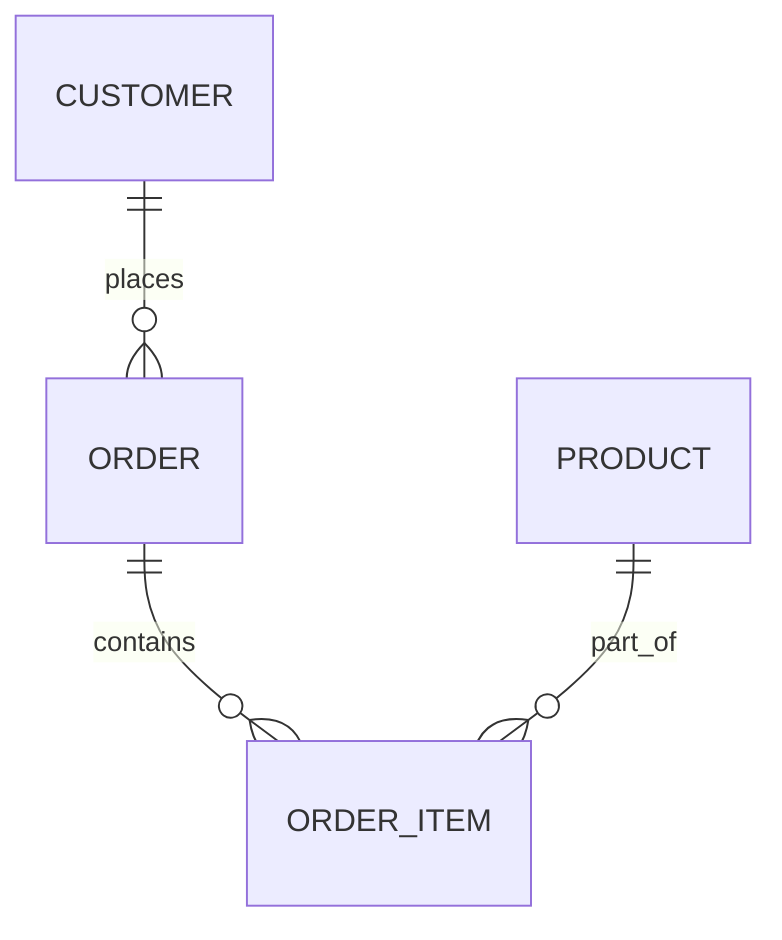

---

title: Conceptual_Database_Design
type: Atomic Note
course: Database Systems
semester: Winter 2026
unit: '3'
hub: "[[3_Database_Design_Hub]]"
source: "[[Chapter_3.pdf]]"
source_pages:
- 8
mode: CS-DB
read: false
generated: true
prerequisites:
- "[[Database_System_Development_Lifecycle]]"

---

# 1. Mental Model

A conceptual database design can be thought of as a blueprint for a city's infrastructure, where entities are like neighborhoods and relationships are like roads connecting them. Just as a city's infrastructure is designed to organize and facilitate the flow of people and resources, a conceptual database design organizes and structures data to support the needs of an enterprise. The entity-relationship model in the design is akin to a map, showing how different neighborhoods (entities) are connected by roads (relationships).

# 2. Schema & Query Mechanics

The [[Conceptual_Database_Design]] process involves constructing a model of the data used in an enterprise, which is a critical part of the [[Database_Development_Methodology]] and [[Database_System_Development_Lifecycle]]. This process begins with [[Requirements_Collection_And_Analysis]] and involves creating an [[Entity_Relationship_Model]], which includes [[Entity_Type]]s, [[Relationship_Type]]s, and [[Attribute]]s. The [[Er_Diagram]] is a visual representation of this model, illustrating [[Multiplicity]], [[Cardinality]], and [[Participation]]. The goal of [[Conceptual_Database_Design]] is to create a platform-independent model that can be mapped to a [[Logical_Database_Design]] and eventually a [[Physical_Database_Design]] using a specific [[Dbms_Selection]]. The output of this phase is crucial for [[Database_Planning]] and informing the [[Information_System]] architecture.

# 3. ACID Violations & Scaling Limits

If the [[Conceptual_Database_Design]] does not accurately reflect the needs of the enterprise, it can lead to [[Acid]] violations, such as inconsistencies in data relationships, ultimately causing the database to break under certain failure states. For instance, a failure to properly define [[Entity_Type]] relationships can result in data inconsistencies when scaling the database. 

| Failure State | Description |
|---|---|
| Inconsistent Data | Data becomes inconsistent due to poor relationship definition. |
| Scalability Issues | Database struggles to scale due to flawed conceptual design. | 

As the database grows, these issues can lead to significant problems, including decreased performance and reliability.

## 4. Entity-Relationship Model



In this Mermaid `erDiagram`, entities are represented as boxes (e.g., `CUSTOMER`, `ORDER`, `ORDER_ITEM`, `PRODUCT`), and relationships are represented as lines connecting them. The cardinality of each relationship is indicated by the symbols: `||--o{` represents a 1:N (one-to-many) relationship, and there is one 1:N and one M:N relationship implicitly shown through the connections.

## 5. Walkthrough

Here are the steps for a walkthrough in the context of Telecommunications & Core Network Routing:

1. **Define Entities**: Identify key entities in the core network routing system, such as `CUSTOMER`, `ROUTING_TABLE`, and `NETWORK_INTERFACE`. These entities represent major concepts that will be crucial in designing the database.

2. **Identify Relationships**: Determine how these entities are related. For instance, a `CUSTOMER` may have multiple `ROUTING_TABLE` entries associated with them, indicating a 1:N relationship.

3. **Establish Cardinality**: Define the cardinality of each relationship. For example, a `ROUTING_TABLE` can be associated with many `NETWORK_INTERFACE` entries, but each `NETWORK_INTERFACE` is associated with only one `ROUTING_TABLE`, suggesting a 1:N relationship.

4. **Create Entity-Relationship Diagram**: Use a tool or notation like Mermaid to create a visual representation of these entities and their relationships, similar to the example provided.

5. **Refine the Model**: Based on the requirements of the core network routing system, refine the model. For instance, consider if there are any M:N relationships that need to be represented through a junction table.

6. **Validate Against Requirements**: Ensure that the entity-relationship model aligns with the functional and non-functional requirements of the telecommunications system, particularly focusing on how data will be organized and accessed for efficient routing decisions.

---

## 6. The Proving Grounds

```interactive-quiz

[
  {
    "id": "q1",
    "type": "true_false",
    "difficulty": "L1",
    "question": "A conceptual database design is primarily used for physical data storage.",
    "answer": false,
    "explanation": "A conceptual database design is a high-level abstract model that represents the overall structure of the data, focusing on entities, attributes, and relationships, without concern for physical storage details."
  },
  {
    "id": "q2",
    "type": "scenario",
    "difficulty": "L2",
    "question": "Given that an enterprise has multiple departments, each with its own set of customers, and a customer can be served by multiple departments, what happens to the relationship between the Customer and Department entities in the conceptual database design?",
    "answer": "The relationship between Customer and Department entities becomes many-to-many, requiring a junction table or associative entity to resolve the relationship.",
    "explanation": "In a conceptual database design, when a customer can be served by multiple departments and each department can serve multiple customers, the relationship between the Customer and Department entities becomes many-to-many. This requires a junction table or associative entity to properly manage the relationships and avoid data redundancy or inconsistencies."
  },
  {
    "id": "q3",
    "type": "debug",
    "difficulty": "L3",
    "question": "Find the error.",
    "content": "Entity-Customer {\n  attribute1: string;\n  attribute2: integer;\n  relationship1: one-to-one with Entity-Order;\n}",
    "answer": "The bug is the incorrect use of 'one-to-one' relationship. It should be 'one-to-many' or 'many-to-one' depending on the actual relationship cardinality.",
    "explanation": "The provided code snippet incorrectly specifies a one-to-one relationship between Customer and Order entities. Typically, a customer can have multiple orders (one-to-many), or an order is associated with only one customer (many-to-one). A one-to-one relationship would imply that a customer can only have one order and an order is only associated with one customer, which is usually not the case in a typical enterprise database design."
  }
]

```