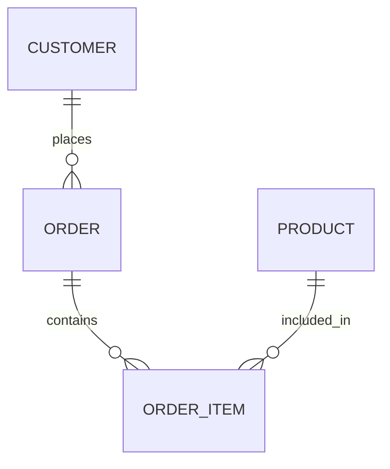

---

title: Dbms_Selection
type: Atomic Note
course: Database Systems
semester: Winter 2026
unit: '3'
hub: "[[3_Database_Design_Hub]]"
source: "[[Chapter_3.pdf]]"
source_pages:
- 4
mode: CS-DB
read: false
generated: true
prerequisites:
- "[[Requirements_Collection_And_Analysis]]"

---

# 1. Mental Model

A DBMS selection process can be likened to choosing a construction team for a building project, where the team members represent different DBMS features. Just as a building project requires a team with various skills, such as architects, engineers, and contractors, a DBMS selection involves evaluating different features, like data modeling, query optimization, and security, to ensure they meet the project's requirements. The team leader, or the DBMS, must coordinate these features to deliver the project successfully.

# 2. Schema & Query Mechanics

The [[Database_Development_Methodology]] involves several phases, including [[Conceptual_Database_Design]], [[Logical_Database_Design]], and [[Physical_Database_Design]], which are critical in the [[Dbms_Selection]] process. During [[Requirements_Collection_And_Analysis]], the [[Entity_Relationship_Model]] is created to identify [[Entity_Type]]s, [[Relationship_Type]]s, and their [[Attribute]]s. The [[Er_Diagram]] serves as a visual representation of the [[Entity_Relationship_Model]], facilitating communication among stakeholders. A well-designed [[Information_System]] relies on a thorough [[Database_Planning]] process, which includes [[Dbms_Selection]] and [[Database_System_Development_Lifecycle]]. Effective [[Dbms_Selection]] enables the creation of a robust [[Conceptual_Database_Design]].

# 3. ACID Violations & Scaling Limits

When a DBMS is not properly selected, it may lead to ACID violations, such as inconsistent data or failed transactions, particularly under high concurrency or large data volumes. If the chosen DBMS cannot handle the workload, it may result in performance degradation or even system crashes. As the database scales, boundary conditions like increased latency or decreased throughput can occur if the DBMS is not designed to handle the growth. In such cases, re-evaluating the [[Dbms_Selection]] and considering factors like [[Multiplicity]], [[Cardinality]], and [[Participation]] can help identify a more suitable solution.

## 4. Entity-Relationship Model



In this Mermaid entity-relationship diagram, `CUSTOMER`, `ORDER`, `ORDER_ITEM`, and `PRODUCT` represent entities. The `||--o{` notation indicates a 1:N (one-to-many) relationship, meaning one customer can place many orders, one order can contain many order items, and one product can be included in many order items.

## 5. Walkthrough

Here are the steps for a DBMS selection process in the context of Industrial Manufacturing & Robotics:

1. **Define Project Requirements**: Identify the specific needs of the industrial manufacturing and robotics project, such as data modeling for production workflows, query optimization for real-time monitoring, and security features to protect sensitive intellectual property.
2. **Evaluate DBMS Features**: Assess different DBMS options based on their features, such as data modeling capabilities, support for concurrent transactions, and advanced security measures like encryption and access controls.
3. **Assess Scalability and Performance**: Consider the scalability and performance requirements of the project, including the ability to handle large volumes of data from sensors and machines, and to support high-performance querying and analytics.
4. **Consider Integration and Compatibility**: Evaluate the DBMS options for their ability to integrate with existing systems and tools used in industrial manufacturing and robotics, such as CAD software, PLCs, and SCADA systems.
5. **Test and Validate**: Test the shortlisted DBMS options with a proof-of-concept project, simulating real-world scenarios to validate their performance, scalability, and feature sets.
6. **Select and Implement**: Based on the evaluation and testing results, select the most suitable DBMS and implement it in the industrial manufacturing and robotics project, ensuring a smooth transition and minimal disruption to operations.

---

## 6. The Proving Grounds

```interactive-quiz

[
  {
    "id": "q1",
    "type": "true_false",
    "difficulty": "L1",
    "question": "A DBMS selection process involves evaluating different features to ensure they meet the project's requirements.",
    "answer": true,
    "explanation": "This statement is true as a DBMS selection process indeed involves evaluating various features such as data modeling, query optimization, and security to ensure they meet the project's requirements."
  },
  {
    "id": "q2",
    "type": "scenario",
    "difficulty": "L2",
    "question": "Given that a company needs to store large amounts of unstructured data, what type of DBMS would be most suitable?",
    "answer": "A NoSQL DBMS would be most suitable for storing large amounts of unstructured data.",
    "explanation": "NoSQL DBMS are designed to handle large amounts of unstructured or semi-structured data, making them a good fit for this scenario."
  },
  {
    "id": "q3",
    "type": "debug",
    "difficulty": "L3",
    "question": "Find the error.",
    "content": "if (data.size > 1000) { return 'Large'; } else { return 'Small'; }",
    "answer": "The bug is a logic inversion. The correct code should be: if (data.size < 1000) { return 'Small'; } else { return 'Large'; }",
    "explanation": "The original code incorrectly labels data with a size greater than 1000 as 'Large' and less than or equal to 1000 as 'Small'. The correct logic should label data with a size less than 1000 as 'Small' and greater than or equal to 1000 as 'Large'."
  }
]

```