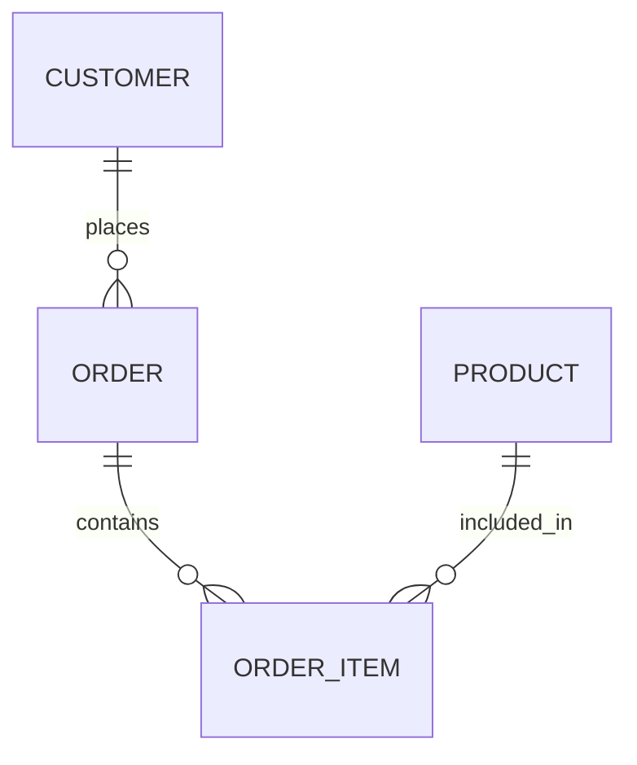

---

title: Database_Development_Methodology
type: Atomic Note
course: Database Systems
semester: Winter 2026
unit: '3'
hub: '[[3_Database_Design_Hub]]'
source: '[[Chapter_3.pdf]]'
source_pages:
- 3
mode: CS-DB
read: false
generated: true
prerequisites:
- '[[Database_Planning]]'
- '[[Requirements_Collection_And_Analysis]]'
- '[[Conceptual_Database_Design]]'
- '[[Logical_Database_Design]]'
- '[[Physical_Database_Design]]'

---


# 1. Mental Model

A database development methodology can be likened to constructing a complex road network. Just as a road network requires careful planning, design, and construction to ensure smooth traffic flow and connectivity, a database development methodology involves a structured approach to designing, building, and maintaining a database system. The schema and relationships in the database correspond to the roads, highways, and intersections in the road network, requiring careful planning to ensure data consistency and efficient access.

# 2. Schema & Query Mechanics

The database development methodology encompasses various stages, including [[Database_Planning]], [[Requirements_Collection_And_Analysis]], [[Conceptual_Database_Design]], [[Logical_Database_Design]], and [[Physical_Database_Design]], all of which are crucial for creating a robust database system. A key aspect of this methodology is the use of [[Entity_Relationship_Model]] to represent the [[Entity_Type]]s, [[Relationship_Type]]s, and [[Attribute]]s, which helps in visualizing the database structure through [[Er_Diagram]]s. The [[Database_System_Development_Lifecycle]] provides a framework for these activities, ensuring that the database development process is systematic and thorough. The [[Dbms_Selection]] is also a critical step, as it influences the [[Database_Development_Methodology]] and the overall [[Information_System]]. Effective [[Database_Development_Methodology]] relies on a deep understanding of these components and their interrelationships.

# 3. ACID Violations & Scaling Limits

In a database system developed using a structured methodology, ACID (Atomicity, Consistency, Isolation, Durability) properties are essential for ensuring transactional reliability. However, if the database is not properly scaled or if there are flaws in the [[Database_Development_Methodology]], ACID violations can occur, leading to inconsistencies and potential data loss. For instance, if the system is not designed to handle high transaction volumes, it may fail to maintain isolation, leading to data corruption. Similarly, if the durability aspect is compromised due to inadequate logging or recovery mechanisms, data could be lost in the event of a failure. 

| Scaling Issue | ACID Property Affected | Potential Impact |

|---------------|------------------------|--------------------|

| High transaction volume | Isolation             | Data corruption    |

| Inadequate logging     | Durability            | Data loss          |

## 4. Entity-Relationship Model



In this Mermaid entity-relationship diagram, `CUSTOMER`, `ORDER`, `ORDER_ITEM`, and `PRODUCT` represent entities. The `||--o{` notation indicates a 1:N (one-to-many) relationship, meaning one customer can place many orders, one order can contain many order items, and one product can be included in many order items.

## 5. Walkthrough

Here are the steps to develop a database for an industrial manufacturing and robotics company:

1. **Define the scope and requirements**: Identify the key business processes and data entities involved in the industrial manufacturing and robotics operations, such as customers, orders, products, and inventory.
2. **Create a conceptual data model**: Develop a high-level data model that represents the main entities and their relationships, similar to the entity-relationship diagram above.
3. **Design the database schema**: Translate the conceptual data model into a physical database schema, defining the tables, columns, data types, and relationships.
4. **Establish data relationships and constraints**: Define the relationships between tables, such as primary and foreign keys, and establish constraints to ensure data consistency and integrity.
5. **Implement data normalization**: Normalize the database schema to minimize data redundancy and improve data integrity, ensuring that each piece of data is stored in one place and one place only.
6. **Test and refine the database**: Test the database with sample data and refine the schema as needed to ensure that it meets the business requirements and performs well under load.

---

## 6. The Proving Grounds

```interactive-quiz

[
  {
    "id": "q1",
    "type": "true_false",
    "difficulty": "L1",
    "question": "A database development methodology is primarily concerned with the physical implementation of a database.",
    "answer": false,
    "explanation": "A database development methodology encompasses a broader structured approach to designing, building, and maintaining a database system, including conceptual and logical design, not just physical implementation."
  },
  {
    "id": "q2",
    "type": "scenario",
    "difficulty": "L2",
    "question": "Given that a database schema has been designed but not yet implemented, and requirements change to add a new type of user with different data needs, what happens to the existing user data?",
    "answer": "The existing user data remains unchanged, but the schema must be altered to accommodate the new user type, potentially requiring data migration or transformation.",
    "explanation": "In a structured database development methodology, changes to requirements are managed through controlled processes like versioning and migration, ensuring data integrity and minimal disruption."
  },
  {
    "id": "q3",
    "type": "debug",
    "difficulty": "L3",
    "question": "Find the error.",
    "content": "if (rowCount > 0) then\n  insert into AuditLog (message) values ('Database schema updated');\nelse\n  update AuditLog set message = 'Database schema unchanged';\nend if;",
    "answer": "The bug is incorrect logic; it should check if rowCount == 0 for the update statement. The fix is to swap the if and else blocks' actions.",
    "explanation": "The current logic inserts a new log entry if any rows are updated, and attempts to update an existing log entry if no rows are updated, which is likely not the intended behavior."
  }
]

```