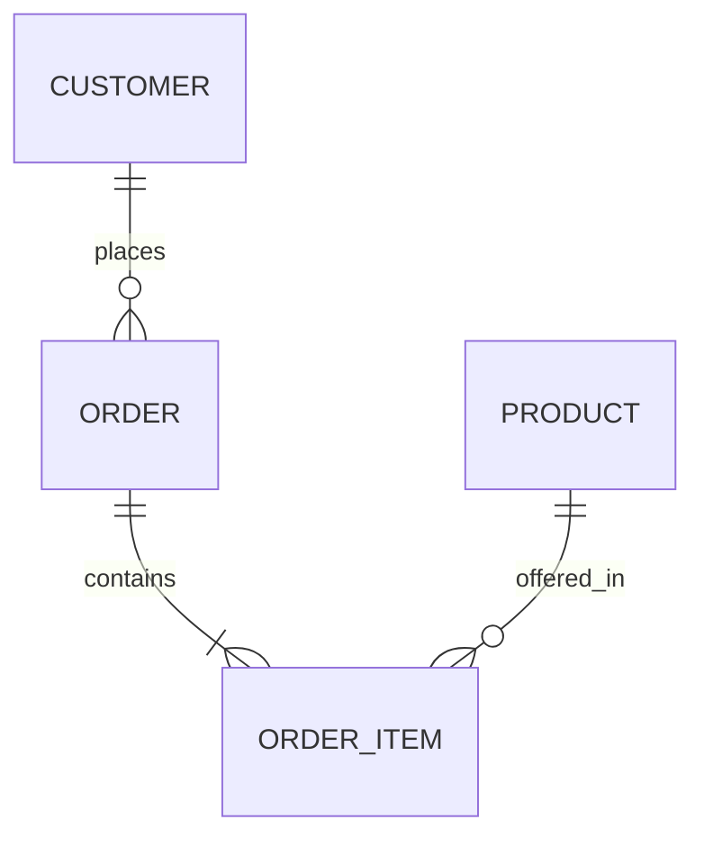

---

title: Database_System_Development_Lifecycle
type: Atomic Note
course: Database Systems
semester: Winter 2026
unit: '3'
hub: "[[3_Database_Design_Hub]]"
source: "[[Chapter_3.pdf]]"
source_pages:
- 4
- 5
mode: CS-DB
read: false
generated: true
prerequisites:
- "[[Database_Development_Methodology]]"

---

# 1. Mental Model

A Database System Development Lifecycle can be likened to constructing a complex building. Just as a building's construction involves planning, blueprinting, foundation-laying, and finishing, a database system development lifecycle involves stages like [[Database_Planning]], [[Requirements_Collection_And_Analysis]], [[Conceptual_Database_Design]], and [[Implementation]]. The blueprint of the building matches the [[Conceptual_Database_Design]] and [[Logical_Database_Design]] phases, where the structure and organization of the database are planned, while the foundation and construction phases align with [[Physical_Database_Design]] and [[Implementation]], where the database is actually built and deployed.

# 2. Schema & Query Mechanics

The [[Database_System_Development_Lifecycle]] encompasses several critical phases, starting with [[Database_Planning]] and [[Requirements_Collection_And_Analysis]], which inform the [[Conceptual_Database_Design]] and [[Logical_Database_Design]] phases. During [[Conceptual_Database_Design]], an [[Entity_Relationship_Model]] is often created to represent the high-level design, detailing [[Entity_Type]]s, [[Relationship_Type]]s, [[Attribute]]s, [[Multiplicity]], [[Cardinality]], and [[Participation]], typically visualized in an [[Er_Diagram]]. The [[Logical_Database_Design]] phase transforms this conceptual model into a more technical map of the database, defining [[Database_Development_Methodology]] and [[Database_System_Development_Lifecycle]] considerations. The actual implementation details are addressed in [[Physical_Database_Design]], which involves selecting a suitable [[Dbms_Selection]]. Effective [[Information_System]] integration requires careful consideration of the entire [[Database_System_Development_Lifecycle]].

# 3. ACID Violations & Scaling Limits

In the context of the [[Database_System_Development_Lifecycle]], ACID violations and scaling limits become critical in the [[Implementation]] and [[Operational_Maintenance]] phases. If a database system is not properly designed or scaled, it may encounter failure states such as data inconsistencies or system crashes, particularly when handling high volumes of transactions. Boundary conditions, like reaching maximum capacity or experiencing peak usage, can exacerbate these issues, leading to ACID violations. 

| Failure State | Description | 

|---|---|

| Data Inconsistency | Occurs when transactions are not properly synchronized. | 

| System Crash | Happens when the system fails to handle peak loads. | 

Inadequate [[Dbms_Selection]] or poor [[Database_Design]] can lead to these problems, emphasizing the importance of careful planning and testing within the [[Database_System_Development_Lifecycle]].

## 4. Entity-Relationship Model



In this Mermaid `erDiagram`, the lines represent relationships between entities. 
- The `||--o{` and `||--|{` symbols indicate 1:N (one-to-many) and M:N (many-to-many) relationships, respectively.

## 5. Walkthrough

Here are the steps to apply the Database System Development Lifecycle in the Industrial Manufacturing & Robotics domain:

1. **Database Planning**: Identify the need for a database system to manage production data in an industrial manufacturing plant, recognizing the current manual data collection process is inefficient and prone to errors.

2. **Requirements Collection and Analysis**: Gather requirements from stakeholders, including production managers, quality control specialists, and robotics engineers, to understand the types of data to be collected (e.g., production rates, defect rates, robot performance metrics).

3. **Conceptual Database Design**: Design a high-level conceptual model of the database, identifying key entities such as `PRODUCT`, `MACHINE`, `ROBOT`, and `PRODUCTION_RUN`, and understanding their relationships.

4. **Logical Database Design**: Translate the conceptual model into a logical model, defining the database schema, including tables for `PRODUCT`, `ORDER`, `ORDER_ITEM`, and relationships between them, as shown in the entity-relationship diagram.

5. **Implementation**: Implement the database using a relational database management system (RDBMS), creating the tables, establishing relationships, and populating the database with initial data.

6. **Maintenance and Evolution**: Continuously monitor the database system's performance, making adjustments as needed to ensure it meets evolving requirements, such as adding new tables to track data from newly introduced robotics equipment.

---

## 6. The Proving Grounds

```interactive-quiz

[
  {
    "id": "q1",
    "type": "true_false",
    "difficulty": "L1",
    "question": "The Database System Development Lifecycle involves stages like planning, requirements collection and analysis, and implementation.",
    "answer": true,
    "explanation": "The statement is true as it accurately describes the stages involved in the Database System Development Lifecycle."
  },
  {
    "id": "q2",
    "type": "scenario",
    "difficulty": "L2",
    "question": "Given that a database system is being developed for a large e-commerce application, what happens when the requirements collection and analysis phase reveals that the system needs to handle a large volume of transactions per second?",
    "answer": "The system design should prioritize scalability, high performance, and reliability to handle the large volume of transactions.",
    "explanation": "During the requirements collection and analysis phase, if it is revealed that the system needs to handle a large volume of transactions per second, the system design should prioritize scalability, high performance, and reliability. This may involve selecting a suitable database management system, designing an efficient database schema, and implementing mechanisms for load balancing and failover."
  },
  {
    "id": "q3",
    "type": "debug",
    "difficulty": "L3",
    "question": "Find the error.",
    "content": "if (row_count > 0) then\n  commit;\nelse\n  rollback;\nend if;",
    "answer": "The bug is a logic inversion. The correct logic should be to rollback when no rows are affected (row_count == 0) and commit when rows are affected (row_count > 0).",
    "explanation": "The given code snippet has a logic inversion. It commits the transaction when rows are affected and rollbacks when no rows are affected, which is the opposite of the expected behavior. The correct code should be: if (row_count == 0) then rollback; else commit; end if;"
  }
]

```