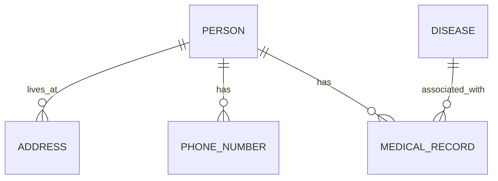

---

title: Er_Diagram
type: Atomic Note
course: Database Systems
semester: Winter 2026
unit: '3'
hub: "[[3_Database_Design_Hub]]"
source: "[[Chapter_3.pdf]]"
source_pages:
- 12
mode: CS-DB
read: false
generated: true
prerequisites:
- "[[Entity-relationship_Model]]"

---

# 1. Mental Model

A database's Entity-Relationship (E-R) diagram can be thought of as a city's urban planning map, where entities are like buildings and relationships are like roads connecting them. Just as a city's map shows the layout of buildings, roads, and intersections, an E-R diagram illustrates the structure of entities, attributes, and relationships within a database. The entities and relationships in an E-R diagram correspond to the buildings and roads on a city map, providing a visual representation of how data is organized and connected.

# 2. Schema & Query Mechanics

The development of an E-R diagram is a crucial step in the [[Database_Development_Methodology]] and [[Database_System_Development_Lifecycle]], as it allows designers to create a conceptual model of the database. During [[Conceptual_Database_Design]], the E-R diagram is used to identify entities, attributes, and relationships, which are then refined during [[Logical_Database_Design]] and [[Physical_Database_Design]]. The E-R diagram is often based on an [[Entity_Relationship_Model]], which describes the structure of the data in terms of [[Entity_Type]], [[Relationship_Type]], [[Attribute]], [[Multiplicity]], [[Cardinality]], and [[Participation]]. The diagram itself is a visual representation of the data structure, often depicted using an [[Er_Diagram]]. By using an E-R diagram, designers can ensure that the database is properly planned and that the [[Information_System]] meets the requirements gathered during [[Requirements_Collection_And_Analysis]].

# 3. ACID Violations & Scaling Limits

If an E-R diagram is not properly designed, it can lead to data inconsistencies and [[Acid]] violations, particularly in terms of data integrity and consistency. For example, if an entity has multiple relationships with other entities, but the relationships are not properly defined, it can lead to data redundancy and inconsistencies. As the database grows, these inconsistencies can become more pronounced, leading to scaling limits and performance issues. In extreme cases, a poorly designed E-R diagram can lead to a database that is unable to meet the needs of the [[Dbms_Selection]] and the overall [[Database_Planning]] strategy.

## 4. Entity-Relationship Model



In this Mermaid erDiagram, entities are represented as boxes (e.g., `PERSON`, `ADDRESS`, `DISEASE`), and relationships are represented as lines connecting them. The cardinality of each relationship is indicated by the symbols: `||--o{` represents a 1:N (one-to-many) relationship, and there is no direct M:N relationship shown here but it can be represented with `||--|{`.


## 5. Walkthrough

Here are the steps to create and interpret an Entity-Relationship diagram in the context of Epidemiology & Public Health Modeling:

1. **Identify Entities**: Identify key entities relevant to the epidemiology domain, such as `PERSON`, `DISEASE`, `ADDRESS`, and `PHONE_NUMBER`. These entities represent major objects of interest in the database.

2. **Define Relationships**: Determine how these entities are related. For instance, a person can have multiple addresses (e.g., home and work), so there's a 1:N relationship between `PERSON` and `ADDRESS`.

3. **Establish Cardinality**: Define the cardinality of each relationship. A person can have multiple phone numbers, establishing a 1:N relationship between `PERSON` and `PHONE_NUMBER`.

4. **Link Entities through Relationships**: Draw lines to represent these relationships between entities. For example, link `PERSON` to `MEDICAL_RECORD` to show that a person has multiple medical records over time.

5. **Incorporate Disease Association**: Connect `DISEASE` with `MEDICAL_RECORD` to illustrate that a medical record can be associated with multiple diseases, reflecting real-world scenarios where a patient may have multiple diagnoses.

6. **Interpret the Diagram**: Finally, interpret the diagram to ensure it accurately reflects the data model. For example, it shows that a person can live at multiple addresses but each address is associated with only one person, and similarly, understand the associations between diseases and medical records.

---

## 6. The Proving Grounds

```interactive-quiz

[
  {
    "id": "q1",
    "type": "true_false",
    "difficulty": "L1",
    "question": "In an Entity-Relationship diagram, entities represent tables in the database and relationships represent the primary keys.",
    "answer": false,
    "explanation": "In an Entity-Relationship diagram, entities represent real-world objects or concepts, such as customers or products, and relationships represent how these entities interact or are related to each other."
  },
  {
    "id": "q2",
    "type": "scenario",
    "difficulty": "L2",
    "question": "Given two entities, Customer and Order, where a customer can place many orders but an order is associated with only one customer, what type of relationship exists between Customer and Order?",
    "answer": "A one-to-many relationship exists between Customer and Order.",
    "explanation": "This is because one customer can have multiple orders (one-to-many), but each order is associated with only one customer."
  },
  {
    "id": "q3",
    "type": "debug",
    "difficulty": "L3",
    "question": "Find the error.",
    "content": "Entity A has a many-to-many relationship with Entity B. The relationship is implemented using a junction table, EntityA_B. However, the primary key of EntityA_B is {EntityA_ID} alone.",
    "answer": "The bug is that the primary key of the junction table EntityA_B should be a composite key of {EntityA_ID, EntityB_ID} to uniquely identify each relationship instance.",
    "explanation": "A many-to-many relationship requires a junction table with a composite primary key that includes the foreign keys to both related entities. Using only {EntityA_ID} as the primary key would allow multiple entries with the same EntityA_ID but different EntityB_IDs, which could lead to data inconsistencies."
  }
]

```