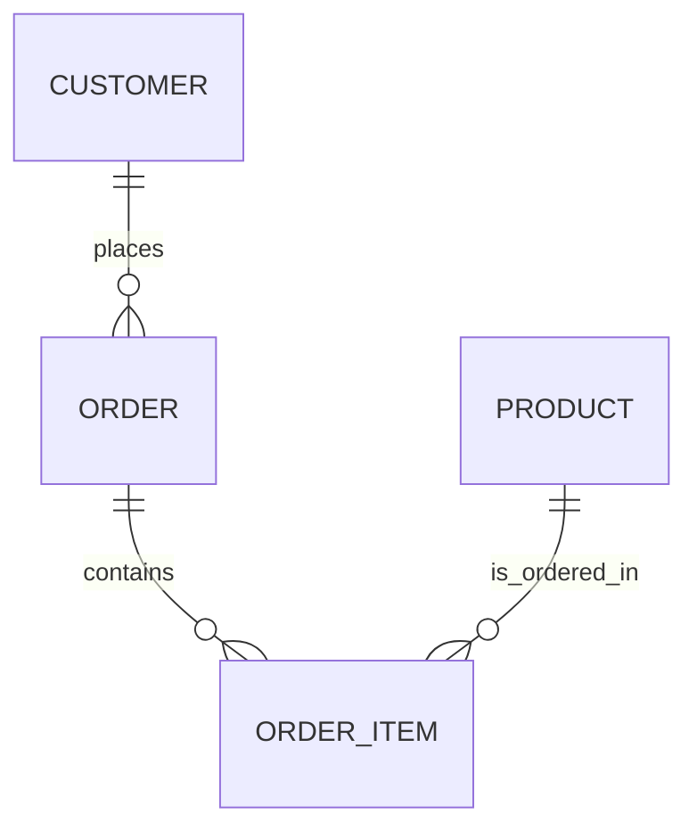

---

title: Entity_Relationship_Model
type: Atomic Note
course: Database Systems
semester: Winter 2026
unit: '3'
hub: "[[3_Database_Design_Hub]]"
source: "[[Chapter_3.pdf]]"
source_pages:
- 15
mode: CS-DB
read: false
generated: true
prerequisites:
- "[[Conceptual_Database_Design]]"

---

# 1. Mental Model

The Entity Relationship Model can be thought of as a city's urban planning system, where entity types are like neighborhoods, each with their own characteristics, and relationship types are like the roads that connect these neighborhoods, defining how they interact. Just as a city's layout is designed to facilitate the flow of people and resources between neighborhoods, an Entity Relationship Model is designed to facilitate the flow of data between entity types. The attributes of an entity type are like the specific features of a neighborhood, such as parks, schools, and shops.

# 2. Schema & Query Mechanics

The Entity Relationship Model is a crucial component of [[Database_Development_Methodology]], as it provides a conceptual framework for designing a database. During [[Conceptual_Database_Design]], the Entity Relationship Model is used to identify [[Entity_Type]]s, [[Relationship_Type]]s, and their corresponding [[Attribute]]s. The [[Entity_Relationship_Model]] is then refined through [[Logical_Database_Design]] and [[Physical_Database_Design]], ensuring that the database is properly structured and optimized for use with a specific [[Dbms_Selection]]. The [[Er_Diagram]] is a visual representation of the Entity Relationship Model, making it easier to communicate and validate the design with stakeholders during [[Requirements_Collection_And_Analysis]]. By following a structured [[Database_System_Development_Lifecycle]], developers can ensure that their database is well-planned, scalable, and meets the needs of the [[Information_System]].

# 3. ACID Violations & Scaling Limits

If the Entity Relationship Model is not properly designed, it can lead to [[Acid]] violations, such as inconsistencies in data relationships or attributes. For example, if an [[Entity_Type]] has a [[Multiplicity]] or [[Cardinality]] that is not properly defined, it can lead to data inconsistencies or errors. As the database scales, these issues can become more pronounced, leading to [[Participation]] and [[Relationship_Type]] inconsistencies. In extreme cases, a poorly designed Entity Relationship Model can lead to a complete failure of the database, highlighting the importance of careful [[Database_Planning]] and [[Dbms_Selection]].

## 4. Entity-Relationship Model



In this Mermaid `erDiagram`, the entities are represented as boxes (e.g., `CUSTOMER`, `ORDER`, `ORDER_ITEM`, `PRODUCT`). The lines connecting them represent the relationships: `||--o{` denotes a 1:N (one-to-many) relationship, where the entity on the left side can have multiple instances of the entity on the right side. For example, a `CUSTOMER` can place many `ORDER`s, but an `ORDER` is placed by only one `CUSTOMER`.

## 5. Walkthrough

Here are the steps to understand the Entity Relationship Model in the context of Telecommunications & Core Network Routing:

1. **Define Entity Types**: Identify the key entities in the core network routing system, such as `CUSTOMER`, `ROUTING_TABLE`, and `NETWORK_INTERFACE`. Each entity type has its own characteristics, like attributes.

2. **Establish Relationships**: Determine how these entities interact. For instance, a `CUSTOMER` has multiple `ROUTING_TABLE` entries associated with their network connections.

3. **Define Relationship Types**: Identify the types of relationships, such as 1:N (one-to-many) or M:N (many-to-many). For example, a `ROUTING_TABLE` can be associated with many `NETWORK_INTERFACE`s, but a `NETWORK_INTERFACE` can be part of many `ROUTING_TABLE`s, suggesting a M:N relationship.

4. **Attribute Identification**: For each entity type, list its attributes. For a `NETWORK_INTERFACE`, attributes might include `INTERFACE_ID`, `IP_ADDRESS`, and `INTERFACE_TYPE`.

5. **Model Refinement**: Refine the model by ensuring that each entity and relationship accurately represents the real-world system. This might involve adjusting relationship types based on deeper analysis.

6. **Implementation Planning**: Finally, plan how this Entity Relationship Model will be implemented in a database, considering indexing, data normalization, and query performance to support efficient core network routing operations.

---

## 6. The Proving Grounds

```interactive-quiz

[
  {
    "id": "q1",
    "type": "true_false",
    "difficulty": "L1",
    "question": "In the Entity Relationship Model, entity types are also known as tables.",
    "answer": false,
    "explanation": "In the Entity Relationship Model, entity types are conceptual representations of objects or concepts, not necessarily tables, which are a physical implementation in a relational database."
  },
  {
    "id": "q2",
    "type": "scenario",
    "difficulty": "L2",
    "question": "Given two entity types, Customer and Order, with a one-to-many relationship between them, what happens when a customer is deleted?",
    "answer": "All related orders should also be deleted or reassigned to another customer.",
    "explanation": "When a customer is deleted, all related orders are typically deleted (cascading deletion) or reassigned to another customer to maintain data consistency and avoid orphan records."
  },
  {
    "id": "q3",
    "type": "debug",
    "difficulty": "L3",
    "question": "Find the error.",
    "content": "function getRelatedOrders(customerId) {\n  return orders.filter(order => order.customer_id == customerId);\n}",
    "answer": "The bug is the use of loose equality operator '==', which can lead to type coercion issues. The fix is to use strict equality operator '==='.",
    "explanation": "The bug is the use of '==', which can cause unexpected type conversions. Using '===' ensures that both the value and type are compared correctly."
  }
]

```